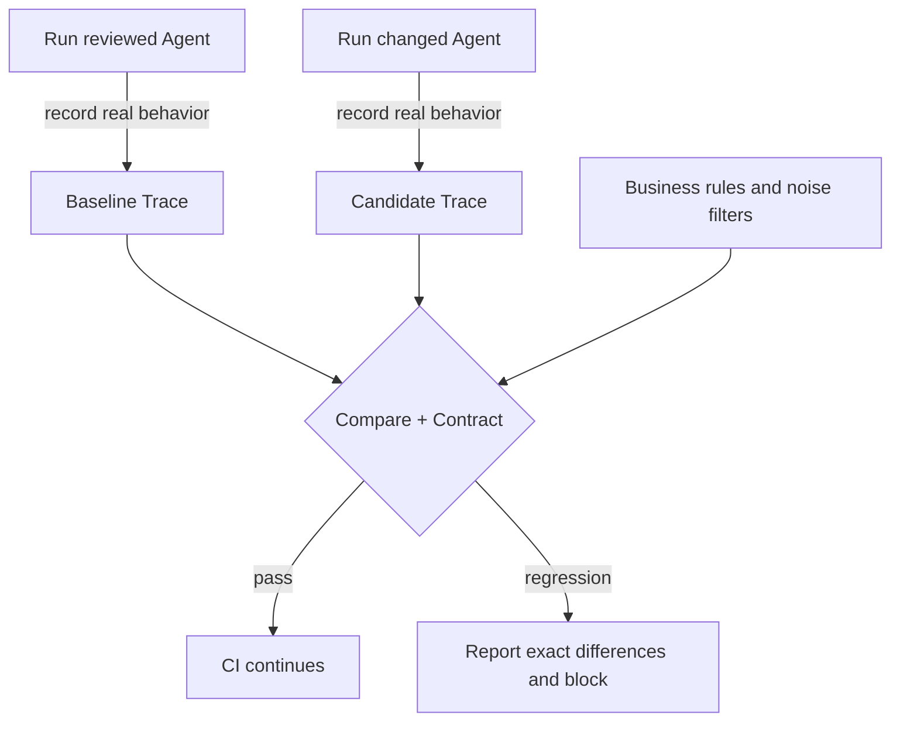

# Agent Regression Kit

[](https://github.com/ANTAO94/agent-regression-kit/actions/workflows/regression.yml)
[](https://github.com/ANTAO94/agent-regression-kit/releases)
[](setup.cfg)
[](LICENSE)

**Regression tests for AI Agents: catch wrong tools, changed arguments, skipped steps, and incorrect business conclusions after changing a prompt, model, tool, or code.**

[Bilingual homepage / 双语首页](README.md#english) · [中文](README.md#简体中文) · [5-minute quick start](#5-minute-quick-start) · [Connect your Agent](#connect-your-agent) · [CI](#run-in-ci) · [User manual](docs/user-manual.en.md) · [Technical design](docs/technical-design.en.md)

Python ≥ 3.9 · Prepared patch `v4.38.1` (not yet tagged) · Latest published release `v4.38.0` · No required third-party core runtime dependencies

> Release status: the `v4.38.1` source contains the HelpPilot evidence and generated CI fixes. The tag/package is pending release; `v4.38.0` does not contain these fixes. See the [HelpPilot case study](docs/helppilot-case-study.md) and [patch acceptance record](docs/v4.38.1-acceptance.md).

## Contents

- [Why this exists](#why-this-exists)
- [How it works](#how-it-works)
- [5-minute quick start](#5-minute-quick-start)
- [Connect your Agent](#connect-your-agent)
- [Configure rules and noise filters](#configure-business-rules-and-noise-filters)
- [Run in CI](#run-in-ci)
- [Source capabilities and validation](#current-source-capabilities)
- [Boundaries and documentation](#what-it-does-not-solve)

## Why this exists

An Agent can return a plausible final sentence while its execution has already regressed. A prompt change may cause it to:

- call the wrong tool or skip a required step;
- send `order_id="132"` instead of `"123"`;
- repeat a refund or another side effect;
- receive “not shipped” and answer “shipped”;
- take a risky tool path that happens to produce the same output.

Agent Regression Kit records a real run as a structured **Trace**, then compares a new run with a reviewed **Baseline** and business **Contract**. It explains the differences and returns a CI-friendly exit code.

| Same request: look up order 123 | Tool behavior | Final conclusion | Result |
| --- | --- | --- | --- |
| Reviewed version | `get_order(order_id="123")` | Not shipped | Save as Baseline |
| Correct changed version | Same tool and order | Not shipped | Pass |
| Argument regression | `get_order(order_id="132")` | Another order's status | Block |
| Result misread | Correct argument and tool result | Incorrectly says “shipped” | Block |

### How it differs from an evaluation platform

| | Evaluation platform | Agent Regression Kit |
| --- | --- | --- |
| Main question | How good is the Agent overall? | What exactly did this change break? |
| Typical output | Scores, accuracy, pass rates | Structured tool, argument, result, state, or claim differences |
| When it runs | Periodic evaluation and model selection | Every PR, prompt change, or tool change |
| Core objects | Dataset, Case, Scorer | Baseline, Candidate Trace, Contract |

They work together: an evaluation platform manages datasets, batch execution, and quality metrics; this kit provides behavioral evidence, precise diffs, and CI regression gates.

## How it works



In one sentence: preserve evidence from a correct run, rerun after every change, and let the comparator explain whether CI should continue.

| Term | Meaning | Typical file |
| --- | --- | --- |
| Trace | Request, tool calls, arguments, results, final answer, and structured conclusions from one run | `*.trace.json` |
| Baseline | A Trace reviewed as correct and committed to Git | `baselines/*.trace.json` |
| Candidate | A fresh Trace from the current implementation | `work/*.trace.json` |
| Contract | Required/forbidden tools, assertions, paths, and side-effect rules | `.agent-regression/config.json` |
| Claims | Structured business facts extracted from the Agent's **actual output** | `final_answer.claims` |

> The kit does not know your correct business answer. Review the Baseline, and derive claims from actual output instead of pre-filling expected answers.

## 5-minute quick start

This example is fully offline and needs no model API key. Commands target macOS, Linux, and Windows WSL.
The install command below is for after the `v4.38.1` tag is published. Before
then, install from this checkout with `python -m pip install .`.

### 1. Install

```bash
python3 -m venv .venv
source .venv/bin/activate
python -m pip install "git+https://github.com/ANTAO94/agent-regression-kit.git@v4.38.1"
agent-regression --version
```

The published `v4.38.0` package lacks the fixes.

### 2. Generate a runnable project

```bash
mkdir agent-regression-demo
cd agent-regression-demo
agent-regression init
```

`init` creates an offline Agent, fixed tool results, a starter Baseline, a strict Contract, a CI example, and integration notes. The starter Baseline proves only that the template runs; it is not approval of your business behavior.

### 3. Run the passing case

```bash
python scripts/record_agent.py \
  --variant normal \
  --out work/my-agent.trace.json
agent-regression check --config .agent-regression/config.json
agent-regression compare --config .agent-regression/config.json
```

Expect `passed: true` and exit code **0**.

### 4. Prove the gate can fail

```bash
python scripts/record_agent.py \
  --variant wrong-resource \
  --out work/my-agent.trace.json
agent-regression compare --config .agent-regression/config.json
```

Expect `passed: false` and exit code **1**. That means the regression was detected; the command itself did not malfunction. The report identifies wrong resources, missing calls, changed arguments, or incorrect business conclusions.

Other built-in negative variants: `skip-tool` and `misread-result`.

### 5. Inspect reports locally

```bash
agent-regression ui
```

Open the printed local URL to view Traces, comparison reports, and configuration. The Viewer is read-only; the Python CLI remains the comparison source of truth.

## Connect your Agent

The scaffold is a demonstration. A real integration has three responsibilities:

1. record the real tool name, arguments, and returned result at the execution boundary;
2. record the final answer actually produced by the Agent;
3. extract important business conclusions into structured claims.

| Your Agent | Recommended entry point |
| --- | --- |
| PydanticAI, OpenAI Agents SDK, LangGraph | [Framework converters](docs/framework-integrations.md) |
| Custom Python Agent | [Callback example](examples/framework_callback_example.py) |
| Existing tool start/end events | [Event ingestion example](examples/langchain_core_event_example.py) |
| MCP tool or server | [MCP example](examples/mcp_record_example.py) |
| Sync/async Adapter scaffold | `agent-regression adapter-init --name my-agent --mode both` |

The minimum integration boundary is:

| Code location | Responsibility |
| --- | --- |
| `invoke_framework(request, context)` | Invoke the real Agent |
| `context.call_tool(...)` | Route real tool execution through the recording boundary |
| `context.final_answer(text, claims)` | Save the real answer and business facts extracted from it |

After the first run, inspect the arguments, results, and claims. Accept a Baseline only after review:

```bash
agent-regression baseline accept \
  --trace work/my-agent.trace.json \
  --out baselines/my-agent.trace.json
```

Subsequent runs generate only a candidate. **Never overwrite the Baseline automatically in CI.**

The repository also includes a pinned [independent LangGraph project pilot](docs/p1-langgraph-agent-stack-validation.md). It leaves the candidate business graph unchanged, records the exact tool evidence consumed by the Agent, and tests argument regression, skipped retrieval, result misinterpretation, and corrupted evidence. This is deterministic integration evidence, not upstream adoption or online-model quality evidence.

The prepared `v4.38.1` [HelpPilot case study](docs/helppilot-case-study.md) runs a public LangGraph support project through order lookup, tracking, refund-policy retrieval, refund drafting, human approval, refund execution, and a cited reply. It rejects wrong-resource, skipped-tool, result-misread, extra-write, and changed-policy-body mutations. The pinned external commit, seeded/demo data, and deterministic substitutes make this reproducible integration evidence, not upstream adoption or production-quality evidence. The [historical v4.38.0 acceptance record](docs/v4.38.0-acceptance.md) preserves the original package's evidence boundary.

## Configure business rules and noise filters

The Baseline stores reference behavior; the config stores decision rules. This example permits wording changes while still checking tools, arguments, and business conclusions:

```json
{
  "baseline": "baselines/my-agent.trace.json",
  "candidate": "work/my-agent.trace.json",
  "report": "work/reports/compare.json",
  "final_answer_mode": "claims-only",
  "contract": {
    "required_claims": ["final_answer.claims.order_status"],
    "assertions": [
      {
        "path": "final_answer.claims.order_status",
        "equals": "not_shipped"
      }
    ],
    "must_call": [
      {
        "tool": "get_order",
        "arguments": {"order_id": "123"}
      }
    ],
    "must_not_call": ["cancel_order", "refund"],
    "ignore_paths": ["tool_results[*].result.request_id"]
  }
}
```

```bash
agent-regression check --config .agent-regression/config.json
agent-regression compare --config .agent-regression/config.json
```

| Need | Configuration capability |
| --- | --- |
| Ignore request IDs, timestamps, and similar noise | `ignore_paths`, normalizers |
| Require or forbid a tool | `must_call`, `must_not_call`, `tool_allowlist` |
| Bound retries and loops | `tool_limits`, `max_steps` |
| Permit multiple safe paths | `path_rules`, `state_equivalence` |
| Check cross-step arguments | `relations` |
| Check before/after state and side effects | world-state snapshots, `side_effects` |
| Permit wording changes but retain business checks | `claims-only` + required claims + assertions |

Pair every relaxation with a nearby negative test. For example, after ignoring `request_id`, a wrong `order_id` must still fail. See the [configuration manual](docs/user-manual.en.md) for every field.

For a business matrix with different legitimate outcomes, use `case_contracts`
in the batch config to attach a separate Contract to each relative Trace path,
such as `orders/shipped.trace.json`. Cases without an override use the default
Contract; unsafe paths, missing Traces, and invalid Contracts still fail the
gate. See the [batch-case guide](docs/usage-guide.en.md#6-multiple-cases-and-ci).

## Run in CI

Commit three project-owned artifacts:

```text
scripts/record_agent.py                 runs the real Agent and writes a candidate
baselines/my-agent.trace.json           reviewed Baseline committed to Git
.agent-regression/config.json           Contract and comparison policy
```

The CI install below also requires the `v4.38.1` tag to have been published.

Minimal GitHub Actions workflow:

```yaml
name: Agent regression
on: [push, pull_request]

jobs:
  regression:
    runs-on: ubuntu-latest
    steps:
      - uses: actions/checkout@v7
      - uses: actions/setup-python@v7
        with:
          python-version: "3.11"
      - name: Install
        run: python -m pip install "git+https://github.com/ANTAO94/agent-regression-kit.git@v4.38.1"
      - name: Record candidate
        run: python scripts/record_agent.py --out work/my-agent.trace.json
      - name: Compare
        run: agent-regression compare --config .agent-regression/config.json
      - name: Upload report
        if: always()
        uses: actions/upload-artifact@v7
        with:
          name: agent-regression-report
          path: work/reports/
          if-no-files-found: error
```

Exit codes: **0 = pass, 1 = regression, 2 = invalid input, configuration, or execution error.** Do not add `|| true` or `continue-on-error` to the comparison step.

## Current source capabilities

- structured Trace, Baseline/Candidate comparison, and deterministic Contracts;
- tool arguments, results, call counts, paths, and unauthorized-tool checks;
- cross-step relations, final state, side effects, and state isolation;
- synchronous, asynchronous, concurrent, multi-turn, and repeated stability runs;
- MCP stdio and Streamable HTTP recording and protocol boundaries;
- PydanticAI, OpenAI Agents SDK, LangGraph, and LangChain Core integration;
- JSON, Markdown, JUnit, GitHub Job Summary, and a local Viewer;
- redaction, history, batch scenarios, coverage, and auditable studies/benchmarks.

## Validation status

The current source is suitable for local development and team CI pilots. The main CI matrix covers Python 3.9, 3.11, and 3.13; the 2026-09-23 local source run recorded **317 passing tests** on Python 3.9.

The 2026-09-22 review found and fixed HelpPilot claim extraction, dropped actions,
missing retrieval bodies, and generated CI tag references. The fixes are in
the prepared `v4.38.1` source, not the published `v4.38.0` artifact. Historical
green CI does not rule out those false negatives; see the [patch acceptance record](docs/v4.38.1-acceptance.md).

| Evidence | What it verifies | What it does not prove |
| --- | --- | --- |
| [Independent consumer repository](docs/consumer-pilot.md) | Released wheel, public API, CLI, and three regression gates work outside this checkout | Zero-code compatibility with every Agent |
| [Independent LangGraph pilot](docs/p1-langgraph-agent-stack-validation.md) | Real external graph events, fixed evidence, and four negative scenarios | Upstream adoption or online-model quality |
| [HelpPilot case study](docs/helppilot-case-study.md) | External graph, SQLite tools, RAG, human approval, and business-shaped regressions | Production quality, upstream adoption, or real-money safety |
| [DeepSeek live run](docs/deepseek-live.md) | Real model order lookup and a two-tool dependency | Reliability across every model and business domain |
| [τ²-bench](docs/tau2-independent-validation.md) | Rule behavior and false-alarm/missed-failure evidence on pinned public trajectories | Generalization to unseen data |
| AgentDojo acceptance matrix | Contracts, hashes, and repeatability on pinned public security trajectories | A complete security rate |

These are pinned, maintainer-run pilots, not evidence of sustained independent adoption or production reliability. See the [product iteration plan](docs/product-iteration-plan.zh-CN.md) and [limitations](docs/limitations.md).

## What it does not solve

The kit does not automatically determine whether arbitrary prose is factually true. It is not a production Tool Gateway, authorization system, tenant-isolation layer, DLP product, or model sandbox. It can check only recorded evidence and explicit rules; hidden side effects require project-owned state snapshots, and real writes require isolated environments.

## Documentation

| Goal | Document |
| --- | --- |
| Full onboarding and configuration | [User manual](docs/user-manual.en.md) |
| Architecture and core boundaries | [Technical design](docs/technical-design.en.md) |
| Integrate Agent frameworks | [Framework integrations](docs/framework-integrations.md) |
| Configure safe path variation and final state | [State equivalence](docs/state-equivalence.md) · [Path variation example](examples/path-variation/README.md) |
| Troubleshoot installation, configuration, and exit codes | [FAQ](docs/usage-guide.en.md) |
| Upgrade an older version | [Upgrade guide](UPGRADING.md) · [Changelog](CHANGELOG.md) |
| Review evidence and the next iteration | [Maturity evidence](docs/maturity-roadmap.md) · [Iteration plan](docs/product-iteration-plan.zh-CN.md) |
| Security and contribution | [Security](SECURITY.md) · [Contributing](CONTRIBUTING.md) |

## Local development

```bash
python3 -m venv .venv
source .venv/bin/activate
python -m pip install .
python -m unittest discover -s tests -v
```

## License

[MIT](LICENSE)
