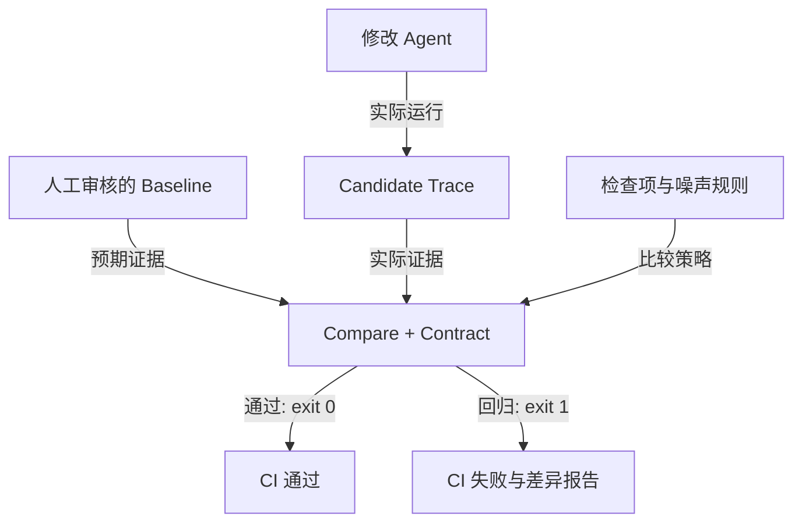

# Agent Regression Kit

[](https://github.com/ANTAO94/agent-regression-kit/actions/workflows/regression.yml)
[](https://github.com/ANTAO94/agent-regression-kit/actions/workflows/framework-compatibility.yml)
[](https://github.com/ANTAO94/agent-regression-kit/actions/workflows/tau2-independent-validation.yml)
[](https://github.com/ANTAO94/agent-regression-kit/actions/workflows/deepseek-live.yml)
[](https://github.com/ANTAO94/agent-regression-kit/releases)
[](LICENSE)

[中文](#中文) · [English](#english)

## 中文

**为 Agent 的工具调用、结构化结论和业务状态建立可审核的回归测试。**

改了 Prompt、模型或工具后，重新运行 Agent，比较审核后的 baseline 与新 candidate：有没有查错订单、漏掉必要工具、错误解读结果，或者发生不允许的状态变化？

当前版本：[v4.12.0](https://github.com/ANTAO94/agent-regression-kit/releases/tag/v4.12.0)。Python ≥3.9，核心无必需第三方运行时依赖，MIT 开源。

### 已验证的真实 Agent

这里的“真实”包含三类证据：官方框架运行时、付费在线模型，以及由独立项目维护的公开任务、轨迹和评分。三类证据回答的问题不同，结果不会互相替代。

| 测试对象 | 实际执行的 Agent 场景 | 已验证结果 | 可核验证据 |
| --- | --- | --- | --- |
| PydanticAI | `Agent + FunctionModel + get_order` 完整工具循环 | 生成合法三事件 Trace | [框架工作流](https://github.com/ANTAO94/agent-regression-kit/actions/workflows/framework-compatibility.yml) · [示例](examples/pydantic_ai_agent_example.py) |
| OpenAI Agents SDK | `Runner + Agent + function_tool` 完整工具循环 | 与 PydanticAI 跨框架比较，0 差异 | [框架工作流](https://github.com/ANTAO94/agent-regression-kit/actions/workflows/framework-compatibility.yml) · [示例](examples/openai_agents_agent_example.py) |
| LangGraph | `StateGraph + ToolNode + get_order` 完整图执行 | 正常路径通过；把订单 `123` 错传成 `456` 时被 CI 阻断 | [反例门禁](https://github.com/ANTAO94/agent-regression-kit/actions/workflows/framework-compatibility.yml) · [示例](examples/langgraph_agent_example.py) |
| LangChain Core | 真实 `RunnableLambda` 回调与事件摄取 | Python 3.9/3.11/3.13 矩阵通过 | [兼容矩阵](https://github.com/ANTAO94/agent-regression-kit/actions/workflows/framework-compatibility.yml) |
| DeepSeek 在线模型 | 真实 `deepseek-flash` 执行单工具查询和 `get_order → check_refund_eligibility` 两步依赖链 | 两份真实 Trace 校验和 baseline 比较均通过，0 差异；错误跨步参数会被阻断 | [已通过的真实运行](https://github.com/ANTAO94/agent-regression-kit/actions/runs/35485202922) · [接入说明](docs/deepseek-live.md) |
| τ²-bench 零售数据 | 独立项目发布的 456 条 `gpt-4.1-mini` 工具 Agent 轨迹；reward 在 Contract 判断后才读取 | 420 条写场景：正确放行 267、正确阻断 153、误报 0、漏报 0；准确率 100% | [独立验证工作流](https://github.com/ANTAO94/agent-regression-kit/actions/workflows/tau2-independent-validation.yml) · [方法与结果](docs/tau2-independent-validation.md) |

DeepSeek 多工具实测证据为 `get_order → result → check_refund_eligibility → result → final_answer`。模型必须把第一步返回的状态和金额传入第二步；三次请求共使用 1,118 个输入 tokens 和 132 个输出 tokens。工具顺序由测试策略固定，因此这里证明的是跨步骤数据传递，不夸大为自主规划。框架还会验证工具名、参数、结果与四个结构化 claims，并在上传产物前检查密钥没有进入 Trace 或报告。

v4.11 的 14 个误报被保留为历史证据，并驱动 v4.12 增加状态等价契约：参考写操作并不总是唯一正确路径，但放宽必须由显式规则约束。v4.12 在同一数据集上达到 0 误报、0 漏报；这份结果证明框架能够统一接收不同运行时证据、发现真实失败并量化自身误报，不代表上游项目采用或认可本框架。完整边界见 [v4.12 验收说明](docs/v4.12-acceptance.md)。

### 从这里开始

| 你想做什么 | 文档 |
| --- | --- |
| 从安装到首个成功/失败用例 | [使用手册](docs/user-manual.zh-CN.md) |
| 配置检查项、断言和噪声过滤 | [策略配置](docs/user-manual.zh-CN.md#4-配置断言噪声过滤与比较范围) |
| 看一个完整业务案例 | [退款业务案例](examples/refund-business-case/README.md) |
| 允许安全的额外查询 | [路径变化案例](examples/path-variation/README.md) |
| 收紧额外调用白名单 | [v4.7 验收说明](docs/v4.7-acceptance.md) |
| 限制工具调用次数 | [v4.8 验收说明](docs/v4.8-acceptance.md) |
| 限制场景可调用的工具目录 | [v4.9 验收说明](docs/v4.9-acceptance.md) |
| 限制每次工具调用的参数和租户/资源边界 | [v4.10 验收说明](docs/v4.10-acceptance.md) |
| 表达替代动作、最终状态与幂等重复 | [状态等价契约](docs/state-equivalence.md) · [v4.12 验收](docs/v4.12-acceptance.md) |
| 接入自己的 Agent | [接入步骤](docs/user-manual.zh-CN.md#5-接入自己的-agent) |
| 接入 PydanticAI / OpenAI Agents / LangGraph | [真实框架集成](docs/framework-integrations.md) |
| 用最低成本 DeepSeek 做真实供应商检查 | [DeepSeek 真实检查](docs/deepseek-live.md) |
| 查看独立项目上的误报、漏报与复现方法 | [τ²-bench 独立验证](docs/tau2-independent-validation.md) |
| 同一策略集成 CI | [完整 CI 工作流](docs/user-manual.zh-CN.md#6-ci使用相同配置执行门禁) |
| 理解架构、实现和边界 | [技术方案](docs/technical-design.zh-CN.md) |
| 验证发布包来源、校验和与 SBOM | [发布完整性](docs/supply-chain.md) |
| 查 API 与高级场景 | [API](docs/api.md) · [高级指南](docs/usage-guide.zh-CN.md) |
| 了解 v4.12 验收与升级 | [v4.12 验收](docs/v4.12-acceptance.md) · [状态等价契约](docs/state-equivalence.md) · [升级说明](UPGRADING.md) |
| 阅读 HTML 讲解 | [HTML 文档](docs/agent-regression-kit-guide.html)，下载后本地打开 |

### 工作方式



Trace 是一次运行的事件证据，baseline 是预期，candidate 是实际；Contract 是字段和行为约束。Claims 是由接入代码提供的结构化业务结论。

### 五分钟体验

macOS/Linux Bash/Zsh 示例。首次安装需要联网，示例不用模型密钥。

```bash
git clone --branch v4.12.0 https://github.com/ANTAO94/agent-regression-kit.git
cd agent-regression-kit
python3 -m venv .venv
source .venv/bin/activate
python -m pip install .
agent-regression --version

agent-regression record \
  --scenario examples/order-123/candidate-ok.scenario.json \
  --out work/candidate.trace.json
agent-regression compare \
  --baseline baselines/order-123.trace.json \
  --candidate work/candidate.trace.json \
  --out work/reports/compare.json
```

预期：passed=true，退出码 0。再故意录制一个错误版本：

```bash
agent-regression record \
  --scenario examples/order-123/candidate-regression.scenario.json \
  --out work/bad.trace.json
agent-regression compare \
  --baseline baselines/order-123.trace.json \
  --candidate work/bad.trace.json \
  --out work/reports/regression.json
```

预期：退出码 1，JSON 显示阻断差异。退出码 2 表示输入或校验错误。[使用手册](docs/user-manual.zh-CN.md)说明配置策略、审核 baseline、接入真实 Agent 和排错。

### 能力与边界

| 能力 | 可做的事情 | 使用边界 |
| --- | --- | --- |
| Trace / Compare | 记录工具名、参数、结果、错误、答案和 claims | 按顺序对齐，需显式插桩 |
| Contract | 字段断言、噪声过滤、归一化、工具/路径/副作用约束 | 业务期望由你定义 |
| Tool limits | 按工具限制最小/最大调用次数，可按参数计数 | 只证明 Trace 中观察到的调用次数 |
| Tool allowlist | 场景级工具目录白名单，可按参数精确匹配；未授权调用生成 `unauthorized_tool_call` | 不替代真实 Tool Gateway 的权限控制 |
| Argument policies | 对指定工具的每一次调用检查参数值、参考字段、必填/禁用字段；违规生成 `tool_argument_policy` | 只验证 Trace 中暴露的参数，不替代生产权限执行 |
| Cross-step relations | 约束后续调用引用前一步结果，以及金额、状态等业务关系 | 只比较 Trace 中已暴露的结构化证据 |
| State equivalence | 在显式声明的规则中归并替代意图，比较最终状态路径，支持受控失败尝试和幂等重复 | 不自动推断等价；忽略参数、别名和重复调用都必须显式配置 |
| 状态 / 多轮 / 异步 | 快照隔离、逐轮检查、并行组记录 | 外部状态和线程安全由接入方负责 |
| Stability / Coverage | 重复运行阈值、工具路径与业务分支覆盖 | 不是模型质量或代码覆盖率 |
| MCP | stdio / Streamable HTTP 工具接入及 Fixture | MCP 服务不等同于完整 Agent |
| SDK | Python 同步/异步 Adapter 与模板 | 无现成 Java/TypeScript SDK |
| CI / Viewer | JSON、Markdown、JUnit、报告索引、配置导出 | 页面是本地静态工具，无账号/远程执行 |
| Controlled replay | 用审核过的工具结果重跑 Agent 并严格检查调用 | 不证明真实工具实现仍然正确 |
| Path/result correlation | 按 call_id 关联结果，路径规则可约束结果和错误状态 | 需要 Trace 保留稳定 call_id |
| Framework events | 接收真实框架的工具开始/结束和最终答案回调 | 框架仍负责模型、生命周期和工具本身 |
| Workspace review | manifest、只读 baseline review、本地工作区页面 | 页面不自动读目录、不执行 Agent、不接受 baseline |
| Compatibility / migration | v4 public API、Trace/Session/Contract/Report 检查、显式迁移 | 不会静默修改源文件 |
| External project validation | 导入 τ²-bench 公开轨迹，以独立 reward 统计误报和漏报 | 当前覆盖固定版本的半双工零售写场景，不代表上游采用 |

**replay 只检查已有 Trace，不重新运行 Agent 或工具。** 需要让 Agent 在不触碰真实工具的情况下运行时，使用 v3.6 的 `replay_agent_run`/`CassetteToolExecutor`；它会阻断漏调用、多调用和参数变化。claims-only 允许措辞变化，但需要有意义的 claims 和业务断言。


```bash
agent-regression ui
```

打开终端提示的地址，默认 http://127.0.0.1:8765/index.html，选择本地 Trace/报告。配置中心导出 JSON 后再运行 CLI。GitHub 不直接运行这些 HTML 页面。

自定义断言的 CI 可以使用 **compare --config**，或在 v3.5.0+ 比较 Action 中传入 `config`；旧的 baseline/candidate 输入仍兼容。策略中的 `required_claims` 能阻止候选 Trace 通过“少报业务结论”，Report Index 的 `required-reports` 能阻止报告缺失被误认为成功。[可复制工作流](docs/user-manual.zh-CN.md#6-ci使用相同配置执行门禁)保留失败退出码并上传三种报告。

### 验证与维护

v4.12.0 的发布验收：

| 检查 | 证据 |
| --- | --- |
| 核心测试 | 本地完整测试 + [Python 3.9/3.11/3.13 CI](https://github.com/ANTAO94/agent-regression-kit/actions/workflows/regression.yml) |
| 框架兼容 | [PydanticAI、OpenAI Agents、LangGraph 与 LangChain Core](https://github.com/ANTAO94/agent-regression-kit/actions/workflows/framework-compatibility.yml) |
| 真实在线 Agent | [DeepSeek live provider：单工具、多工具依赖链、比较与密钥扫描](https://github.com/ANTAO94/agent-regression-kit/actions/runs/35485202922) |
| 构建与干净安装 | [发布流水线](https://github.com/ANTAO94/agent-regression-kit/actions/workflows/release.yml) |
| 发布完整性 | SHA-256、SPDX 2.3 SBOM 与 GitHub 签名证明，见[验证说明](docs/supply-chain.md) |
| 业务回归案例 | [v4.5 验收契约](docs/v4.5-acceptance.md) |
| 路径变化与误报控制 | [v4.6 验收契约](docs/v4.6-acceptance.md) · [路径变化案例](examples/path-variation/README.md) |
| 额外调用白名单 | [v4.7 验收契约](docs/v4.7-acceptance.md) · `extra_tool_call` 诊断 |
| 工具调用次数契约 | [v4.8 验收契约](docs/v4.8-acceptance.md) · `tool_count` 诊断 · 退款重复调用反例 |
| 场景工具白名单 | [v4.9 验收契约](docs/v4.9-acceptance.md) · `unauthorized_tool_call` 诊断 · 空白名单与参数范围反例 |
| 工具参数与租户边界 | [v4.10 验收契约](docs/v4.10-acceptance.md) · `tool_argument_policy` 诊断 · 错误订单/超额退款反例 |
| 独立项目实测 | [τ²-bench 公开零售轨迹](docs/tau2-independent-validation.md) · 420 条写场景 · 153 个失败全部阻断 · 0 误报 · 0 漏报 |
| 状态等价验收 | [v4.12 验收契约](docs/v4.12-acceptance.md) · [配置与负向用例](docs/state-equivalence.md) |
| 下载 | [wheel 与源码包](https://github.com/ANTAO94/agent-regression-kit/releases/tag/v4.12.0) |

这些验证覆盖已实现路径，生产接入仍需要自己的业务用例。官方 MCP 检查是独立的[可选工作流](.github/workflows/mcp-compatibility.yml)，不等于完整协议认证。文档更新以 main 为准，发布 tag 内容固定。

[升级](UPGRADING.md) · [变更](CHANGELOG.md) · [限制](docs/limitations.md) · [发布完整性](docs/supply-chain.md) · [安全](SECURITY.md) · [兼容矩阵](docs/compatibility-matrix.md) · [贡献](CONTRIBUTING.md)

## English

**Regression tests for Agent tool calls, structured conclusions and business state.**

After changing prompts, models or tools, run the Agent again and compare candidate evidence against a reviewed baseline. Detect wrong arguments, missing/forbidden calls, changed claims and exposed side effects.

Release: [v4.12.0](https://github.com/ANTAO94/agent-regression-kit/releases/tag/v4.12.0). Python ≥3.9, no required third-party core runtime dependencies, MIT license.

### Verified real Agents

“Real” evidence covers official framework runtimes, paid hosted models, and
published tasks, trajectories and rewards maintained by an independent project.
Each category answers a different validation question.

| Target | Agent run actually executed | Verified result | Evidence |
| --- | --- | --- | --- |
| PydanticAI | `Agent + FunctionModel + get_order` tool loop | Valid three-event Trace | [Framework workflow](https://github.com/ANTAO94/agent-regression-kit/actions/workflows/framework-compatibility.yml) · [Example](examples/pydantic_ai_agent_example.py) |
| OpenAI Agents SDK | `Runner + Agent + function_tool` tool loop | Cross-framework comparison with PydanticAI: 0 differences | [Framework workflow](https://github.com/ANTAO94/agent-regression-kit/actions/workflows/framework-compatibility.yml) · [Example](examples/openai_agents_agent_example.py) |
| LangGraph | `StateGraph + ToolNode + get_order` graph execution | Normal path passes; changing order `123` to `456` is blocked | [Negative gate](https://github.com/ANTAO94/agent-regression-kit/actions/workflows/framework-compatibility.yml) · [Example](examples/langgraph_agent_example.py) |
| LangChain Core | Real `RunnableLambda` callback and event ingestion | Python 3.9/3.11/3.13 matrix passes | [Compatibility matrix](https://github.com/ANTAO94/agent-regression-kit/actions/workflows/framework-compatibility.yml) |
| Hosted DeepSeek | Real `deepseek-flash` runs a single-tool lookup and a `get_order → check_refund_eligibility` dependency chain | Both live traces pass validation and baseline comparison with 0 differences; wrong cross-step arguments are blocked | [Passing live run](https://github.com/ANTAO94/agent-regression-kit/actions/runs/35485202922) · [Guide](docs/deepseek-live.md) |
| τ²-bench retail | 456 published `gpt-4.1-mini` tool-Agent trajectories with reward labels hidden until after each Contract decision | 420 write scenarios: 267 true passes, 153 true blocks, 0 false alarms and 0 missed failures; 100% accuracy | [Independent workflow](https://github.com/ANTAO94/agent-regression-kit/actions/workflows/tau2-independent-validation.yml) · [Method and evidence](docs/tau2-independent-validation.md) |

The multi-tool DeepSeek path is `get_order → result → check_refund_eligibility
→ result → final_answer`. The model must propagate status and amount from the
first result into the second call; three requests used 1,118 input and 132
output tokens. Tool order is fixed by test policy, so this proves cross-step
data propagation rather than autonomous planning. The gate keeps tools,
arguments, results and four business claims strict, then scans artifacts for
the active credential before upload.

This evidence proves that the current kit can normalize different Agent
runtimes, detect a real argument regression and gate a hosted model in CI. It
does not claim coverage of every model, multi-Agent topology or long-running
production workload. The independent project does not imply upstream adoption
or endorsement. See the [v4.12 acceptance contract](docs/v4.12-acceptance.md).

### Documentation

| Goal | Read |
| --- | --- |
| Install and reproduce pass/fail behavior | [User manual](docs/user-manual.en.md) |
| Configure assertions and noise filtering | [Comparison policy](docs/user-manual.en.md#4-configure-assertions-and-noise-filtering) |
| See a complete business case | [Refund business case](examples/refund-business-case/README.md) |
| Allow a safe extra query | [Path variation example](examples/path-variation/README.md) |
| Constrain tolerant extra calls | [v4.7 acceptance](docs/v4.7-acceptance.md) |
| Enforce per-tool call counts | [v4.8 acceptance](docs/v4.8-acceptance.md) |
| Restrict the scenario tool catalog | [v4.9 acceptance](docs/v4.9-acceptance.md) |
| Constrain every tool call's arguments and tenant/resource boundary | [v4.10 acceptance](docs/v4.10-acceptance.md) |
| Express alternative actions, final state and idempotent retries | [State-equivalence contracts](docs/state-equivalence.md) · [v4.12 acceptance](docs/v4.12-acceptance.md) |
| Connect your own Agent | [Integration](docs/user-manual.en.md#5-integrate-your-own-agent) |
| Connect PydanticAI / OpenAI Agents / LangGraph | [Real framework integrations](docs/framework-integrations.md) |
| Run a low-cost live DeepSeek provider check | [DeepSeek live check](docs/deepseek-live.md) |
| Inspect measured false alarms and missed failures on an independent project | [τ²-bench validation](docs/tau2-independent-validation.md) |
| Use the same policy in CI | [Complete workflow](docs/user-manual.en.md#6-use-the-same-policy-in-ci) |
| Understand architecture and boundaries | [Technical design](docs/technical-design.en.md) |
| Verify release provenance, checksums and SBOM | [Release integrity](docs/supply-chain.md) |
| Explore advanced APIs | [API reference](docs/api.md) · [Advanced guide](docs/usage-guide.en.md) |
| Read the v4.12 acceptance and upgrade contract | [v4.12 acceptance](docs/v4.12-acceptance.md) · [State-equivalence contracts](docs/state-equivalence.md) · [Upgrade guide](UPGRADING.md) |

### Quick start

Bash/Zsh on macOS/Linux. Installation needs network access; examples need no model credentials.

```bash
git clone --branch v4.12.0 https://github.com/ANTAO94/agent-regression-kit.git
cd agent-regression-kit
python3 -m venv .venv
source .venv/bin/activate
python -m pip install .
agent-regression --version

agent-regression record \
  --scenario examples/order-123/candidate-ok.scenario.json \
  --out work/candidate.trace.json
agent-regression compare \
  --baseline baselines/order-123.trace.json \
  --candidate work/candidate.trace.json \
  --out work/reports/compare.json
```

Expected: passed=true and exit 0. Prove a regression fails:

```bash
agent-regression record \
  --scenario examples/order-123/candidate-regression.scenario.json \
  --out work/bad.trace.json
agent-regression compare \
  --baseline baselines/order-123.trace.json \
  --candidate work/bad.trace.json \
  --out work/reports/regression.json
```

Expected: exit 1 and blocking differences. Exit 2 means invalid inputs or validation failure.

A Trace records one run; baseline is reviewed expectation; candidate is new evidence. Contracts express explicit business rules. Claims are structured conclusions emitted by the integration, not inferred automatically from prose.

### Capabilities and boundaries

| Feature | Provides | Boundary |
| --- | --- | --- |
| Trace / Compare | Calls, arguments, results, errors, answer and claims comparison | Ordered alignment, explicit instrumentation |
| Contracts | Assertions, noise filters, normalizers, tool/path/state constraints | Integrator-owned expectations |
| Tool limits | Per-tool minimum/maximum counts, optionally scoped by arguments | Only observed Trace call counts |
| Tool allowlist | Scenario-level permitted tool catalog with optional exact arguments | Does not replace permissions in the real Tool Gateway |
| Argument policies | Check every call's argument values, Trace references, required and forbidden fields; emit `tool_argument_policy` | Verifies exposed Trace arguments; does not replace production authorization |
| State / sessions / async | Snapshot isolation, per-turn checks, parallel groups | Integrator-owned cleanup and thread safety |
| Stability / coverage | Repeat thresholds and observed tool/business branches | Not model quality or code coverage |
| MCP | stdio / Streamable HTTP tools and controlled fixtures | Not a complete Agent framework |
| SDK | Python sync/async adapters and templates | No bundled Java/TypeScript SDK |
| Reports / UI | JSON, Markdown, JUnit, index and config export | Local static UI, no hosted management backend |
| Compatibility / migration | v4 public API and document checks, explicit Trace migration | Source files are never silently rewritten |
| External project validation | Imports published τ²-bench trajectories and measures decisions against an independent reward | Pinned half-duplex retail write scenarios only; no upstream adoption claim |

**replay inspects recorded evidence; it does not re-execute Agents or tools.** Record a new candidate to test changes. claims-only permits prose changes but needs meaningful claims and business assertions.

Run agent-regression ui, open the printed loopback URL and select local files. Save exported configuration before CLI checks. GitHub HTML links display source rather than a running page.

Use **compare --config** for custom contracts in CI, or pass `config` to the v3.5.0+ comparison Action. The legacy baseline/candidate Action inputs remain compatible. `required_claims` prevents a candidate from passing by omitting a business conclusion, Report Index `required-reports` turns missing artifacts into a failure, and controlled replay checks an Agent without calling live tools. The [documented workflow](docs/user-manual.en.md#6-use-the-same-policy-in-ci) preserves exit codes and uploads all three report formats.

### Verification and maintenance

Recorded v4.12.0 evidence is maintained by the main regression, framework compatibility, path-variation, refund, τ²-bench, live-provider and release workflows; each release also includes local full-test, wheel-build, compatibility, migration and clean-install checks.

Tagged releases additionally publish SHA-256 checksums, an SPDX 2.3 release
SBOM, and GitHub-signed provenance/SBOM attestations. See the
[release integrity guide](docs/supply-chain.md) before consuming an artifact in
a sensitive environment.

These checks cover implemented paths; production integrations need their own scenarios. The [optional MCP workflow](.github/workflows/mcp-compatibility.yml) is separate and does not certify every protocol behavior. Main contains documentation updates; published tags are fixed snapshots.


```bash
PYTHONPATH=src python3 -m unittest discover -s tests -q
```

[Upgrading](UPGRADING.md) · [Changelog](CHANGELOG.md) · [Limitations](docs/limitations.md) · [Compatibility](docs/compatibility-matrix.md) · [Contributing](CONTRIBUTING.md)
