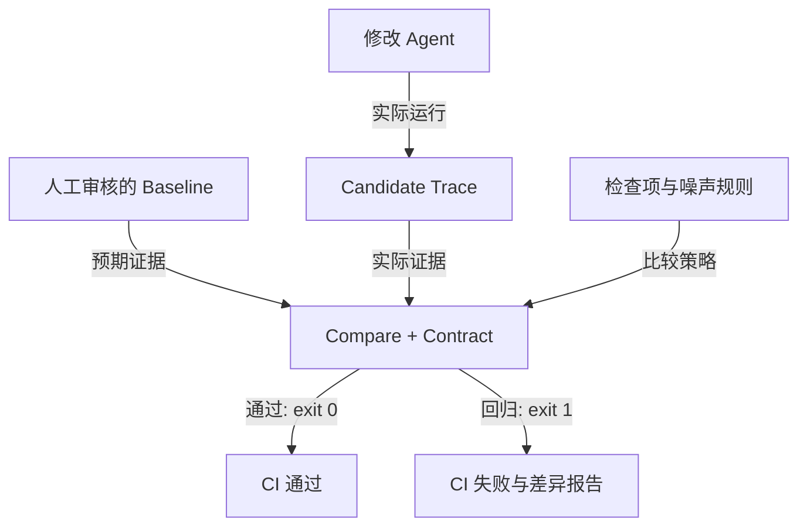

# Agent Regression Kit

[](https://github.com/ANTAO94/agent-regression-kit/actions/workflows/regression.yml)
[](https://github.com/ANTAO94/agent-regression-kit/releases)
[](LICENSE)

[中文](#中文) · [English](#english)

## 中文

**为 Agent 的工具调用、结构化结论和业务状态建立可审核的回归测试。**

改了 Prompt、模型或工具后，重新运行 Agent，比较审核后的 baseline 与新 candidate：有没有查错订单、漏掉必要工具、错误解读结果，或者发生不允许的状态变化？

当前版本：[v3.5.0](https://github.com/ANTAO94/agent-regression-kit/releases/tag/v3.5.0)。Python ≥3.9，核心无必需第三方运行时依赖，MIT 开源。

### 从这里开始

| 你想做什么 | 文档 |
| --- | --- |
| 从安装到首个成功/失败用例 | [使用手册](docs/user-manual.zh-CN.md) |
| 配置检查项、断言和噪声过滤 | [策略配置](docs/user-manual.zh-CN.md#4-配置断言噪声过滤与比较范围) |
| 接入自己的 Agent | [接入步骤](docs/user-manual.zh-CN.md#5-接入自己的-agent) |
| 同一策略集成 CI | [完整 CI 工作流](docs/user-manual.zh-CN.md#6-ci使用相同配置执行门禁) |
| 理解架构、实现和边界 | [技术方案](docs/technical-design.zh-CN.md) |
| 查 API 与高级场景 | [API](docs/api.md) · [高级指南](docs/usage-guide.zh-CN.md) |
| 阅读 HTML 讲解 | [HTML 文档](docs/agent-regression-kit-guide.html)，下载后本地打开 |

### 工作方式



Trace 是一次运行的事件证据，baseline 是预期，candidate 是实际；Contract 是字段和行为约束。Claims 是由接入代码提供的结构化业务结论。

### 五分钟体验

macOS/Linux Bash/Zsh 示例。首次安装需要联网，示例不用模型密钥。

```bash
git clone --branch v3.5.0 https://github.com/ANTAO94/agent-regression-kit.git
cd agent-regression-kit
python3 -m venv .venv
source .venv/bin/activate
python -m pip install .
agent-regression --version

agent-regression record \
  --scenario examples/order-123/candidate-ok.scenario.json \
  --out work/candidate.trace.json
agent-regression compare \
  --baseline baselines/order-123.trace.json \
  --candidate work/candidate.trace.json \
  --out work/reports/compare.json
```

预期：passed=true，退出码 0。再故意录制一个错误版本：

```bash
agent-regression record \
  --scenario examples/order-123/candidate-regression.scenario.json \
  --out work/bad.trace.json
agent-regression compare \
  --baseline baselines/order-123.trace.json \
  --candidate work/bad.trace.json \
  --out work/reports/regression.json
```

预期：退出码 1，JSON 显示阻断差异。退出码 2 表示输入或校验错误。[使用手册](docs/user-manual.zh-CN.md)说明配置策略、审核 baseline、接入真实 Agent 和排错。

### 能力与边界

| 能力 | 可做的事情 | 使用边界 |
| --- | --- | --- |
| Trace / Compare | 记录工具名、参数、结果、错误、答案和 claims | 按顺序对齐，需显式插桩 |
| Contract | 字段断言、噪声过滤、归一化、工具/路径/副作用约束 | 业务期望由你定义 |
| 状态 / 多轮 / 异步 | 快照隔离、逐轮检查、并行组记录 | 外部状态和线程安全由接入方负责 |
| Stability / Coverage | 重复运行阈值、工具路径与业务分支覆盖 | 不是模型质量或代码覆盖率 |
| MCP | stdio / Streamable HTTP 工具接入及 Fixture | MCP 服务不等同于完整 Agent |
| SDK | Python 同步/异步 Adapter 与模板 | 无现成 Java/TypeScript SDK |
| CI / Viewer | JSON、Markdown、JUnit、报告索引、配置导出 | 页面是本地静态工具，无账号/远程执行 |

**replay 只检查已有 Trace，不重新运行 Agent 或工具。** 测新版本必须重新录制 candidate。claims-only 允许措辞变化，但需要有意义的 claims 和业务断言。


```bash
agent-regression ui
```

打开终端提示的地址，默认 http://127.0.0.1:8765/index.html，选择本地 Trace/报告。配置中心导出 JSON 后再运行 CLI。GitHub 不直接运行这些 HTML 页面。

自定义断言的 CI 可以使用 **compare --config**，或在 v3.5.0 比较 Action 中传入 `config`；旧的 baseline/candidate 输入仍兼容。策略中的 `required_claims` 能阻止候选 Trace 通过“少报业务结论”，Report Index 的 `required-reports` 能阻止报告缺失被误认为成功。[可复制工作流](docs/user-manual.zh-CN.md#6-ci使用相同配置执行门禁)保留失败退出码并上传三种报告。

### 验证与维护

v3.5.0 的发布验收：

| 检查 | 证据 |
| --- | --- |
| 核心测试 | 本地完整测试 + [Python 3.9/3.11/3.13 CI](https://github.com/ANTAO94/agent-regression-kit/actions/workflows/regression.yml) |
| 框架回调 | [LangChain Core 三版本矩阵](https://github.com/ANTAO94/agent-regression-kit/actions/runs/35349647091) |
| 构建与干净安装 | [发布流水线](https://github.com/ANTAO94/agent-regression-kit/actions/runs/35349647344) |
| 下载 | [wheel 与源码包](https://github.com/ANTAO94/agent-regression-kit/releases/tag/v3.5.0) |

这些验证覆盖已实现路径，生产接入仍需要自己的业务用例。官方 MCP 检查是独立的[可选工作流](.github/workflows/mcp-compatibility.yml)，不等于完整协议认证。文档更新以 main 为准，发布 tag 内容固定。

[升级](UPGRADING.md) · [变更](CHANGELOG.md) · [限制](docs/limitations.md) · [兼容矩阵](docs/compatibility-matrix.md) · [贡献](CONTRIBUTING.md)

## English

**Regression tests for Agent tool calls, structured conclusions and business state.**

After changing prompts, models or tools, run the Agent again and compare candidate evidence against a reviewed baseline. Detect wrong arguments, missing/forbidden calls, changed claims and exposed side effects.

Release: [v3.5.0](https://github.com/ANTAO94/agent-regression-kit/releases/tag/v3.5.0). Python ≥3.9, no required third-party core runtime dependencies, MIT license.

### Documentation

| Goal | Read |
| --- | --- |
| Install and reproduce pass/fail behavior | [User manual](docs/user-manual.en.md) |
| Configure assertions and noise filtering | [Comparison policy](docs/user-manual.en.md#4-configure-assertions-and-noise-filtering) |
| Connect your own Agent | [Integration](docs/user-manual.en.md#5-integrate-your-own-agent) |
| Use the same policy in CI | [Complete workflow](docs/user-manual.en.md#6-use-the-same-policy-in-ci) |
| Understand architecture and boundaries | [Technical design](docs/technical-design.en.md) |
| Explore advanced APIs | [API reference](docs/api.md) · [Advanced guide](docs/usage-guide.en.md) |

### Quick start

Bash/Zsh on macOS/Linux. Installation needs network access; examples need no model credentials.

```bash
git clone --branch v3.5.0 https://github.com/ANTAO94/agent-regression-kit.git
cd agent-regression-kit
python3 -m venv .venv
source .venv/bin/activate
python -m pip install .
agent-regression --version

agent-regression record \
  --scenario examples/order-123/candidate-ok.scenario.json \
  --out work/candidate.trace.json
agent-regression compare \
  --baseline baselines/order-123.trace.json \
  --candidate work/candidate.trace.json \
  --out work/reports/compare.json
```

Expected: passed=true and exit 0. Prove a regression fails:

```bash
agent-regression record \
  --scenario examples/order-123/candidate-regression.scenario.json \
  --out work/bad.trace.json
agent-regression compare \
  --baseline baselines/order-123.trace.json \
  --candidate work/bad.trace.json \
  --out work/reports/regression.json
```

Expected: exit 1 and blocking differences. Exit 2 means invalid inputs or validation failure.

A Trace records one run; baseline is reviewed expectation; candidate is new evidence. Contracts express explicit business rules. Claims are structured conclusions emitted by the integration, not inferred automatically from prose.

### Capabilities and boundaries

| Feature | Provides | Boundary |
| --- | --- | --- |
| Trace / Compare | Calls, arguments, results, errors, answer and claims comparison | Ordered alignment, explicit instrumentation |
| Contracts | Assertions, noise filters, normalizers, tool/path/state constraints | Integrator-owned expectations |
| State / sessions / async | Snapshot isolation, per-turn checks, parallel groups | Integrator-owned cleanup and thread safety |
| Stability / coverage | Repeat thresholds and observed tool/business branches | Not model quality or code coverage |
| MCP | stdio / Streamable HTTP tools and controlled fixtures | Not a complete Agent framework |
| SDK | Python sync/async adapters and templates | No bundled Java/TypeScript SDK |
| Reports / UI | JSON, Markdown, JUnit, index and config export | Local static UI, no hosted management backend |

**replay inspects recorded evidence; it does not re-execute Agents or tools.** Record a new candidate to test changes. claims-only permits prose changes but needs meaningful claims and business assertions.

Run agent-regression ui, open the printed loopback URL and select local files. Save exported configuration before CLI checks. GitHub HTML links display source rather than a running page.

Use **compare --config** for custom contracts in CI, or pass `config` to the v3.5.0 comparison Action. The legacy baseline/candidate Action inputs remain compatible. `required_claims` prevents a candidate from passing by omitting a business conclusion, and Report Index `required-reports` turns missing artifacts into a failure. The [documented workflow](docs/user-manual.en.md#6-use-the-same-policy-in-ci) preserves exit codes and uploads all three report formats.

### Verification and maintenance

Recorded v3.5.0 evidence is maintained by the main regression, framework compatibility and release workflows; each release also includes local full-test, wheel-build and clean-install checks.

These checks cover implemented paths; production integrations need their own scenarios. The [optional MCP workflow](.github/workflows/mcp-compatibility.yml) is separate and does not certify every protocol behavior. Main contains documentation updates; published tags are fixed snapshots.


```bash
PYTHONPATH=src python3 -m unittest discover -s tests -q
```

[Upgrading](UPGRADING.md) · [Changelog](CHANGELOG.md) · [Limitations](docs/limitations.md) · [Compatibility](docs/compatibility-matrix.md) · [Contributing](CONTRIBUTING.md)
