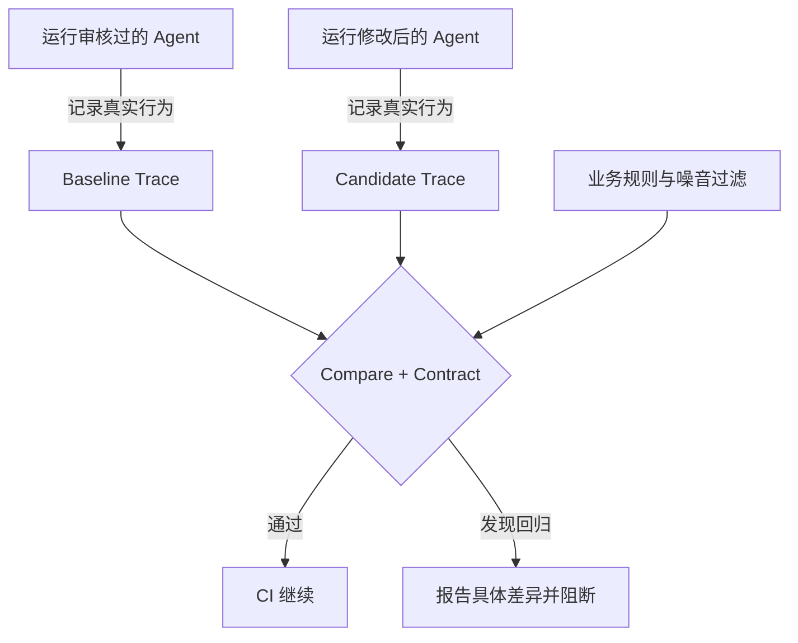

# Agent Regression Kit

[](https://github.com/ANTAO94/agent-regression-kit/actions/workflows/regression.yml)
[](https://github.com/ANTAO94/agent-regression-kit/releases)
[](setup.cfg)
[](LICENSE)

**给 AI Agent 加回归测试：在 Prompt、模型、工具或代码变化后，发现错误工具、错误参数、漏步骤和错误业务结论。**

[English](README.en.md) · [5 分钟上手](#5-分钟跑通) · [接入自己的-agent](#接入自己的-agent) · [CI](#放进-ci) · [中文手册](docs/user-manual.zh-CN.md) · [技术设计](docs/technical-design.zh-CN.md)

Python ≥ 3.9 · 当前 Release `v4.36.1` · 核心无必需第三方运行时依赖

## Contents

- [为什么需要它](#为什么需要它)
- [工作方式](#工作方式)
- [5 分钟跑通](#5-分钟跑通)
- [接入自己的 Agent](#接入自己的-agent)
- [配置业务规则与噪音过滤](#配置业务规则与噪音过滤)
- [放进 CI](#放进-ci)
- [当前能力与验证状态](#当前能力)
- [边界与文档导航](#不解决什么)

## 为什么需要它

Agent 的问题往往不在最后一句话，而在中间过程。修改一个 Prompt 后，回答看起来仍然合理，但 Agent 可能已经：

- 调用了错误工具，或者漏掉必要步骤；
- 把 `order_id="123"` 传成 `132`；
- 重复执行退款等有副作用的操作；
- 正确拿到“未发货”，却回答成“已发货”；
- 走了一条结果相同、但风险完全不同的工具路径。

Agent Regression Kit 将一次真实运行保存为结构化 **Trace**，再把新运行与审核过的 **Baseline** 和业务 **Contract** 比较。差异会进入报告，并通过退出码直接阻断 CI。

| 同一个请求：查询订单 123 | 工具行为 | 最终结论 | 结果 |
| --- | --- | --- | --- |
| 审核过的版本 | `get_order(order_id="123")` | 未发货 | 保存为 Baseline |
| 修改后的正常版本 | 同一个工具和订单 | 未发货 | 通过 |
| 参数回归 | `get_order(order_id="132")` | 另一个订单的状态 | 阻断 |
| 结果误读 | 参数和工具结果都正确 | 错误地回答“已发货” | 阻断 |

### 它和评测平台有什么不同

| | 评测平台 | Agent Regression Kit |
| --- | --- | --- |
| 回答的问题 | Agent 整体表现有多好 | 这次改动具体弄坏了什么 |
| 典型输出 | 得分、准确率、通过率 | 工具、参数、结果、状态或 claims 的结构化差异 |
| 运行时机 | 定期评测、模型选型、版本验收 | 每次 PR、Prompt 或工具修改 |
| 核心对象 | Dataset、Case、Scorer | Baseline、Candidate Trace、Contract |

两者可以组合：评测平台负责数据集、批量运行和质量指标，本项目负责行为证据、差异定位和 CI 回归门禁。

## 工作方式



一句话：保留正确版本的运行证据，每次改动后重新运行，比较器负责解释变化并决定 CI 是否放行。

| 名词 | 含义 | 常见文件 |
| --- | --- | --- |
| Trace | 一次 Agent 运行中的请求、工具调用、参数、结果、最终回答和结构化结论 | `*.trace.json` |
| Baseline | 由人审核正确并提交到 Git 的参考 Trace | `baselines/*.trace.json` |
| Candidate | 当前代码重新运行得到的 Trace | `work/*.trace.json` |
| Contract | 必须调用/禁止调用的工具、业务断言、路径和副作用规则 | `.agent-regression/config.json` |
| Claims | 从 Agent **实际输出**提取的结构化业务事实 | `final_answer.claims` |

> 框架不会自动知道业务正确答案。Baseline 必须审核；claims 必须来自实际输出，不能预填“正确答案”。

## 5 分钟跑通

以下示例完全离线，不需要模型 API Key。命令适用于 macOS、Linux 和 Windows WSL。

### 1. 安装

```bash
python3 -m venv .venv
source .venv/bin/activate
python -m pip install "git+https://github.com/ANTAO94/agent-regression-kit.git@v4.36.1"
agent-regression --version
```

### 2. 生成可运行项目

```bash
mkdir agent-regression-demo
cd agent-regression-demo
agent-regression init
```

`init` 会生成一个离线 Agent、固定工具结果、starter baseline、严格 Contract、CI 示例和接入说明。这个 baseline 只适用于模板场景，不代表你的业务已经审核通过。

### 3. 运行正常场景

```bash
python scripts/record_agent.py \
  --variant normal \
  --out work/my-agent.trace.json
agent-regression check --config .agent-regression/config.json
agent-regression compare --config .agent-regression/config.json
```

预期 `passed: true`，退出码为 **0**。

### 4. 确认门禁真的会失败

```bash
python scripts/record_agent.py \
  --variant wrong-resource \
  --out work/my-agent.trace.json
agent-regression compare --config .agent-regression/config.json
```

预期 `passed: false`，退出码为 **1**。这表示框架成功发现回归，不是命令执行失败。报告会指出错误资源、缺失调用、参数变化或业务结论差异。

其他内置负向变体：`skip-tool` 和 `misread-result`。

### 5. 查看报告

```bash
agent-regression ui
```

打开终端给出的本地地址，可查看 Trace、比较报告和配置。Viewer 是只读本地页面；比较结果仍以 Python CLI 为准。

## 接入自己的 Agent

模板只是演示。真实接入需要完成三件事：

1. 在工具执行边界记录工具名、真实参数和真实返回值；
2. 记录 Agent 实际产生的最终回答；
3. 将需要稳定检查的业务结论提取成结构化 claims。

| 你的 Agent | 推荐入口 |
| --- | --- |
| PydanticAI、OpenAI Agents SDK、LangGraph | [框架转换器](docs/framework-integrations.md) |
| 自己实现的 Python Agent | [Callback 示例](examples/framework_callback_example.py) |
| 已有工具开始/结束事件 | [事件接入示例](examples/langchain_core_event_example.py) |
| MCP 工具或 Server | [MCP 示例](examples/mcp_record_example.py) |
| 需要同步/异步 Adapter 模板 | `agent-regression adapter-init --name my-agent --mode both` |

最小接入代码中，各部分职责如下：

| 代码位置 | 责任 |
| --- | --- |
| `invoke_framework(request, context)` | 调用真实 Agent |
| `context.call_tool(...)` | 让真实工具执行经过记录边界 |
| `context.final_answer(text, claims)` | 保存真实回答及从中提取的业务事实 |

首次运行后，检查 Trace 中的参数、结果和 claims，确认正确再接受基线：

```bash
agent-regression baseline accept \
  --trace work/my-agent.trace.json \
  --out baselines/my-agent.trace.json
```

之后只重新生成 candidate。**不要在 CI 中自动覆盖 baseline。**

仓库还提供一条固定 commit 的[独立 LangGraph 项目接入验证](docs/p1-langgraph-agent-stack-validation.md)：不修改候选项目业务图，从真实事件流记录 Agent 实际消费的工具证据，并验证参数回归、漏调用、结果误读和证据正文损坏。它是确定性技术预演，不代表上游采用或在线模型质量。

## 配置业务规则与噪音过滤

Baseline 保存参考行为，config 保存判断规则。下面的配置允许回答措辞变化，但仍检查工具、参数和业务结论：

```json
{
  "baseline": "baselines/my-agent.trace.json",
  "candidate": "work/my-agent.trace.json",
  "report": "work/reports/compare.json",
  "final_answer_mode": "claims-only",
  "contract": {
    "required_claims": ["final_answer.claims.order_status"],
    "assertions": [
      {
        "path": "final_answer.claims.order_status",
        "equals": "not_shipped"
      }
    ],
    "must_call": [
      {
        "tool": "get_order",
        "arguments": {"order_id": "123"}
      }
    ],
    "must_not_call": ["cancel_order", "refund"],
    "ignore_paths": ["tool_results[*].result.request_id"]
  }
}
```

```bash
agent-regression check --config .agent-regression/config.json
agent-regression compare --config .agent-regression/config.json
```

常用规则：

| 诉求 | 配置能力 |
| --- | --- |
| 忽略 request ID、时间戳等噪音 | `ignore_paths`、normalizers |
| 必须/禁止调用某工具 | `must_call`、`must_not_call`、`tool_allowlist` |
| 限制次数、防止循环 | `tool_limits`、`max_steps` |
| 允许多条安全路径 | `path_rules`、`state_equivalence` |
| 检查跨步骤参数 | `relations` |
| 检查执行前后状态和副作用 | world-state snapshots、`side_effects` |
| 允许措辞变化但保留业务判断 | `claims-only` + required claims + assertions |

任何放宽规则都应配一个邻近负向用例：例如忽略 `request_id` 后，错误 `order_id` 仍必须失败。完整字段见[配置手册](docs/user-manual.zh-CN.md)。

## 放进 CI

项目中需要提交三类文件：

```text
scripts/record_agent.py                 每次运行真实 Agent，生成 candidate
baselines/my-agent.trace.json           人工审核并提交的 baseline
.agent-regression/config.json           Contract 和比较策略
```

最小 GitHub Actions：

```yaml
name: Agent regression
on: [push, pull_request]

jobs:
  regression:
    runs-on: ubuntu-latest
    steps:
      - uses: actions/checkout@v7
      - uses: actions/setup-python@v7
        with:
          python-version: "3.11"
      - name: Install
        run: python -m pip install "git+https://github.com/ANTAO94/agent-regression-kit.git@v4.36.1"
      - name: Record candidate
        run: python scripts/record_agent.py --out work/my-agent.trace.json
      - name: Compare
        run: agent-regression compare --config .agent-regression/config.json
      - name: Upload report
        if: always()
        uses: actions/upload-artifact@v7
        with:
          name: agent-regression-report
          path: work/reports/
          if-no-files-found: error
```

退出码约定：**0 = 通过，1 = 发现回归，2 = 输入、配置或运行错误。** 不要给比较命令添加 `|| true` 或 `continue-on-error`。

## 当前能力

- 结构化 Trace、baseline/candidate 比较和确定性 Contract；
- 工具参数、结果、调用次数、调用路径和未授权工具检查；
- 跨步骤关系、最终状态、副作用和状态隔离；
- 同步、异步、并发、多轮 Session 和稳定性重复运行；
- MCP stdio / Streamable HTTP 记录与协议边界；
- PydanticAI、OpenAI Agents SDK、LangGraph 和 LangChain Core 接入；
- JSON、Markdown、JUnit、GitHub Job Summary 和本地 Viewer；
- 脱敏、历史趋势、批量场景、覆盖率和可审计 study/benchmark。

## 已验证到什么程度

当前源码适合本地开发和团队 CI 试点。主分支测试矩阵覆盖 Python 3.9、3.11 和 3.13；当前源码树通过 **303 个测试和 35 个子测试**。

| 证据 | 已验证 | 不能说明 |
| --- | --- | --- |
| [独立消费仓库](docs/consumer-pilot.md) | 发布 wheel、公开 API、CLI 和三类回归门禁可在独立仓库运行 | 不代表无代码兼容所有 Agent |
| [独立 LangGraph 技术预演](docs/p1-langgraph-agent-stack-validation.md) | 真实外部 graph 的事件接入、固定资料和四类负向场景 | 不代表上游采用或在线模型质量 |
| [DeepSeek 实测](docs/deepseek-live.md) | 真实模型的订单查询和两步工具依赖 | 不代表所有模型或所有业务可靠 |
| [τ²-bench](docs/tau2-independent-validation.md) | 固定公开轨迹上的规则验证和误报/漏报记录 | 不代表未见数据泛化 |
| AgentDojo 验收矩阵 | 固定公开安全轨迹的 Contract、哈希和重复性 | 不代表完整安全率 |

仍缺少：10–20 个业务负责人审核的真实案例、多个独立项目连续使用、真实改动周期中的误报/漏报记录，以及未参与开发者的可用性研究。详见[后续迭代方案](docs/product-iteration-plan.zh-CN.md)和[能力限制](docs/limitations.md)。

## 不解决什么

本项目不会自动判断任意自然语言是否真实，也不是生产 Tool Gateway、权限系统、租户隔离、DLP 或模型安全沙箱。它只能检查已经记录的证据和明确配置的规则；隐藏副作用需要项目提供状态快照，真实写操作需要隔离环境。

## 文档导航

| 目标 | 文档 |
| --- | --- |
| 从零接入和全部配置 | [中文使用手册](docs/user-manual.zh-CN.md) |
| 理解架构和核心边界 | [技术设计](docs/technical-design.zh-CN.md) |
| 接入主流 Agent 框架 | [框架集成](docs/framework-integrations.md) |
| 配置合法路径和最终状态 | [状态等价](docs/state-equivalence.md) · [路径变化示例](examples/path-variation/README.md) |
| 排查安装、配置和退出码 | [常见问题](docs/usage-guide.zh-CN.md#7-常见问题) |
| 升级旧版本 | [升级说明](UPGRADING.md) · [Changelog](CHANGELOG.md) |
| 查看真实验证和下一阶段 | [证据清单](docs/maturity-roadmap.md) · [迭代方案](docs/product-iteration-plan.zh-CN.md) |
| 安全与贡献 | [Security](SECURITY.md) · [Contributing](CONTRIBUTING.md) |

## 本地开发

```bash
python3 -m venv .venv
source .venv/bin/activate
python -m pip install .
python -m unittest discover -s tests -v
```

## License

[MIT](LICENSE)
