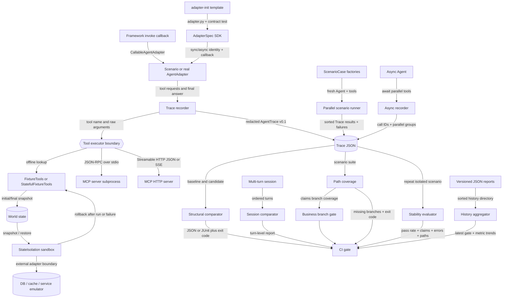
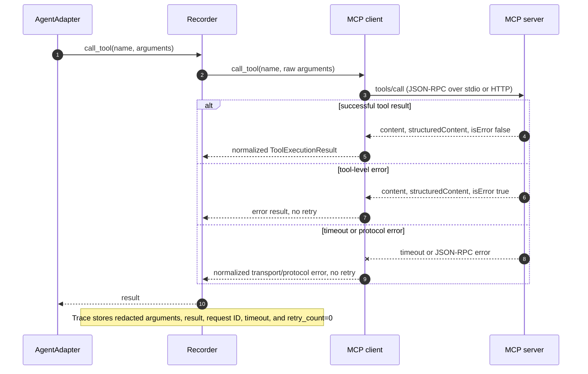
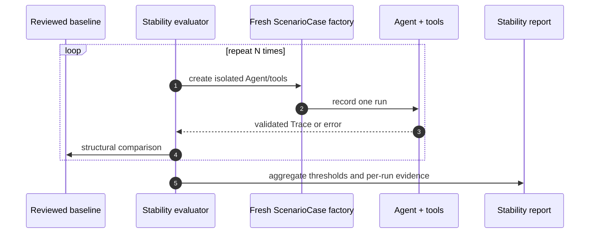
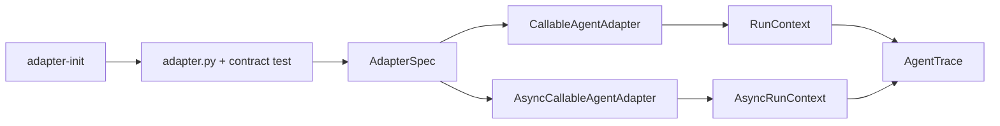
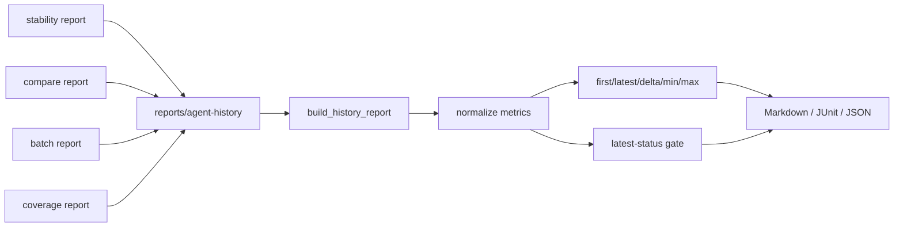

# Architecture

See the [current technical design](technical-design.en.md) / [中文技术方案](technical-design.zh-CN.md) for a layered explanation, exact replay semantics and failure boundaries.

This document describes Agent Regression Kit v4.4 and its local Viewer. The core question is: how does a live or scripted agent run become deterministic regression evidence without coupling comparison logic to an agent framework, leaking mutable test state between cases, making a large scenario suite run serially, hiding repeat-run instability, losing meaning when tools finish asynchronously, forcing every integration author to rediscover the adapter boundary, or losing long-term trend context between releases?

The recorder is the stable center: adapters produce actions, executors isolate tool effects, and downstream comparison consumes only redacted AgentTrace documents.

The Viewer is deliberately outside the evidence core. `agent-regression ui`
serves static Trace, Diff, report-index, and configuration pages on loopback; it reads Trace and compare report files in the
browser, but it does not execute Agents, recompute policy decisions, mutate
baselines, or upload evidence. The Python library and CLI remain the source of
truth for comparison outcomes.

## Component boundaries

- `AgentAdapter` translates one framework-specific run into `RunContext.call_tool` and `RunContext.final_answer` calls. It does not compare or score.
- `CallableAgentAdapter` is the low-boilerplate bridge for a framework's `invoke` callback. It standardizes the boundary but deliberately does not auto-discover or control framework internals.
- `ToolExecutor` owns tool execution. `FixtureTools` is deterministic and in-process; `McpToolExecutor` delegates to either a child process or an HTTP endpoint.
- `StatefulFixtureTools` owns a detached mutable `WorldState` for business scenarios. Its `snapshot()` boundary lets the recorder prove initial/final state and lets the comparator report field-level side effects.
- `SnapshotBackend` is the minimal external-state contract: `snapshot()` captures a detached test-safe representation and `restore(snapshot)` rolls it back. `StateIsolation` applies that contract as a context manager; `isolated_record_run` and `isolated_record_session` guarantee cleanup after normal or exceptional Agent execution.
- `ScenarioCase` owns factories for one Agent and one tool executor. `record_scenario_batch` runs those independent cases with bounded threads, captures failures per case, and sorts results by `case_id` so concurrency does not make reports flaky.
- `record_stability` reuses the same factory and isolation boundary for repeated runs, compares every run to one baseline, and turns pass rate, claims match, tool errors, and path variants into explicit thresholds.
- `AsyncAgentAdapter` and `AsyncCallableAgentAdapter` expose an async framework boundary. `async_record_run` assigns call IDs when calls are created, stores grouped results in that order, and records the explicit parallel-group shape without changing AgentTrace schema `0.1`.
- `AdapterSpec` is the small integration SDK: it owns the stable identity and builds either a `CallableAgentAdapter` or `AsyncCallableAgentAdapter` without knowing framework internals. `adapter-init` generates the same boundary plus a runnable offline contract test.
- `record_run` sequences events, pairs calls/results, applies redaction, and validates AgentTrace.
- `record_session` runs multiple requests through the same adapter and executor, producing one validated AgentTrace per turn inside an `AgentSession`.
- `StdioMcpClient` owns the pinned MCP lifecycle and newline-delimited JSON-RPC transport. It does not know about comparison policy.
- `StreamableHttpMcpClient` owns synchronous Streamable HTTP request/response transport, session propagation, JSON/SSE decoding, and explicit GET event-stream iteration. It shares the same lifecycle surface as the stdio client.
- `compare_traces` performs deterministic structural comparison. `ComparisonPolicy` can allow named categories, exact paths, or explicitly compare only structured final-answer claims without an LLM.
- `compare_trace_coverage` aggregates ordered tool paths across a directory of traces. It is a scenario-suite gate, not a statement about internal model neuron or code coverage.
- `compare_sessions` compares corresponding turns without flattening a conversation into one opaque final answer. Outcome-aware coverage can distinguish `tool[ok]` from `tool[error]`.
- `check_session_state_continuity` verifies that an instrumented candidate turn starts from the previous turn's final world snapshot. `trace_business_branch` projects structured claims into explicit business branches.
- `ContractPolicy` adds explicit behavior constraints: required and forbidden tools, scenario tool allowlists, field assertions, nested noise paths, deterministic normalizers, maximum tool-call steps, multiple allowed tool paths, and side-effect transitions.
- The CLI configuration layer resolves project-level baseline, candidate, report, and policy defaults while keeping direct command-line flags authoritative.
- The reusable GitHub Action forwards the same final-answer mode and allow-list controls, so local and CI policy decisions do not diverge.
- `config validate` is a side-effect-free config preflight boundary; `check` adds the next boundary by reading every configured Trace and validating batch file-set symmetry before CI executes a comparison.
- CLI and report renderers translate library results into files and process exit codes; they do not change comparison outcomes.

## MCP call and failure flow

The same tool-result event shape records success, MCP tool errors, protocol errors, and timeouts; the metadata makes the no-retry safety policy explicit.

## Stability evaluation flow

The evaluator is intentionally not a sampler or judge: it does not infer
quality from prose. It only aggregates comparisons and explicit policies.

## Async event invariants

An asynchronous run has three separate orders:

1. call creation order, which receives stable `call-1`, `call-2`, ... IDs;
2. actual completion order, which can vary and is not used to reorder evidence;
3. emitted Trace order, which keeps calls and their results deterministic by
   call creation order and leaves the final answer last.

The optional `parallel_group` identifier is attached to each grouped call and
result. The trace-level `metadata.execution.parallel_groups` records the group
membership. A changed group shape is a blocking `execution_concurrency`
difference, so a serial fallback cannot silently look identical to a parallel
baseline.

## Framework integration boundary

The template is intentionally a starting point, not framework auto-discovery.
The integration author owns framework startup and maps only two observable
responsibilities: tool calls and the terminal structured answer. This keeps
LangChain, Spring AI, and custom framework details outside the core recorder.

## Long-term history flow

History is deliberately file-based. Stable filename prefixes define order,
unknown JSON remains visible in `skipped`, and the exit code follows the
latest recognized point. Earlier failures are evidence, not silently deleted
state.

## Version boundaries

Agent Regression Kit v4.4 writes AgentTrace schema version `0.1` and AgentSession schema version `0.1`. Product and evidence-schema versions are independent so the package can evolve without silently changing stored evidence. World snapshots, sessions, coverage metadata, isolation metadata, parallel-run summaries, stability reports, async execution metadata, adapter-template files, history reports, and report indexes are optional, so v2.4-v3.3 traces remain readable. The MCP clients and bundled fixtures are pinned to protocol revision `2025-11-25`; future protocol revisions belong in separate transports or an explicit compatibility layer.
