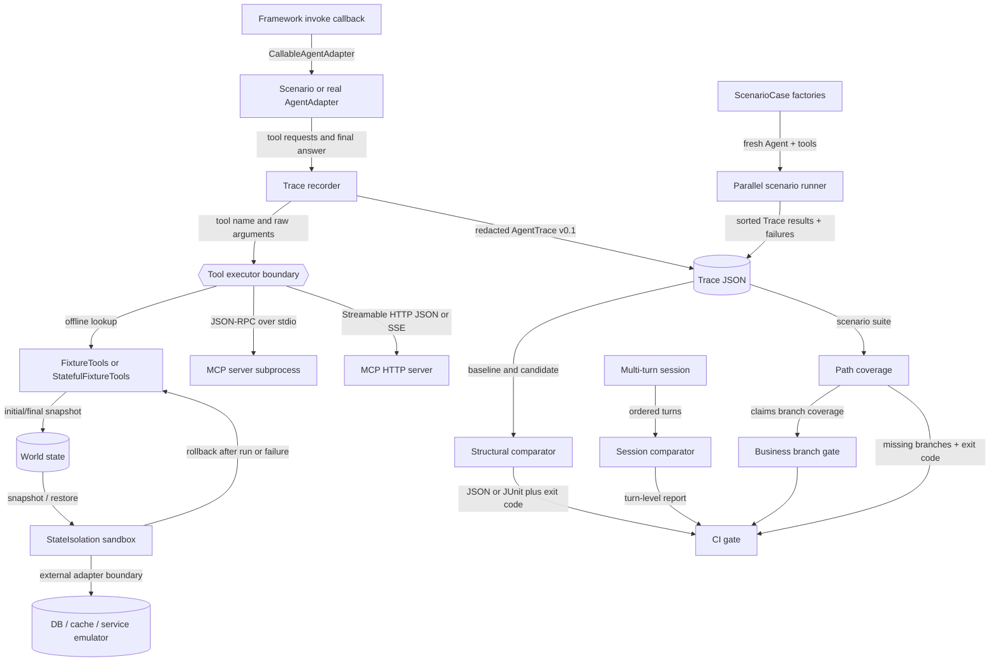
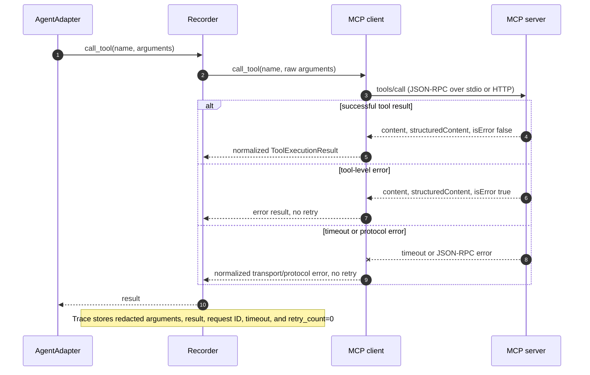

# Architecture

This document describes Agent Regression Kit v2.7. The core question is: how does a live or scripted agent run become deterministic regression evidence without coupling comparison logic to an agent framework, leaking mutable test state between cases, or making a large scenario suite run serially?

The recorder is the stable center: adapters produce actions, executors isolate tool effects, and downstream comparison consumes only redacted AgentTrace documents.

## Component boundaries

- `AgentAdapter` translates one framework-specific run into `RunContext.call_tool` and `RunContext.final_answer` calls. It does not compare or score.
- `CallableAgentAdapter` is the low-boilerplate bridge for a framework's `invoke` callback. It standardizes the boundary but deliberately does not auto-discover or control framework internals.
- `ToolExecutor` owns tool execution. `FixtureTools` is deterministic and in-process; `McpToolExecutor` delegates to either a child process or an HTTP endpoint.
- `StatefulFixtureTools` owns a detached mutable `WorldState` for business scenarios. Its `snapshot()` boundary lets the recorder prove initial/final state and lets the comparator report field-level side effects.
- `SnapshotBackend` is the minimal external-state contract: `snapshot()` captures a detached test-safe representation and `restore(snapshot)` rolls it back. `StateIsolation` applies that contract as a context manager; `isolated_record_run` and `isolated_record_session` guarantee cleanup after normal or exceptional Agent execution.
- `ScenarioCase` owns factories for one Agent and one tool executor. `record_scenario_batch` runs those independent cases with bounded threads, captures failures per case, and sorts results by `case_id` so concurrency does not make reports flaky.
- `record_run` sequences events, pairs calls/results, applies redaction, and validates AgentTrace.
- `record_session` runs multiple requests through the same adapter and executor, producing one validated AgentTrace per turn inside an `AgentSession`.
- `StdioMcpClient` owns the pinned MCP lifecycle and newline-delimited JSON-RPC transport. It does not know about comparison policy.
- `StreamableHttpMcpClient` owns synchronous Streamable HTTP request/response transport, session propagation, JSON/SSE decoding, and explicit GET event-stream iteration. It shares the same lifecycle surface as the stdio client.
- `compare_traces` performs deterministic structural comparison. `ComparisonPolicy` can allow named categories, exact paths, or explicitly compare only structured final-answer claims without an LLM.
- `compare_trace_coverage` aggregates ordered tool paths across a directory of traces. It is a scenario-suite gate, not a statement about internal model neuron or code coverage.
- `compare_sessions` compares corresponding turns without flattening a conversation into one opaque final answer. Outcome-aware coverage can distinguish `tool[ok]` from `tool[error]`.
- `check_session_state_continuity` verifies that an instrumented candidate turn starts from the previous turn's final world snapshot. `trace_business_branch` projects structured claims into explicit business branches.
- `ContractPolicy` adds explicit behavior constraints: required and forbidden tools, field assertions, nested noise paths, deterministic normalizers, maximum tool-call steps, multiple allowed tool paths, and side-effect transitions.
- The CLI configuration layer resolves project-level baseline, candidate, report, and policy defaults while keeping direct command-line flags authoritative.
- The reusable GitHub Action forwards the same final-answer mode and allow-list controls, so local and CI policy decisions do not diverge.
- `config validate` is a side-effect-free preflight boundary: it checks the same config contract used by single-case and batch comparison before CI executes a run.
- CLI and report renderers translate library results into files and process exit codes; they do not change comparison outcomes.

## MCP call and failure flow

The same tool-result event shape records success, MCP tool errors, protocol errors, and timeouts; the metadata makes the no-retry safety policy explicit.

## Version boundaries

Agent Regression Kit v2.7 writes AgentTrace schema version `0.1` and AgentSession schema version `0.1`. Product and evidence-schema versions are independent so the package can evolve without silently changing stored evidence. World snapshots, sessions, coverage metadata, isolation metadata, and parallel-run summaries are optional, so v2.4-v2.6 traces remain readable. The MCP clients and bundled fixtures are pinned to protocol revision `2025-11-25`; future protocol revisions belong in separate transports or an explicit compatibility layer.
