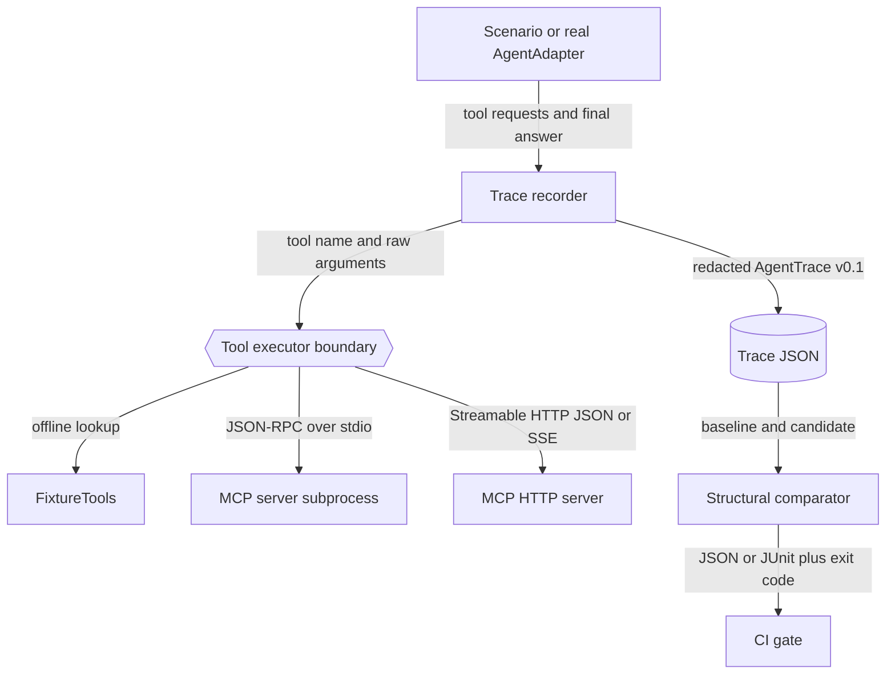
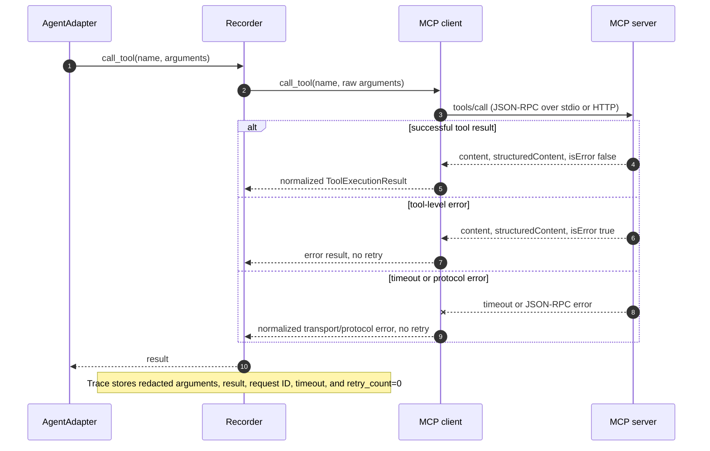

# Architecture

This document describes Agent Regression Kit v1.3. The core question is: how does a live or scripted agent run become deterministic regression evidence without coupling comparison logic to an agent framework?

The recorder is the stable center: adapters produce actions, executors isolate tool effects, and downstream comparison consumes only redacted AgentTrace documents.

## Component boundaries

- `AgentAdapter` translates one framework-specific run into `RunContext.call_tool` and `RunContext.final_answer` calls. It does not compare or score.
- `ToolExecutor` owns tool execution. `FixtureTools` is deterministic and in-process; `McpToolExecutor` delegates to either a child process or an HTTP endpoint.
- `record_run` sequences events, pairs calls/results, applies redaction, and validates AgentTrace.
- `StdioMcpClient` owns the pinned MCP lifecycle and newline-delimited JSON-RPC transport. It does not know about comparison policy.
- `StreamableHttpMcpClient` owns synchronous Streamable HTTP request/response transport, session propagation, JSON/SSE decoding, and explicit GET event-stream iteration. It shares the same lifecycle surface as the stdio client.
- `compare_traces` performs deterministic structural comparison. `ComparisonPolicy` can allow named categories or exact paths without an LLM.
- CLI and report renderers translate library results into files and process exit codes; they do not change comparison outcomes.

## MCP call and failure flow

The same tool-result event shape records success, MCP tool errors, protocol errors, and timeouts; the metadata makes the no-retry safety policy explicit.

## Version boundaries

Agent Regression Kit v1.3 writes AgentTrace schema version `0.1`. Product and evidence-schema versions are independent so the package can evolve without silently changing stored evidence. The MCP clients and bundled fixtures are pinned to protocol revision `2025-11-25`; future protocol revisions belong in separate transports or an explicit compatibility layer.
