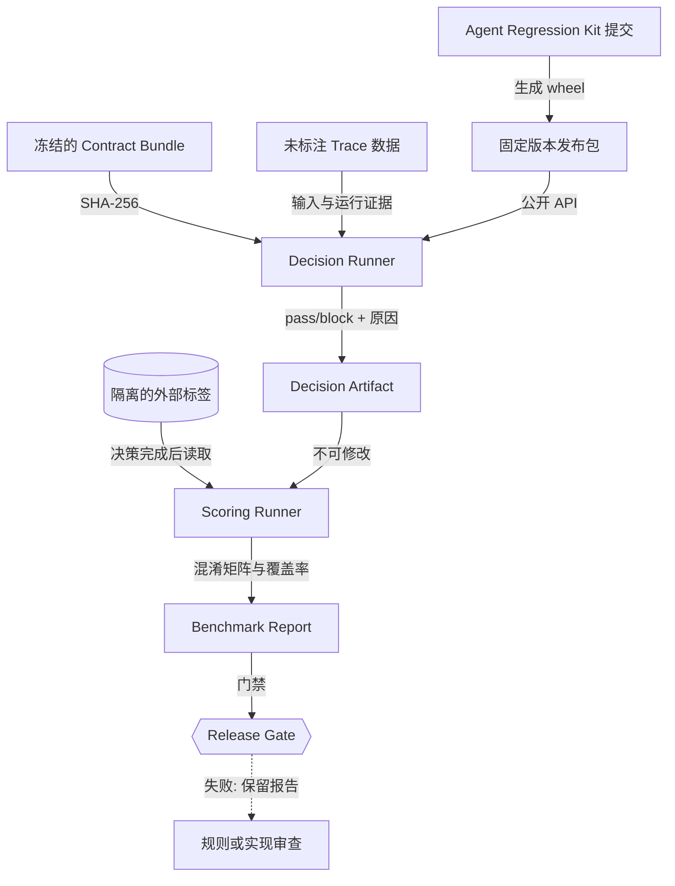
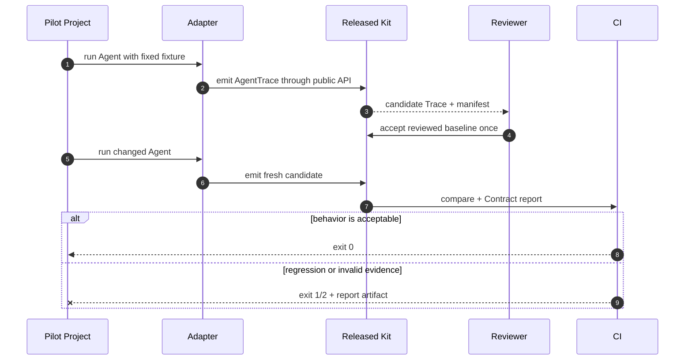

# Agent Regression Kit 成熟度提升技术方案（v4.13–v4.16）

> 状态：v4.13 已落地，v4.14–v4.16 持续实施
> 当前基线版本：v4.14.0
> 更新时间：2026-09-20  
> 目标：把“功能完整、项目内验证通过”推进到“规则边界明确、未见数据可验证、外部项目可接入”。

## 1. 背景与结论

v4.12 已具备 Trace、Contract、Compare、MCP、框架 Adapter、CLI、Viewer、CI、发布包和
状态等价规则，可以作为本地开发和团队 CI 试点工具。当前不足主要不是命令数量，而是三类
成熟度证据：

1. 状态等价规则需要进一步收紧，特别是失败尝试能否单独满足预期动作，以及只比较部分
   最终状态时，其他状态变化是否会被遗漏；
2. τ²-bench 的 v4.12 规则参考了同一份数据中的历史误报，复测结果不能作为未见数据上的
   泛化证明；
3. 主要接入和验收仍由项目维护者完成，还缺少独立消费仓库从安装到 CI 的持续使用证据。

下一阶段不以增加后台、LLM Judge 或更多零散命令为目标，而是完成下面的证据链：

```text
安全语义冻结
    → 留出数据决策
    → 标签隔离评分
    → 独立项目接入
    → 新用户可重复完成
```

完成 v4.16 后，项目应达到“成熟的本地/CI Agent 回归测试框架”标准。服务端管理平台仍是
独立产品层，不作为这轮成熟度的必要条件。

## 2. 成熟度验收目标

| 维度 | v4.12 现状 | v4.16 目标 |
| --- | --- | --- |
| 契约安全 | 有正反例，状态等价边界仍需收紧 | 失败重试、成功要求、幂等重复和未声明状态变化均有明确语义和负向用例 |
| 泛化验证 | 同一固定 τ² 数据集复测 | 规则冻结后，在未参与调参的数据上独立决策和评分 |
| 外部接入 | 仓库内框架示例和公开轨迹导入 | 独立消费仓库只依赖发布包和公共 API，持续运行 CI |
| 易用性 | README 已覆盖首跑、配置、接入和 CI | 首次用户无需阅读核心代码即可完成首个通过、失败和自定义 Agent 接入 |
| 可追溯性 | 有版本、提交、数据校验和 | 每次评测同时记录代码、规则、数据、拆分和报告哈希 |
| 性能边界 | 没有正式门禁 | 建立可重复的批量比较时间和内存基线 |

### 最终通过条件

- 维护的安全反例中漏报为 0；
- 留出数据的 failure recall 不低于 99%，false-alarm rate 不高于 5%，所有不支持样本单独计数；
- 至少覆盖 300 个留出可判定样本，其中至少包含 50 个失败样本；样本不足时不得给出百分比
  成熟度结论，只报告原始计数；
- 一个独立消费仓库连续使用两个正式版本，只通过 wheel 和公共 API 接入；
- 至少注入三类真实回归：错误资源参数、漏掉必要动作、错误解读工具结果，均被 CI 阻断；
- 一名未参与核心实现的使用者在 30 分钟内跑通示例，在 90 分钟内完成一个自定义 Agent 的
  baseline、candidate 和 CI；
- 10,000 份小型 Trace 的批量比较在标准 GitHub Actions runner 上 60 秒内完成，峰值内存
  低于 512 MiB。性能数据只作为回归基线，不宣称生产容量。

## 3. 目标架构

下面的图回答“代码、规则、数据和标签如何隔离并形成可审核结论”。



文字摘要：Decision Runner 在看不到标签时作出决定；Scoring Runner 只对已冻结的决定评分，
报告同时绑定代码、规则和数据哈希。

核心继续分成四层：

| 层 | 责任 | 不承担的责任 |
| --- | --- | --- |
| Evidence | 将真实运行转换为 AgentTrace | 判断业务是否正确 |
| Policy | 表达允许路径、参数、状态和安全边界 | 从自然语言自动猜测规则 |
| Decision | 使用固定规则对 Trace 作 pass/block 判断 | 读取 benchmark reward 或标签 |
| Evaluation | 将已冻结决定与外部标签比较 | 修改决定或自动接受 baseline |

## 4. v4.13：契约安全加固（已落地）

### 4.1 需要解决的问题

当前 `allow_failed_expected: true` 可以允许失败事件参与预期动作匹配。如果 candidate 只有
一次失败写操作，而没有最终成功动作，它仍可能满足行为路径。另一个边界是：配置
`state_equivalence.paths` 后，比较器只检查声明路径，未声明的余额、库存或权限状态变化需要
额外规则才能发现。

### 4.2 新配置模型

在保持旧配置可读取的前提下，增加显式尝试策略和状态范围：

```json
{
  "state_equivalence": {
    "mode": "outcome",
    "paths": [
      "world_state.final.orders.123.status"
    ],
    "attempt_policy": {
      "require_success": true,
      "allow_failed_before_success": true,
      "max_failed_attempts": 2
    },
    "state_scope": "declared_and_unchanged_rest",
    "ignore_argument_paths": [
      "payment_method_id"
    ],
    "idempotent_tools": [
      "modify_pending_order_address"
    ]
  }
}
```

| 字段 | 默认值 | 语义 |
| --- | --- | --- |
| `attempt_policy.require_success` | `true` | 每个预期业务意图必须至少由一个成功事件满足 |
| `attempt_policy.allow_failed_before_success` | `false` | 失败尝试只能作为成功前的额外尝试，不能代替成功 |
| `attempt_policy.max_failed_attempts` | `0` | 每个业务意图允许的失败尝试上限 |
| `state_scope=declared_only` | 兼容模式 | 只比较 `paths` 声明的结果路径 |
| `state_scope=declared_and_unchanged_rest` | 新配置推荐值 | 比较声明路径，并阻断未忽略的其他状态变化 |
| `state_scope=full` | 严格模式 | 完整比较 baseline 与 candidate 的 world state |

现有 `allow_failed_expected` 在 v4.x 继续读取，但生成配置诊断；它不会被静默改写。
`agent-regression config validate` 和 `check` 输出迁移建议。到 v5.0 才考虑移除旧字段，届时
必须提供自动迁移命令和升级文档。

### 4.3 判定算法

1. 使用工具名和未忽略参数把已声明规则归为业务意图；
2. 对每个意图分别收集成功事件和失败事件；
3. `require_success=true` 时，只允许成功事件满足主规则；
4. 失败事件仅在 `allow_failed_before_success=true` 且不超过上限时作为额外尝试；
5. 幂等重复必须命中同一工具、同一参数和成功结果；
6. 比较声明的最终状态路径；
7. 根据 `state_scope` 比较剩余状态，阻断未声明副作用；
8. 最后执行禁用工具、工具白名单、参数规则、调用次数和总步骤上限。

新增差异类别：

| 类别 | 触发条件 |
| --- | --- |
| `required_success_missing` | 只有失败尝试，没有成功动作 |
| `retry_limit_exceeded` | 失败尝试超过配置上限 |
| `unexpected_state_change` | 声明结果相同，但其他未忽略状态发生变化 |
| `state_evidence_missing` | baseline 或 candidate 缺少必需状态快照 |

实现证据见 [v4.13 验收记录](v4.13-acceptance.md)。v4.13 已完成 231 项本地测试、配置中心
字段校验、旧字段迁移诊断和固定 τ²-bench 复测；后续 v4.14 仍需要把 benchmark 规则冻结
与留出评测集隔离，不能把本次复测误认为泛化证明。

### 4.4 安全测试矩阵

| 场景 | 期望 |
| --- | --- |
| 第一次支付失败，第二个已声明支付方式成功 | 通过 |
| 只有失败支付，没有成功动作 | 阻断 `required_success_missing` |
| 最终订单状态正确，但扣错用户余额 | 阻断 `unexpected_state_change` |
| 重复相同地址更新，工具已声明幂等 | 通过 |
| 重复更新使用不同订单号 | 阻断 |
| candidate 使用未声明别名工具 | 阻断 |
| 忽略支付路由参数，但订单号变化 | 阻断 |
| 最终状态路径任一侧缺失 | 阻断 `state_evidence_missing` |

### 4.5 v4.13 发布门禁

- 上述矩阵全部通过，并包含对应报告快照；
- 所有 v4.12 配置仍可读取，兼容性报告解释旧字段语义；
- τ² 当前数据重新跑全量，公开新旧规则结果和变化样本；
- 配置中心能够生成新字段，默认选择安全策略；
- README、API、升级说明和限制说明同步更新。

## 5. v4.14：冻结规则与留出数据验证（基础设施已落地）

### 5.1 Benchmark Manifest

新增通用 benchmark manifest，使一次结果能够被复现：

```json
{
  "schema_version": "0.1",
  "benchmark_id": "retail-heldout-2026-01",
  "source": {
    "repository": "owner/project",
    "revision": "immutable-tag-or-commit",
    "data_sha256": "..."
  },
  "split": {
    "name": "evaluation",
    "definition_sha256": "..."
  },
  "contract_bundle": {
    "path": "contracts/retail.json",
    "sha256": "..."
  },
  "agent_regression": {
    "version": "4.14.0",
    "commit": "..."
  }
}
```

必须记录：上游不可变版本、原始数据哈希、拆分哈希、Contract Bundle 哈希、框架版本和
Git 提交。URL 的 `main`、`latest` 或未锁定依赖不能进入正式验收报告。

### 5.2 决策与评分分离

计划增加三个命令：

```bash
agent-regression benchmark prepare --manifest benchmark.json
agent-regression benchmark decide --manifest benchmark.json --out decisions.json
agent-regression benchmark score --manifest benchmark.json --decisions decisions.json --out report.json
```

- `prepare` 校验来源、哈希、样本 ID 和 Contract；
- `decide` 只读取无标签证据，输出每个样本的决定、原因和支持状态；
- `score` 要求 decisions 文件已完整生成且哈希固定，之后才读取标签；
- 三步均生成 provenance，任何输入改变都会使报告失效；
- 不支持的样本标为 `unsupported`，不能从分母中静默删除。

### 5.3 数据使用规则

| 数据 | 用途 | 是否允许调规则 |
| --- | --- | --- |
| calibration | 发现误报、设计规则和编写用例 | 允许，但结果只作为开发证据 |
| evaluation | 正式验收 | 决策前禁止根据标签修改规则；失败后进入下一轮 calibration，不能回写本轮成绩 |

开放数据无法阻止维护者看到公开标签，因此项目依靠流程和不可变证据保证可审核性：先提交
Contract Bundle 和 decisions，再单独提交 score 报告。正式报告必须说明数据是否真正未见、
谁冻结规则、何时读取标签。

### 5.4 指标

报告至少包含：

- 总样本、可判定样本、unsupported 数量和原因；
- true pass、true block、false alarm、missed failure 原始计数；
- failure precision、failure recall、false-alarm rate、missed-failure rate；
- 按任务类型、工具数量、路径长度和错误类型分层的结果；
- 每个比例的 Wilson 95% 区间，避免小样本显示虚假的精确度；
- 失败样本 ID、决定原因和脱敏 Trace 链接；
- 代码、数据、规则、决策文件和报告哈希。

### 5.5 v4.14 发布门禁

- 至少一份此前未参与规则开发的 evaluation 数据；
- 至少 300 个可判定样本和 50 个失败样本；
- 安全反例漏报为 0；留出数据 failure recall ≥99%，false-alarm rate ≤5%；
- 决策和评分两个 CI Job 使用不同输入权限；
- 任意改动 Trace、Contract、标签或 decisions 都会触发哈希失败；
- τ² 旧结果降级为 calibration 历史证据，不再称为独立泛化成绩。

v4.14 已实现 manifest、prepare/decide/score 命令、决策 digest、unsupported 显式计数和
Wilson 95% 区间。由于当前 τ² 文件曾参与 v4.12/v4.13 规则设计，本版本不把它包装成留出
泛化成绩；真正的外部 evaluation 数据需要在后续消费仓库接入前冻结。

## 6. v4.15：独立项目接入

### 6.1 消费仓库边界

建立一个独立消费仓库，不复制核心源码，也不使用本地相对 Action：

```text
agent-regression-kit（发布者）
    └── v4.15 wheel / public API / docs

agent-regression-pilot-<project>（消费者）
    ├── upstream.lock.json
    ├── adapter/
    ├── baselines/
    ├── contracts/
    ├── injected-regressions/
    └── .github/workflows/regression.yml
```

消费仓库只能从正式 Release 安装，使用公开导出和 CLI。禁止通过 `PYTHONPATH` 指向核心仓库，
避免测试通过依赖未发布实现。

### 6.2 项目选择标准

候选项目必须同时满足：

- OSI 兼容许可证和固定提交；
- 存在真实 Agent 循环及至少两个工具；
- 可在测试环境替换工具或模型，避免 CI 依赖不稳定外部服务；
- 能观察工具调用、结果和最终输出；
- 有明确的业务成功条件，可注入可验证错误；
- 初始接入不要求修改上游核心代码，或修改量可以形成清晰 PR。

浏览器自动化、多 Agent 长任务和需要大型容器集群的项目留到后续，因为它们会同时引入环境
不确定性，难以判断失败来自 Adapter 还是回归框架。

### 6.3 接入顺序

下面的图回答“外部项目从首次运行到持续 CI 要经过哪些审核点”。



文字摘要：外部项目首次只接受一份人工审核基线，后续 CI 每次重新运行 Agent 并生成 candidate，
基线不会自动更新。

### 6.4 必须注入的回归

1. 将一个资源 ID 传错，验证参数和租户/资源边界；
2. 跳过一个必要工具调用，验证行为路径；
3. 工具结果正确但最终结论错误，验证 claims 和结果解读；
4. 可选：重复副作用、未授权工具和合法额外查询。

每个回归保留 Trace、JSON 报告和最小修复提交。接入报告记录新增代码行数、配置字段数、
首次运行时间、错误定位时间以及需要阅读的文档。

### 6.5 v4.15 发布门禁

- 独立消费仓库 CI 在默认分支持续通过；
- 三类必需回归在专用测试中稳定失败；
- 从 v4.14 升级到 v4.15 不修改 baseline 含义；
- 消费仓库只使用发布 wheel 和 public API；
- 报告列出上游项目、固定提交、适配范围和未覆盖边界；
- 如果条件允许，向上游提交可选集成 PR；没有上游接受也要保留可复现消费仓库。

## 7. v4.16：接入体验与成熟版门禁

### 7.1 CLI 与模板

复用已有 `init`、`adapter-init`、`check` 和 `config validate`，避免增加重复命令：

- `init` 生成能直接通过和失败的最小项目，包含 baseline、candidate、config 和 CI；
- `adapter-init` 支持 callback、framework-result、framework-events 三种模板；
- `check` 输出“错误位置、原因、下一条可执行命令”，并检查 claims 缺失、宽松路径、状态快照
  缺失和旧字段；
- 配置中心默认生成严格策略，并在启用 ignore、alias、failed attempt 时显示负向用例提醒；
- 报告首页先展示阻断原因和建议动作，高级原始 Trace 放在后面。

### 7.2 首次用户验收

选择至少一名未参与核心实现的人，只提供 README 和 Release：

| 任务 | 目标时间 | 成功条件 |
| --- | ---: | --- |
| 安装并运行正常/错误示例 | 30 分钟 | 能解释退出码 0/1/2 和报告差异 |
| 接入一个自定义工具 Agent | 60 分钟 | Trace 来自实际运行，claims 没有硬编码期望值 |
| 审核 baseline 并加入 CI | 90 分钟 | CI 能通过正常场景并阻断注入错误 |

观察者只能记录卡点，不在操作中代替用户输入命令。每个卡点进入 issue，按“文档、错误消息、
模板、核心 API”分类。至少完成一轮修复后重新测试。

### 7.3 性能基线

建立固定生成器和两个工作负载：

- 10,000 个小 Trace：1–3 个工具调用，验证吞吐和启动开销；
- 1,000 个中型 Trace：20–50 个事件，包含状态、relations 和 state equivalence；

报告运行时间、峰值 RSS、Python 版本、操作系统、CPU 和提交。性能 CI 每周运行；PR 只运行
小样本 smoke。与最近稳定版本相比，耗时或内存回退超过 20% 时提示，超过 40% 时阻断发布。

### 7.4 v4.16 发布门禁

- 首次用户验收达到目标，卡点有记录和修复证据；
- 独立消费仓库升级通过；
- 留出 benchmark 重跑通过且输入哈希不变；
- 性能门禁通过；
- wheel 全新安装、Python 支持矩阵、所有示例、文档链接和发布证明通过；
- 更新成熟度说明，明确“团队 CI 成熟”和“尚无托管平台或大规模生产 SLA”的边界。

## 8. 模块与文件改造清单

| 模块 | 计划改动 |
| --- | --- |
| `contracts.py` | 尝试策略、状态范围、严格诊断和新差异类别 |
| `compare.py` | 选择性状态比较，同时检测未声明状态变化 |
| `config.py` | 新字段校验、旧字段迁移建议、严格配置诊断 |
| `benchmark.py`（新增） | manifest、prepare、decide、score 和 provenance |
| `reports.py` | benchmark 分层指标、Wilson 区间和证据链接 |
| `cli.py` | benchmark 子命令，增强现有 init/check 的行动建议 |
| `viewer/config.html` | 安全默认值、字段解释和风险提示 |
| `tests/` | 契约矩阵、标签隔离、哈希篡改、外部消费和性能 smoke |
| `.github/workflows/` | calibration、held-out decision、score、external pilot、weekly performance |
| `docs/` | 配置迁移、benchmark 方法、独立接入报告和首次用户测试记录 |

## 9. CI 结构

| 工作流 | 触发方式 | 是否阻断发布 |
| --- | --- | --- |
| core-regression | 每个 PR | 是 |
| contract-safety | 修改 Contract 或 Compare 时 | 是 |
| calibration | 规则或 Adapter 改动时 | 否，输出开发指标 |
| heldout-decision | Contract Bundle 冻结或候选发布时 | 是 |
| heldout-score | decision artifact 完成后 | 是 |
| external-pilot | 每日或上游固定版本变化时 | 候选发布必须通过 |
| performance | 每周和候选发布时 | 超过硬阈值时阻断 |
| release | tag 推送时 | 是 |

`heldout-decision` 不接触标签；`heldout-score` 下载不可变 decision artifact。两者使用不同 Job，
并在报告中保留 artifact digest。

## 10. 兼容与迁移策略

- v4.13–v4.16 不修改 PUBLIC_API_VERSION=4；新增字段均为可选；
- v4.12 Contract 默认保持原含义，新生成配置使用更安全的尝试策略；
- 旧 `allow_failed_expected` 输出 deprecation warning 和确定性迁移建议；
- 任何旧字段语义调整都必须通过 major version，并提供 `migrate contract`；
- AgentTrace schema 只有在数据结构无法向后表示时才升级，不随产品版本递增；
- benchmark manifest 和 report 使用独立 schema version，避免绑定 Trace schema。

## 11. 数据、安全与隐私

- benchmark 和消费仓库只提交脱敏 Trace，密钥扫描在上传 artifact 前运行；
- manifest 不存 API Key，只记录供应商、模型标识和不可变输入哈希；
- baseline 必须由人审核，CI 没有自动接受权限；
- 外部 Agent 运行使用最小权限 Fixture 或隔离测试账号；
- 真实写工具默认不在 PR CI 执行，需要在线验证时使用定时工作流和幂等测试资源；
- 公开失败样本前移除用户数据、token、请求头和自由文本中的敏感值；
- provenance 证明输入和产物关系，不等于业务数据真实性证明。

## 12. 主要风险与处理

| 风险 | 表现 | 处理方式 |
| --- | --- | --- |
| 为 benchmark 继续调参 | 分数上升但新项目表现不变 | calibration/evaluation 分离，冻结规则和 decisions |
| Contract 过宽 | 误放错误资源或副作用 | 默认 require_success，检查剩余状态，维护负向矩阵 |
| Contract 过窄 | 合法路径频繁误报 | 只把已审核替代路径写入规则，保留 false-alarm 样本 |
| claims 被硬编码 | 最终答案错误仍然通过 | 接入测试追踪 claims 来源，增加结果误读反例 |
| 外部项目不稳定 | 上游变化导致 CI 噪音 | 固定上游提交，升级由单独 PR 完成 |
| 接入只在本仓库有效 | 发布包用户无法复现 | 独立消费仓库只安装 wheel 和公开 API |
| 小样本百分比失真 | 100% 指标被过度解释 | 原始计数、置信区间和最小样本门槛 |
| 功能继续膨胀 | 文档和维护成本上升 | v4.13–v4.16 只接受与四个成熟度目标直接相关的变更 |

## 13. 实施顺序与提交原则

每个版本独立提交、打 tag、发布和记录验收，不把四个阶段一次性合并：

1. **v4.13**：契约语义和负向测试；
2. **v4.14**：benchmark manifest、决策和评分隔离、留出数据；
3. **v4.15**：独立消费仓库和三类真实回归；
4. **v4.16**：首次用户验收、CLI 收敛和性能门禁。

每个版本开始前先固定验收用例，结束时依次执行：单元和集成测试、全量安全矩阵、已有公开
数据回归、wheel 构建、全新环境安装、文档命令验证、GitHub Actions。任何未满足项写入发布
限制，不用版本号掩盖缺口。

## 14. 完成定义

这轮方案完成时，应该能够给出以下可核验证据：

- 一份明确区分成功动作、失败尝试和未声明副作用的 Contract 规范；
- 一份规则冻结后生成的留出数据 decisions artifact；
- 一份在读取标签后生成、包含混淆矩阵和置信区间的评分报告；
- 一个独立消费仓库及其连续版本 CI 历史；
- 三类注入回归的 Trace 和阻断报告；
- 一次首次用户接入记录和修复清单；
- 一份可重复的性能基线；
- 完整的升级、限制和安全说明。

这些证据齐全后，可以把项目描述为成熟的本地/CI Agent 回归框架。托管后台、多租户权限、
远程 Runner 和企业 SLA 仍需要单独的产品方案与运行数据。
