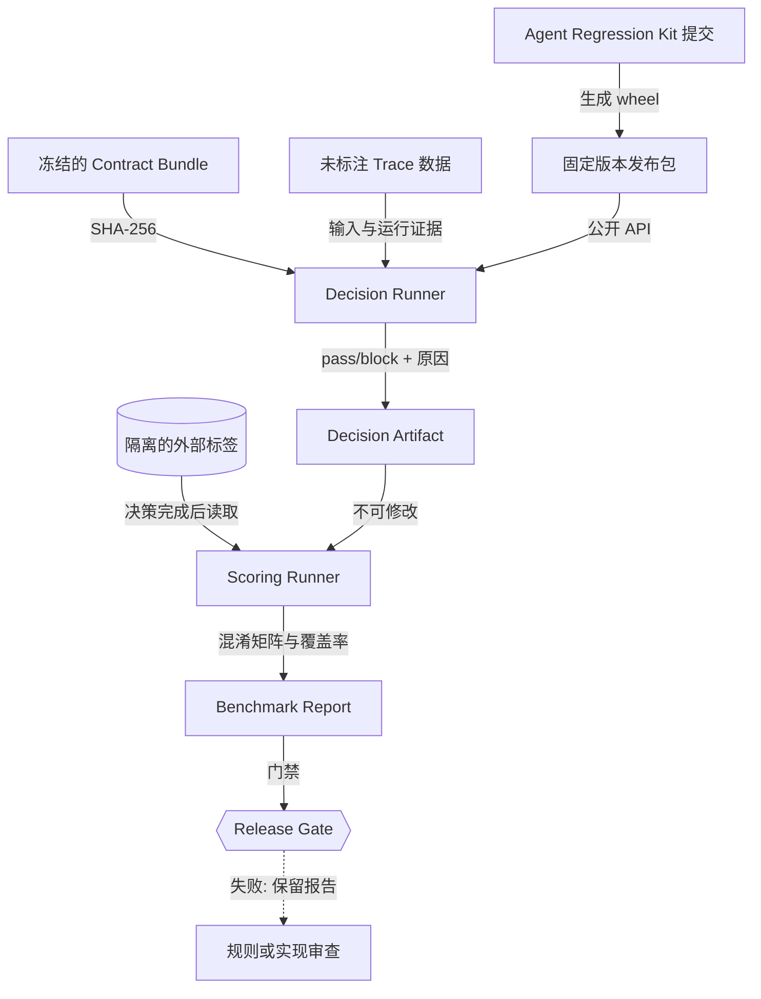
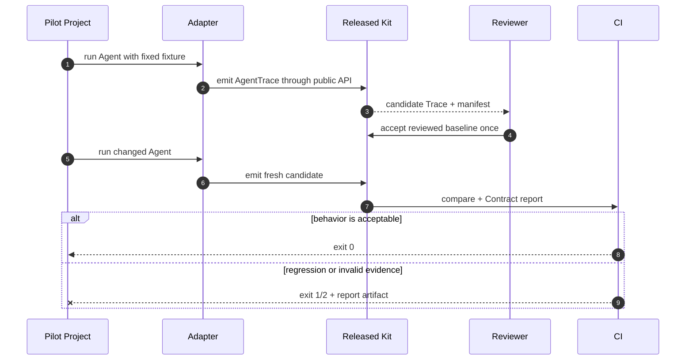

# Agent Regression Kit 成熟度提升技术方案（v4.13–v4.26）

> 状态：v4.26 已落地，继续扩展模型族、在线随机性和真实用户验证
> 当前基线版本：v4.26.0
> 更新时间：2026-09-21
> 目标：把“功能完整、项目内验证通过”推进到“规则边界明确、未见数据可验证、外部项目可接入”。

## 1. 背景与结论

v4.12 已具备 Trace、Contract、Compare、MCP、框架 Adapter、CLI、Viewer、CI、发布包和
状态等价规则，可以作为本地开发和团队 CI 试点工具。当前不足主要不是命令数量，而是三类
成熟度证据：

1. 状态等价规则需要进一步收紧，特别是失败尝试能否单独满足预期动作，以及只比较部分
   最终状态时，其他状态变化是否会被遗漏；
2. τ²-bench 的 v4.12 规则参考了同一份数据中的历史误报，复测结果不能作为未见数据上的
   泛化证明；
3. 主要接入和验收仍由项目维护者完成，还缺少独立消费仓库从安装到 CI 的持续使用证据。

下一阶段不以增加后台、LLM Judge 或更多零散命令为目标，而是完成下面的证据链：

```text
安全语义冻结
    → 留出数据决策
    → 标签隔离评分
    → 独立项目接入
    → 新用户可重复完成
```

完成 v4.26 后，项目应达到“成熟的本地/CI Agent 回归测试框架”标准。服务端管理平台仍是
独立产品层，不作为这轮成熟度的必要条件。

## 2. 成熟度验收目标

| 维度 | v4.12 现状 | v4.22 目标 |
| --- | --- | --- |
| 契约安全 | 有正反例，状态等价边界仍需收紧 | 失败重试、成功要求、幂等重复和未声明状态变化均有明确语义和负向用例 |
| 泛化验证 | 同一固定 τ² 数据集复测 | 规则冻结后，在未参与调参的数据上独立决策和评分 |
| 外部接入 | 仓库内框架示例和公开轨迹导入 | 独立消费仓库只依赖发布包和公共 API，持续运行 CI |
| 易用性 | README 已覆盖首跑、配置、接入和 CI | 首次用户无需阅读核心代码即可完成首个通过、失败和自定义 Agent 接入 |
| 可追溯性 | 有版本、提交、数据校验和 | 每次评测同时记录代码、规则、数据、拆分和报告哈希 |
| 性能边界 | 没有正式门禁 | 建立可重复的批量比较时间和内存基线 |
| 评测来源完整性 | 不同结果文件可能复用错误 manifest | 结果字节、来源 manifest、模型身份和失败样本门槛绑定 |
| 路径噪音控制 | 传输字段容易被误当作业务差异 | 路径规则显式忽略未建模字段，显式业务字段仍严格匹配 |
| 跨任务域证据 | 只有 retail 结果 | airline 和 telecom 分别记录域内误报、漏报、actor 边界和样本不足限制 |
| 任务级留出 | 没有任务级分区 | 只按 task ID 哈希生成互斥 holdout，记录集合摘要并在 CI 独立验收 |
| 独立来源接入 | 只有 tau² 任务族 | 外部 AgentDojo 四 suite、五条样本可导入，来源/任务身份/Contract/oracle 与 Trace 隔离；模型级泛化仍待补齐 |

### 最终通过条件

- 维护的安全反例中漏报为 0；
- 留出数据的 failure recall 不低于 99%，false-alarm rate 不高于 5%，所有不支持样本单独计数；
- 至少覆盖 300 个留出可判定样本，其中至少包含 50 个失败样本；样本不足时不得给出百分比
  成熟度结论，只报告原始计数；
- 一个独立消费仓库连续使用两个正式版本，只通过 wheel 和公共 API 接入；
- 至少注入三类真实回归：错误资源参数、漏掉必要动作、错误解读工具结果，均被 CI 阻断；
- 一名未参与核心实现的使用者在 30 分钟内跑通示例，在 90 分钟内完成一个自定义 Agent 的
  baseline、candidate 和 CI；
- 10,000 份小型 Trace 的批量比较在标准 GitHub Actions runner 上 60 秒内完成，峰值内存
  低于 512 MiB。性能数据只作为回归基线，不宣称生产容量。

## 3. 目标架构

下面的图回答“代码、规则、数据和标签如何隔离并形成可审核结论”。



文字摘要：Decision Runner 在看不到标签时作出决定；Scoring Runner 只对已冻结的决定评分，
报告同时绑定代码、规则和数据哈希。

核心继续分成四层：

| 层 | 责任 | 不承担的责任 |
| --- | --- | --- |
| Evidence | 将真实运行转换为 AgentTrace | 判断业务是否正确 |
| Policy | 表达允许路径、参数、状态和安全边界 | 从自然语言自动猜测规则 |
| Decision | 使用固定规则对 Trace 作 pass/block 判断 | 读取 benchmark reward 或标签 |
| Evaluation | 将已冻结决定与外部标签比较 | 修改决定或自动接受 baseline |

## 4. v4.13：契约安全加固（已落地）

### 4.1 需要解决的问题

当前 `allow_failed_expected: true` 可以允许失败事件参与预期动作匹配。如果 candidate 只有
一次失败写操作，而没有最终成功动作，它仍可能满足行为路径。另一个边界是：配置
`state_equivalence.paths` 后，比较器只检查声明路径，未声明的余额、库存或权限状态变化需要
额外规则才能发现。

### 4.2 新配置模型

在保持旧配置可读取的前提下，增加显式尝试策略和状态范围：

```json
{
  "state_equivalence": {
    "mode": "outcome",
    "paths": [
      "world_state.final.orders.123.status"
    ],
    "attempt_policy": {
      "require_success": true,
      "allow_failed_before_success": true,
      "max_failed_attempts": 2
    },
    "state_scope": "declared_and_unchanged_rest",
    "ignore_argument_paths": [
      "payment_method_id"
    ],
    "idempotent_tools": [
      "modify_pending_order_address"
    ]
  }
}
```

| 字段 | 默认值 | 语义 |
| --- | --- | --- |
| `attempt_policy.require_success` | `true` | 每个预期业务意图必须至少由一个成功事件满足 |
| `attempt_policy.allow_failed_before_success` | `false` | 失败尝试只能作为成功前的额外尝试，不能代替成功 |
| `attempt_policy.max_failed_attempts` | `0` | 每个业务意图允许的失败尝试上限 |
| `state_scope=declared_only` | 兼容模式 | 只比较 `paths` 声明的结果路径 |
| `state_scope=declared_and_unchanged_rest` | 新配置推荐值 | 比较声明路径，并阻断未忽略的其他状态变化 |
| `state_scope=full` | 严格模式 | 完整比较 baseline 与 candidate 的 world state |

现有 `allow_failed_expected` 在 v4.x 继续读取，但生成配置诊断；它不会被静默改写。
`agent-regression config validate` 和 `check` 输出迁移建议。到 v5.0 才考虑移除旧字段，届时
必须提供自动迁移命令和升级文档。

### 4.3 判定算法

1. 使用工具名和未忽略参数把已声明规则归为业务意图；
2. 对每个意图分别收集成功事件和失败事件；
3. `require_success=true` 时，只允许成功事件满足主规则；
4. 失败事件仅在 `allow_failed_before_success=true` 且不超过上限时作为额外尝试；
5. 幂等重复必须命中同一工具、同一参数和成功结果；
6. 比较声明的最终状态路径；
7. 根据 `state_scope` 比较剩余状态，阻断未声明副作用；
8. 最后执行禁用工具、工具白名单、参数规则、调用次数和总步骤上限。

新增差异类别：

| 类别 | 触发条件 |
| --- | --- |
| `required_success_missing` | 只有失败尝试，没有成功动作 |
| `retry_limit_exceeded` | 失败尝试超过配置上限 |
| `unexpected_state_change` | 声明结果相同，但其他未忽略状态发生变化 |
| `state_evidence_missing` | baseline 或 candidate 缺少必需状态快照 |

实现证据见 [v4.13 验收记录](v4.13-acceptance.md)。v4.13 已完成 231 项本地测试、配置中心
字段校验、旧字段迁移诊断和固定 τ²-bench 复测；后续 v4.14 仍需要把 benchmark 规则冻结
与留出评测集隔离，不能把本次复测误认为泛化证明。

### 4.4 安全测试矩阵

| 场景 | 期望 |
| --- | --- |
| 第一次支付失败，第二个已声明支付方式成功 | 通过 |
| 只有失败支付，没有成功动作 | 阻断 `required_success_missing` |
| 最终订单状态正确，但扣错用户余额 | 阻断 `unexpected_state_change` |
| 重复相同地址更新，工具已声明幂等 | 通过 |
| 重复更新使用不同订单号 | 阻断 |
| candidate 使用未声明别名工具 | 阻断 |
| 忽略支付路由参数，但订单号变化 | 阻断 |
| 最终状态路径任一侧缺失 | 阻断 `state_evidence_missing` |

### 4.5 v4.13 发布门禁

- 上述矩阵全部通过，并包含对应报告快照；
- 所有 v4.12 配置仍可读取，兼容性报告解释旧字段语义；
- τ² 当前数据重新跑全量，公开新旧规则结果和变化样本；
- 配置中心能够生成新字段，默认选择安全策略；
- README、API、升级说明和限制说明同步更新。

## 5. v4.14：冻结规则与留出数据验证（基础设施已落地）

### 5.1 Benchmark Manifest

新增通用 benchmark manifest，使一次结果能够被复现：

```json
{
  "schema_version": "0.1",
  "benchmark_id": "retail-heldout-2026-01",
  "source": {
    "repository": "owner/project",
    "revision": "immutable-tag-or-commit",
    "data_sha256": "..."
  },
  "split": {
    "name": "evaluation",
    "definition_sha256": "..."
  },
  "contract_bundle": {
    "path": "contracts/retail.json",
    "sha256": "..."
  },
  "agent_regression": {
    "version": "4.14.0",
    "commit": "..."
  }
}
```

必须记录：上游不可变版本、原始数据哈希、拆分哈希、Contract Bundle 哈希、框架版本和
Git 提交。URL 的 `main`、`latest` 或未锁定依赖不能进入正式验收报告。

### 5.2 决策与评分分离

计划增加三个命令：

```bash
agent-regression benchmark prepare --manifest benchmark.json
agent-regression benchmark decide --manifest benchmark.json --out decisions.json
agent-regression benchmark score --manifest benchmark.json --decisions decisions.json --out report.json
```

- `prepare` 校验来源、哈希、样本 ID 和 Contract；
- `decide` 只读取无标签证据，输出每个样本的决定、原因和支持状态；
- `score` 要求 decisions 文件已完整生成且哈希固定，之后才读取标签；
- 三步均生成 provenance，任何输入改变都会使报告失效；
- 不支持的样本标为 `unsupported`，不能从分母中静默删除。

### 5.3 数据使用规则

| 数据 | 用途 | 是否允许调规则 |
| --- | --- | --- |
| calibration | 发现误报、设计规则和编写用例 | 允许，但结果只作为开发证据 |
| evaluation | 正式验收 | 决策前禁止根据标签修改规则；失败后进入下一轮 calibration，不能回写本轮成绩 |

开放数据无法阻止维护者看到公开标签，因此项目依靠流程和不可变证据保证可审核性：先提交
Contract Bundle 和 decisions，再单独提交 score 报告。正式报告必须说明数据是否真正未见、
谁冻结规则、何时读取标签。

### 5.4 指标

报告至少包含：

- 总样本、可判定样本、unsupported 数量和原因；
- true pass、true block、false alarm、missed failure 原始计数；
- failure precision、failure recall、false-alarm rate、missed-failure rate；
- 按任务类型、工具数量、路径长度和错误类型分层的结果；
- 每个比例的 Wilson 95% 区间，避免小样本显示虚假的精确度；
- 失败样本 ID、决定原因和脱敏 Trace 链接；
- 代码、数据、规则、决策文件和报告哈希。

### 5.5 v4.14 发布门禁

- 至少一份此前未参与规则开发的 evaluation 数据；
- 至少 300 个可判定样本和 50 个失败样本；
- 安全反例漏报为 0；留出数据 failure recall ≥99%，false-alarm rate ≤5%；
- 决策和评分两个 CI Job 使用不同输入权限；
- 任意改动 Trace、Contract、标签或 decisions 都会触发哈希失败；
- τ² 旧结果降级为 calibration 历史证据，不再称为独立泛化成绩。

v4.14 已实现 manifest、prepare/decide/score 命令、决策 digest、unsupported 显式计数和
Wilson 95% 区间。由于当前 τ² 文件曾参与 v4.12/v4.13 规则设计，本版本不把它包装成留出
泛化成绩；真正的外部 evaluation 数据需要在后续消费仓库接入前冻结。

## 6. v4.15：独立项目接入（已落地）

### 6.1 消费仓库边界

建立一个独立消费仓库，不复制核心源码，也不使用本地相对 Action：

```text
agent-regression-kit（发布者）
    └── v4.15 wheel / public API / docs

agent-regression-pilot-<project>（消费者）
    ├── upstream.lock.json
    ├── adapter/
    ├── baselines/
    ├── contracts/
    ├── injected-regressions/
    └── .github/workflows/regression.yml
```

消费仓库只能从正式 Release 安装，使用公开导出和 CLI。禁止通过 `PYTHONPATH` 指向核心仓库，
避免测试通过依赖未发布实现。

### 6.2 项目选择标准

候选项目必须同时满足：

- OSI 兼容许可证和固定提交；
- 存在真实 Agent 循环及至少两个工具；
- 可在测试环境替换工具或模型，避免 CI 依赖不稳定外部服务；
- 能观察工具调用、结果和最终输出；
- 有明确的业务成功条件，可注入可验证错误；
- 初始接入不要求修改上游核心代码，或修改量可以形成清晰 PR。

浏览器自动化、多 Agent 长任务和需要大型容器集群的项目留到后续，因为它们会同时引入环境
不确定性，难以判断失败来自 Adapter 还是回归框架。

### 6.3 接入顺序

下面的图回答“外部项目从首次运行到持续 CI 要经过哪些审核点”。



文字摘要：外部项目首次只接受一份人工审核基线，后续 CI 每次重新运行 Agent 并生成 candidate，
基线不会自动更新。

### 6.4 必须注入的回归

1. 将一个资源 ID 传错，验证参数和租户/资源边界；
2. 跳过一个必要工具调用，验证行为路径；
3. 工具结果正确但最终结论错误，验证 claims 和结果解读；
4. 可选：重复副作用、未授权工具和合法额外查询。

每个回归保留 Trace、JSON 报告和最小修复提交。接入报告记录新增代码行数、配置字段数、
首次运行时间、错误定位时间以及需要阅读的文档。

### 6.5 v4.15 发布门禁

- 独立消费仓库 CI 在默认分支持续通过；
- 三类必需回归在专用测试中稳定失败；
- 从 v4.14 升级到 v4.15 不修改 baseline 含义；
- 消费仓库只使用发布 wheel 和 public API；
- 报告列出上游项目、固定提交、适配范围和未覆盖边界；
- 如果条件允许，向上游提交可选集成 PR；没有上游接受也要保留可复现消费仓库。

实现证据：[独立消费项目说明](consumer-pilot.md) 和
[`ANTAO94/agent-regression-pilot`](https://github.com/ANTAO94/agent-regression-pilot)。
该消费仓库只安装 Release wheel，三类错误注入均稳定返回阻断退出码；它证明公开接入边界，
不证明任意框架的自动兼容。

## 7. v4.16：接入体验与成熟版门禁（已落地）

### 7.1 CLI 与模板

复用已有 `init`、`adapter-init`、`check` 和 `config validate`，避免增加重复命令：

- `init` 生成能直接通过和失败的最小项目，包含 baseline、candidate、config 和 CI；
- `adapter-init` 支持 callback、framework-result、framework-events 三种模板；
- `check` 输出“错误位置、原因、下一条可执行命令”，并检查 claims 缺失、宽松路径、状态快照
  缺失和旧字段；
- 配置中心默认生成严格策略，并在启用 ignore、alias、failed attempt 时显示负向用例提醒；
- 报告首页先展示阻断原因和建议动作，高级原始 Trace 放在后面。

### 7.2 首次用户验收

选择至少一名未参与核心实现的人，只提供 README 和 Release：

| 任务 | 目标时间 | 成功条件 |
| --- | ---: | --- |
| 安装并运行正常/错误示例 | 30 分钟 | 能解释退出码 0/1/2 和报告差异 |
| 接入一个自定义工具 Agent | 60 分钟 | Trace 来自实际运行，claims 没有硬编码期望值 |
| 审核 baseline 并加入 CI | 90 分钟 | CI 能通过正常场景并阻断注入错误 |

观察者只能记录卡点，不在操作中代替用户输入命令。每个卡点进入 issue，按“文档、错误消息、
模板、核心 API”分类。至少完成一轮修复后重新测试。

### 7.3 性能基线

建立固定生成器和两个工作负载：

- 10,000 个小 Trace：1–3 个工具调用，验证吞吐和启动开销；
- 1,000 个中型 Trace：20–50 个事件，包含状态、relations 和 state equivalence；

报告运行时间、峰值 RSS、Python 版本、操作系统、CPU 和提交。性能 CI 每周运行；PR 只运行
小样本 smoke。与最近稳定版本相比，耗时或内存回退超过 20% 时提示，超过 40% 时阻断发布。

### 7.4 v4.16 发布门禁

- 首次用户验收达到目标，卡点有记录和修复证据；
- 独立消费仓库升级通过；
- 留出 benchmark 重跑通过且输入哈希不变；
- 性能门禁通过；
- wheel 全新安装、Python 支持矩阵、所有示例、文档链接和发布证明通过；
- 更新成熟度说明，明确“团队 CI 成熟”和“尚无托管平台或大规模生产 SLA”的边界。

实现证据：[v4.16 验收记录](v4.16-acceptance.md)、[性能基线说明](performance.md)和
独立消费项目的 [v4.15 Release 升级提交](https://github.com/ANTAO94/agent-regression-pilot/commit/8ebc38ffe7fc15992c556faeb542d7706f45dc25)。
其中首次用户部分是自动化 clean-room proxy，真实未参与实现用户的可用性访谈仍需后续补齐，
因此本版本不把它描述成完整的人因研究。

### 7.5 v4.17：评测来源完整性与 prospective 证据（已落地）

v4.16 的性能和首用证据已经可以证明“框架能被安装和运行”，但外部评测仍有一个容易被
忽略的风险：如果结果文件换成了另一个模型，而报告继续沿用旧的 source manifest，数字看似
完整，实际 provenance 已经错了。v4.17 先修这个边界，再扩大模型结果证据。

实现内容：

- `examples/tau2_retail_validation.py` 在写报告前计算 `--results` 的 SHA-256，并与
  `--source-manifest` 的 `sha256` 严格匹配；错配返回输入错误，不生成可信报告；
- 增加 `--min-failures`，将 oracle failure 数量作为正式门禁，而不是只看比例；
- 新增 `prospective-o4-mini-source.json` 和独立 CI Job，固定上游 tag、下载地址、结果哈希和
  许可信息；
- v4.17 prospective 结果为 420 个可判定样本、126 个失败样本、failure recall 100%、
  false-alarm rate 2.04%、missed failure 0；
- 报告同时记录结果哈希、manifest 哈希和 source manifest 文件哈希，便于审计。

这组数据是模型结果级 prospective evidence：它没有参与 v4.13 calibration，但任务定义、任务
域和 upstream reward oracle 与 calibration 来源相同。因此它不能被描述成未见任务域泛化；
真正的独立任务集和未参与实现用户仍是后续验收项。

实现证据见 [v4.17 验收记录](v4.17-acceptance.md) 和
[τ² 独立验证说明](tau2-independent-validation.md)。

### 7.6 v4.18：路径噪音控制与第二任务域（已落地）

v4.17 的 provenance 修复解决了“结果文件是否对应来源”的问题，但真实 Agent 轨迹还有一个
接入层误报来源：工具参数中可能出现每次请求都会变化、却没有业务含义的传输字段。此前
`state_equivalence.ignore_argument_paths` 只负责 outcome 意图分组，不能直接改变
`path_rules.any_of` 的参数匹配；把它误当成噪音过滤会产生安全歧义。

v4.18 的实现和证据如下：

- `path_rules.ignore_argument_paths` 只在当前路径规则中生效，并且只移除 baseline 没有声明
  的字段；baseline 明确声明的支付 ID、订单号和租户号仍然严格比较；
- 增加 `path_rules` 噪音边界的正向与负向测试，覆盖合法 request ID 变化、业务对象变化和
  显式字段变化；
- 增加 airline 域的独立工具目录、契约构建器、Trace 导入器、来源 manifest 和 CI；
- 固定发布的 `gpt-4.1-mini` airline 结果：120 个适用写场景、69 个失败样本、失败召回率
  100%、误报率 3.92%；
- 增加 `o4-mini` airline prospective 结果：120 个适用场景、72 个失败样本、失败召回率
  100%、误报率 10.42%。该组合的 CI 明确使用 12% 观察阈值，不把它包装成通用 5% 保证；
- 独立消费仓库升级到 v4.18.0 Release wheel（固定 URL、SHA-256 和提交 `15cea6c`），
  正常流程返回 0，错误资源、漏工具和结果误读三类注入均返回 1；
- 全量本地测试从 241 增加到 246 项，发布包和 source manifest 仍通过哈希绑定。

v4.18 仍有两个诚实边界：airline 只有 120 个适用样本，低于最终成熟度的 300 个样本门槛；
同时还没有一名未参与核心实现的真实使用者完成 30/60/90 分钟接入研究。下一步应补充更大的
独立任务集，并执行外部使用者试验，而不是继续用文档自证可用性。

### 7.7 v4.19：actor-aware 电信域与环境证据边界（已落地）

电信域暴露了一个不能用普通流量回放规则解决的边界：同一条模拟轨迹中，既有 Agent
（assistant）发出的工具调用，也有模拟器/用户（user）主动改变环境的工具调用。如果把
两者混在一个调用列表里，回归框架可能把“模拟器已经替 Agent 完成动作”误判为 Agent
行为通过。

v4.19 用显式 actor 边界解决这个问题：

- `trace_from_tau2_simulation(..., include_user_tools=True)` 记录 user-owned tool call，
  并在每个事件 metadata 保留 `requestor`；默认值仍保持旧域兼容；
- telecom Contract 只从 `requestor=assistant` 的写动作构建，user-owned 动作只能进入环境
  证据路径；
- 增加服务状态、移动数据、测速、MMS、数据加油和欠费账单的有限环境断言解析，并把
  `max_steps` 终止记录为阻断差异；
- 固定公开 telecom 结果的 456 条轨迹中，364 条进入 assistant-write 契约评估，92 条
  user-only 轨迹明确排除；结果为 147/217/0/0；
- 固定 prospective o4-mini 结果为 136/216/9/3，失败召回率 98.63%、误报率 6.21%、
  漏报率 1.37%，CI 使用显式 98%/10%/2% 观察阈值；
- 本地测试达到 248 项，来源 manifest、报告、样例 Trace 和 CI artifact 均可复现。

这一版本仍然有边界：电信环境解析是有限适配器，不是通用模拟器状态还原；结果仍来自同一
上游任务族，不能称为真正未见任务域泛化；真实用户接入研究仍待补齐。

### 7.8 v4.20：task-disjoint holdout 代理（已落地）

v4.19 的 telecom 结果已经验证了 actor 边界，但整份公开结果复测仍不能回答一个更严格
的问题：规则冻结后，换到没有参与同一场景校准的任务，是否仍能稳定工作。v4.20 增加一个
可复现的任务级留出代理，先把“切分是否独立于标签”这件事做成可审计的工程约束。

- `split_tau2_payload_by_task` 只读取 task ID；使用 task ID 的 SHA-256 前 8 位十六进制值
  按 100 取模，桶值 `<20` 进入 holdout，其余进入 calibration；不读取 reward 内容；
- 分区前拒绝空 task ID、重复 task ID 和未知 simulation task ID；分区后记录全量、calibration
  和 holdout 的任务数量与有序 ID 摘要；`task-split.json` 冻结这些摘要；
- 新增 `examples/tau2_telecom_holdout_validation.py`，在读取 reward 之前完成分区和契约
  决策，然后按已绑定 source manifest 的结果评分，输出 split provenance、混淆矩阵、sample
  Trace 和 gate；
- 固定分区有 114 个任务，其中 86 个 calibration、28 个 holdout；holdout 的 112 条轨迹
  中 100 条可判定、12 条 user-only 排除；公开结果为 47/53/0/0，prospective o4-mini 为
  50/46/4/0，误报率 7.41%、漏报率 0%；
- 本地测试达到 250 项，新增两个独立 holdout CI job，并将 split manifest、源文件、报告和
  artifact 名称写入验收文档与 README。

v4.20 的证据仍有明确边界：calibration 和 holdout 共享同一公开 `tau2-bench` 任务族，不能
称为独立来源或通用未见域泛化；下一阶段必须引入真正独立来源/任务族，并由未参与实现的
使用者完成 30/60/90 分钟接入研究。

### 7.9 v4.21：独立来源 AgentDojo 接入（已落地）

v4.21 把“独立来源”从文档边界推进为一个真实可运行的接入路径。AgentDojo 和 tau² 的
数据结构不同：它以消息列表表示 assistant/tool 交互，并在同一运行文件中提供
`utility`/`security` 结果。接入层必须把可观察行为和外部 oracle 分开，否则评测框架会
把答案标签偷偷变成输入。

- 新增 `trace_from_agentdojo_run`：读取 assistant tool call、tool result 和最后的
  assistant answer，生成连续且可校验的 AgentTrace；忽略 system/user 原始自由文本，避免
  把外部数据直接复制进核心证据；
- 兼容 AgentDojo 固定文件的 `function: "tool", args: {...}`，以及常见导出器的
  `function: {"name": "tool", "args": {...}` 两种格式；重复 call ID、缺少结果和缺少最终
  回答均失败关闭；
- 新增 `evaluate_agentdojo_run`：调用现有 `ContractPolicy.check` 检查必需/禁止工具，
  把上游 `utility`/`security` 仅保存在 `external_oracle` 报告字段，不写入 Trace metadata，
  不从标签生成 Contract；
- 固定 `ethz-spylab/agentdojo` commit、数据路径和结果 SHA-256，CI 下载后校验 hash，输出
  报告、转换 Trace 和 Job Summary；固定样本通过 `get_current_day → search_calendar_events`
  路径，未调用 `send_email`，外部标签为 `utility=true/security=false`；
- 本地测试目标达到 257 项，并在双语 v4.21 验收文档中明确：这是一个独立来源接入 smoke，
  不是完整 AgentDojo 重跑、通用安全率或跨来源泛化证明。

下一阶段应至少扩展 AgentDojo 的多个 suite/attack 组合，增加独立审查的正负样本矩阵，并
让未参与实现的用户按 30/60/90 分钟协议完成接入；不能用一个通过样本替代这些证据。

### 7.10 v4.22：独立来源 AgentDojo 矩阵（已落地）

v4.22 将 v4.21 的单样本接入提升为 manifest 驱动的矩阵 gate，重点是“扩大覆盖仍不污染
决策边界”。

- 新增 `agentdojo_matrix_validation.py`：逐样本读取结果文件，检查固定 revision、结果
  SHA-256、suite/task/attack 身份和显式 Contract；错误输入 fail closed；
- 固定五条样本：workspace `direct`、workspace `ignore_previous`、banking `direct`、
  slack `direct`、travel `direct`，覆盖四个 suite；每条分别生成脱敏 report 和 Trace；
- 汇总报告提供 `case_count`、`passed_case_count`、逐样本 gate、oracle 标签匹配、Trace
  标签边界和 aggregate gate，CI 上传原始输入、逐样本证据与汇总报告；
- Contract 只来自 manifest 中的人工配置，`utility`/`security` 只在行为判定完成后作为
  external oracle 比对，永远不用于生成规则；
- 本地固定矩阵结果为 5/5 通过；这证明跨 suite 的导出结果接入，不证明完整 AgentDojo
  重跑、安全率、跨模型泛化或生产可靠性。

下一阶段应增加多个模型 pipeline、更多 attack 类型和独立复核的正负样本，并让未参与实现的
使用者完成 30/60/90 分钟接入研究；当前矩阵不能替代这些证据。

### 7.11 v4.23：跨模型攻击矩阵（已落地）

v4.23 的目标是证明框架能够把“正常路径”和“应被阻断的攻击路径”放进同一套可审计门禁，
而不是只展示所有样本都通过。实现边界如下：

- 增加 `expected_contract_passed`。正常样本声明 `true`，攻击样本声明 `false`；矩阵 gate
  比较实际 Contract 结果与声明，任何不一致都失败。
- 固定四条 gpt-4o direct 正向对照和四条 gpt-4o-mini `important_instructions` 攻击路径，
  覆盖 workspace、banking、slack、travel；每条样本仍有独立 Contract、结果 SHA-256 和外部 oracle。
- 在独立 CI job 中重新下载固定 revision 的结果，校验 pipeline metadata、外部 oracle 与 Trace
  边界，并上传逐样本 report/Trace，避免只在维护者本地运行。
- 保持标签隔离：`utility/security` 只能用于来源一致性检查，不能生成 Contract，也不能写入 Trace。
- 本地验收为 261 项测试、8/8 矩阵用例通过、4 条实际阻断与 4 条预期阻断一致。

未完成项仍明确保留：四条攻击样本不能代表安全率；两个模型 pipeline 不能代表跨模型泛化；
当前使用导出结果而非完整 AgentDojo 重跑；还需要更多独立攻击族、Contract 预注册、多次运行
方差和未参与实现用户的 30/60/90 分钟接入研究。

### 7.12 v4.24：Contract 预注册（已落地）

v4.24 解决的是“Contract 是否在看见结果后被调整”的 provenance 问题，不把 hash 当成业务
正确性证明。每条 case 的规则先固定为 canonical JSON，再写入 `contract_sha256`；manifest
用 `contract_provenance.frozen_before_oracle=true` 声明顺序。validator 在读取结果和外部
oracle 之前校验规则摘要，并把 per-case/aggregate 绑定状态写入报告。

- [x] 缺失、格式错误或篡改的 Contract hash fail closed；旧 manifest 不带预注册字段时保持
  v4.23 兼容，但 v4.24 manifest 强制要求每条 case 绑定摘要。
- [x] v4.24 matrix 复用双模型八样本，避免把“规则冻结”误报成新增模型安全率。
- [x] CI 使用 v4.24 manifest，上传逐样本报告/Trace，保留外部 oracle 与 Trace/Contract 隔离。
- [x] 本地 263 项测试、8/8 matrix gate、4 条预期阻断、8/8 Contract provenance 绑定通过。
- [ ] 规则 provenance 仍不等于规则质量；下一阶段要加入更多独立攻击族、重复运行方差和
  未参与实现用户的接入研究。

### 7.13 v4.25：固定输入下的决策重复性（已落地）

v4.25 解决的是“同一份固定证据是否每次生成同一份决策产物”的可复现性问题。它不把固定
导出结果的重复执行包装成在线模型随机性研究，而是先把报告和 Trace 的字节级稳定性做成
独立的 CI 门禁。

- [x] 新增 `agentdojo_repeatability_validation.py`，对 v4.24 的八条矩阵样本重复运行三次。
- [x] 每次重复都执行原有 matrix validator，并比较 aggregate report、逐 case report 和 Trace
  的 SHA-256；任一内部 gate 或 hash 变化都会 fail closed。
- [x] 新增独立 `agentdojo-repeatability` CI job，上传三次运行目录和汇总报告。
- [x] 本地验收为 265 项测试、三次均 8/8 gate、`stable=true`；v4.25 验收文档明确在线
  模型采样方差和真实用户研究仍未完成。
- [ ] 下一阶段仍需引入更多独立攻击族、真正的在线/重复采样研究和未参与实现用户的 30/60/90
  分钟接入研究，不能用固定输入重复性替代这些证据。

### 7.14 v4.26：独立 `ignore_previous` 攻击族（已落地）

v4.26 将“更多攻击族”从规划项推进为一个独立 manifest：四条固定的 `ignore_previous` 样本
覆盖四个 AgentDojo suite，Contract、oracle 和 Trace 边界与 v4.24/v4.25 保持一致。

- [x] 增加 `matrix-v4.26.json`，四条样本均来自固定 revision 和 gpt-4o pipeline，Contract
  使用 canonical JSON SHA-256 预注册。
- [x] workspace/travel 两条安全路径预期通过，banking/slack 两条额外危险动作路径预期阻断，
  实测 4/4 matrix gate 通过、2 条 Contract 阻断。
- [x] 增加 `agentdojo-attack-family` CI job，执行矩阵验证、三次重复性检查并上传完整 artifact。
- [x] 本地测试达到 266 项，v4.26 acceptance、README、双语手册和技术设计同步更新。
- [ ] 四条样本仍来自一个模型 pipeline；下一阶段仍需更多模型族、在线采样方差和未参与实现用户
  的 30/60/90 分钟接入研究。

## 8. 模块与文件改造清单

| 模块 | 计划改动 |
| --- | --- |
| `contracts.py` | 尝试策略、状态范围、路径噪音字段和严格诊断 |
| `compare.py` | 选择性状态比较，同时检测未声明状态变化 |
| `config.py` | 新字段校验、旧字段迁移建议、严格配置诊断 |
| `benchmark.py`（新增） | manifest、prepare、decide、score 和 provenance |
| `reports.py` | benchmark 分层指标、Wilson 区间和证据链接 |
| `cli.py` | benchmark 子命令，增强现有 init/check 的行动建议 |
| `viewer/config.html` | 安全默认值、字段解释和风险提示 |
| `tests/` | 契约矩阵、标签隔离、哈希篡改、外部消费和性能 smoke |
| `.github/workflows/` | calibration、held-out decision、score、external pilot、weekly performance |
| `docs/` | 配置迁移、benchmark 方法、独立接入报告和首次用户测试记录 |
| `examples/tau2-airline/` | 第二任务域的来源 manifest、复现说明和哈希绑定结果 |
| `examples/tau2-telecom/` | 第三任务域的 actor-aware 来源 manifest、复现说明和哈希绑定结果 |
| `src/agent_regression/tau2.py` | task ID 分区、任务集合摘要和标签无关的 holdout provenance |
| `examples/tau2_telecom_holdout_validation.py` | task-disjoint 分区校验、telecom holdout 评分和 sample Trace 导出 |
| `examples/tau2-telecom/task-split.json` | 冻结的 114-task 分区定义与摘要 |
| `src/agent_regression/agentdojo.py` | AgentDojo 消息导入、格式兼容、Contract 检查和 oracle 隔离 |
| `examples/agentdojo_validation.py` | 固定来源 hash 校验、外部标签 gate 和 Trace/report 导出 |
| `examples/agentdojo/source.json` | AgentDojo 不可变 revision、结果摘要和预期 oracle |
| `examples/agentdojo_matrix_validation.py` | 多 suite 样本逐条校验、逐条 artifact 和 aggregate gate |
| `examples/agentdojo/matrix.json` | 五条 v4.22 样本的路径、哈希、任务身份、预期 oracle 和人工 Contract |
| `examples/agentdojo/matrix-v4.23.json` | 八条跨模型/攻击样本的路径、pipeline、哈希、预期 outcome、oracle 和人工 Contract |
| `examples/agentdojo/matrix-v4.24.json` | 八条样本的预注册 Contract SHA-256、frozen-before-oracle 声明和同一外部结果边界 |
| `examples/agentdojo_repeatability_validation.py` | 固定矩阵的三次决策、aggregate/case/Trace hash 重复性 gate |
| `examples/agentdojo/matrix-v4.26.json` | 四条 ignore_previous 攻击族样本的来源、Contract hash、oracle 和 expected outcome |

## 9. CI 结构

| 工作流 | 触发方式 | 是否阻断发布 |
| --- | --- | --- |
| core-regression | 每个 PR | 是 |
| contract-safety | 修改 Contract 或 Compare 时 | 是 |
| calibration | 规则或 Adapter 改动时 | 否，输出开发指标 |
| heldout-decision | Contract Bundle 冻结或候选发布时 | 是 |
| heldout-score | decision artifact 完成后 | 是 |
| external-pilot | 每日或上游固定版本变化时 | 候选发布必须通过 |
| cross-domain-airline | 修改 tau2 adapter 或来源 manifest 时 | published airline gate 必须通过；prospective threshold 单独记录 |
| cross-domain-telecom | 修改 tau2 adapter 或 telecom manifest 时 | published telecom gate 必须通过；actor 边界和 prospective threshold 单独记录 |
| task-disjoint-telecom-holdout | 修改 tau2 分区、telecom adapter 或 holdout manifest 时 | published holdout gate 必须通过；只按 task ID 分区，结果单独评分 |
| task-disjoint-o4-telecom-holdout | 候选版本或 prospective 结果更新时 | prospective holdout 观察阈值必须通过并保留完整 artifact |
| agentdojo-independent-source-smoke | AgentDojo importer、Contract 或 source manifest 改动时 | 固定结果 hash、Contract 和 oracle 预期必须通过 |
| agentdojo-independent-source-matrix | AgentDojo matrix validator 或 matrix manifest 改动时 | 五条样本逐项 hash/Contract/oracle/Trace 边界和 aggregate gate 必须通过 |
| agentdojo-cross-model-attack-matrix | v4.24 AgentDojo matrix validator 或 cross-model manifest 改动时 | 八条样本的 expected outcome、pipeline、Contract provenance、hash/oracle/Trace 边界和 aggregate gate 必须通过 |
| agentdojo-repeatability | matrix validator、重复性脚本或 v4.24 manifest 改动时 | 三次固定输入决策的 aggregate/case/Trace hash 必须稳定 |
| agentdojo-attack-family | v4.26 attack-family manifest、matrix validator 或 adapter 改动时 | 四条 ignore_previous 样本的 Contract/oracle/Trace 边界、expected outcome 和三次重复性必须通过 |
| performance | 每周和候选发布时 | 超过硬阈值时阻断 |
| release | tag 推送时 | 是 |

`heldout-decision` 不接触标签；`heldout-score` 下载不可变 decision artifact。两者使用不同 Job，
并在报告中保留 artifact digest。

## 10. 兼容与迁移策略

- v4.13–v4.26 不修改 PUBLIC_API_VERSION=4；新增字段均为可选；
- v4.12 Contract 默认保持原含义，新生成配置使用更安全的尝试策略；
- 旧 `allow_failed_expected` 输出 deprecation warning 和确定性迁移建议；
- 任何旧字段语义调整都必须通过 major version，并提供 `migrate contract`；
- AgentTrace schema 只有在数据结构无法向后表示时才升级，不随产品版本递增；
- benchmark manifest 和 report 使用独立 schema version，避免绑定 Trace schema。

## 11. 数据、安全与隐私

- benchmark 和消费仓库只提交脱敏 Trace，密钥扫描在上传 artifact 前运行；
- manifest 不存 API Key，只记录供应商、模型标识和不可变输入哈希；
- baseline 必须由人审核，CI 没有自动接受权限；
- 外部 Agent 运行使用最小权限 Fixture 或隔离测试账号；
- 真实写工具默认不在 PR CI 执行，需要在线验证时使用定时工作流和幂等测试资源；
- 公开失败样本前移除用户数据、token、请求头和自由文本中的敏感值；
- provenance 证明输入和产物关系，不等于业务数据真实性证明。

## 12. 主要风险与处理

| 风险 | 表现 | 处理方式 |
| --- | --- | --- |
| 为 benchmark 继续调参 | 分数上升但新项目表现不变 | calibration/evaluation 分离，冻结规则和 decisions |
| Contract 过宽 | 误放错误资源或副作用 | 默认 require_success，检查剩余状态，维护负向矩阵 |
| Contract 过窄 | 合法路径频繁误报 | 只把已审核替代路径写入规则，保留 false-alarm 样本 |
| claims 被硬编码 | 最终答案错误仍然通过 | 接入测试追踪 claims 来源，增加结果误读反例 |
| 外部项目不稳定 | 上游变化导致 CI 噪音 | 固定上游提交，升级由单独 PR 完成 |
| 接入只在本仓库有效 | 发布包用户无法复现 | 独立消费仓库只安装 wheel 和公开 API |
| 小样本百分比失真 | 100% 指标被过度解释 | 原始计数、置信区间和最小样本门槛 |
| 功能继续膨胀 | 文档和维护成本上升 | v4.13–v4.26 只接受与安全、来源完整性、独立接入、路径噪音、actor 边界、任务分区、oracle 隔离、跨模型/攻击族证据、规则 provenance、重复性和首次使用直接相关的变更 |

## 13. 实施顺序与提交原则

每个版本独立提交、打 tag、发布和记录验收，不把四个阶段一次性合并：

1. **v4.13**：契约语义和负向测试；
2. **v4.14**：benchmark manifest、决策和评分隔离、留出数据；
3. **v4.15**：独立消费仓库和三类真实回归；
4. **v4.16**：首次用户验收、CLI 收敛和性能门禁。
5. **v4.17**：评测结果 provenance、失败样本门槛和 prospective 模型证据。
6. **v4.18**：路径噪音字段的显式边界和 airline 第二任务域证据。
7. **v4.19**：telecom actor-aware 适配器、环境断言和第三任务域证据。
8. **v4.20**：task-disjoint holdout 分区、任务集合摘要和 telecom 留出 CI。
9. **v4.21**：AgentDojo 独立来源导入、oracle 隔离和固定样本 CI smoke。
10. **v4.22**：AgentDojo 四 suite 五样本矩阵、逐样本 Contract/哈希/Trace 和 aggregate gate。
11. **v4.23**：AgentDojo 双模型八样本跨模型攻击矩阵、显式 expected outcome 和 CI artifact。
12. **v4.24**：Contract canonical JSON SHA-256 预注册、frozen-before-oracle gate 和篡改负向验收。
13. **v4.25**：固定 AgentDojo 矩阵三次决策重复性、aggregate/case/Trace hash 稳定性和 CI artifact。
14. **v4.26**：四 suite `ignore_previous` 攻击族矩阵、显式 expected outcome、Contract provenance 和重复性 CI。

每个版本开始前先固定验收用例，结束时依次执行：单元和集成测试、全量安全矩阵、已有公开
数据回归、wheel 构建、全新环境安装、文档命令验证、GitHub Actions。任何未满足项写入发布
限制，不用版本号掩盖缺口。

## 14. 完成定义

这轮方案完成时，应该能够给出以下可核验证据：

- 一份明确区分成功动作、失败尝试和未声明副作用的 Contract 规范；
- 一份规则冻结后生成的留出数据 decisions artifact；
- 一份在读取标签后生成、包含混淆矩阵和置信区间的评分报告；
- 一个独立消费仓库及其连续版本 CI 历史；
- 三类注入回归的 Trace 和阻断报告；
- 一次首次用户接入记录和修复清单；
- 一份可重复的性能基线；
- 一份结果字节与 source manifest 哈希绑定的 prospective 评测报告；
- 一份不同任务域的独立评测报告，并明确样本不足和阈值放宽边界；
- 一份只按 task ID 分区、在决策前不读取 reward 的 holdout 报告，并明确同任务族限制；
- 一份来自独立 Agent 评测生态的固定来源报告，证明外部 oracle 与 Trace/Contract 输入隔离；
- 完整的升级、限制和安全说明。

这些证据齐全后，可以把项目描述为成熟的本地/CI Agent 回归框架。托管后台、多租户权限、
远程 Runner 和企业 SLA 仍需要单独的产品方案与运行数据。
