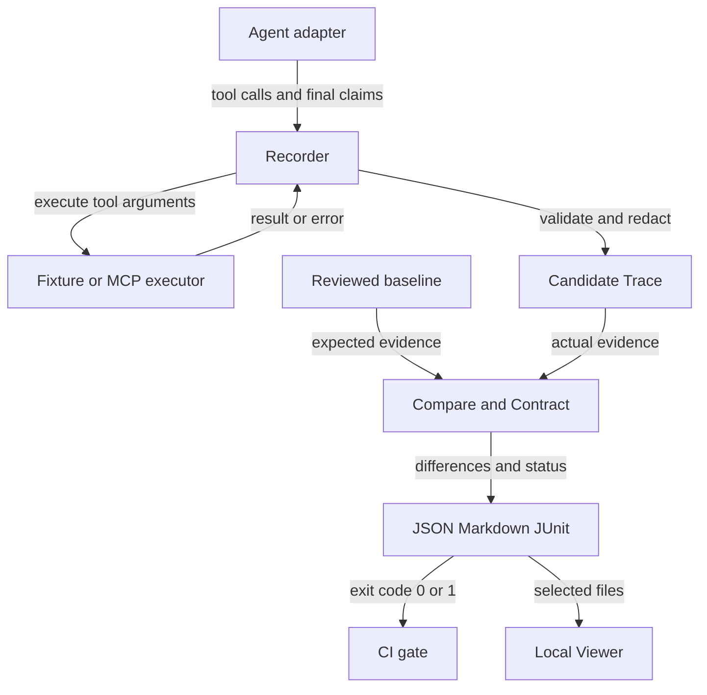

# Agent Regression Kit technical design

[中文](technical-design.zh-CN.md) · [User manual](user-manual.en.md) · [API](api.md)

Based on v4.15.0 source. Package version 4.15.0, PUBLIC_API_VERSION=4 and Trace/Session/Contract/Report schema=0.1 are independent compatibility boundaries; benchmark manifest/decision/score use their own schema 0.1.

## 1. Purpose and ownership

The kit records observable Agent behavior and checks it after changes to prompts, models, tools or orchestration. Integrators own business expectations, input sets, instrumentation and environment isolation. The kit owns recording, validation, structural comparison, contracts and reporting.

It can check arguments, structured conclusions, forbidden tools, turn continuity, business side effects and repeat-run stability. Open-ended prose quality and unobserved reasoning are outside deterministic evidence checks.

## 2. Architecture



Adapters supply observable events; comparison consumes Trace and policy; reports feed CI and the local Viewer.

| Layer | Source modules | Responsibility |
| --- | --- | --- |
| Integration | adapters.py, sdk.py, templates.py | Agent identity and sync/async callback boundary |
| Recording | record.py, async_record.py | Pairing, sequencing, redaction and validation |
| Execution | record.py, mcp.py, scenario.py | Fixed/stateful fixtures or MCP tool calls |
| Isolation | isolation.py | Snapshot and restore explicitly connected state |
| Model | model.py, session.py | Trace and turn invariants |
| Comparison | compare.py, contracts.py | Structural differences and behavioral constraints |
| Evaluation | batch.py, batch_record.py, stability.py, coverage.py | Bounded parallel cases, thresholds, coverage |
| Handoff | history.py, report_index.py, reports.py | File aggregation and rendering |
| Entry points | cli.py, config.py, preflight.py | Config precedence, paths, validation and exit codes |
| UI | ui.py, viewer/*.html | Static local file inspection and config export |
| Workspace review | workspace.py, workspace.html | Project directory to relative paths and fingerprints |
| Compatibility | public_api.py, migration.py | Version checks, deprecation status and explicit Trace migration |

Python modules live in src/agent_regression/. The core has no required third-party runtime dependencies. LangChain Core is an optional example dependency. There is no separate database or application backend.

## 3. Execution and failure behavior

```mermaid
sequenceDiagram
    participant A as Agent adapter
    participant C as Recording context
    participant T as Tool executor
    participant V as Trace validator
    A->>C: call_tool(name, arguments)
    C->>T: call with raw arguments
    alt result returned
        T-->>C: result or ToolExecutionResult
        C-->>A: redacted result
        A->>C: final_answer(text, claims)
        C->>V: completed Trace
        V-->>C: valid Trace
    else executor raises
        T--xC: exception
        C--xA: record error event and re-raise
        Note over A,C: Unhandled error aborts record_run; no successful Trace returned
    end
```

The context records a call before executing it. If a synchronous executor raises, it records an error event and re-raises; record_run returns a complete Trace only after Agent completion and validation. Internal error events are not automatically persisted crash reports.

A ToolExecutionResult can carry is_error/error/metadata; this differs from an executor raising a Python exception. Integrations must handle the distinction. The synchronous context returns redacted results to the Agent, which can affect logic using sensitive fields.

## 4. Evidence model

AgentTrace contains schema_version, run_id, agent, events and metadata. call_id pairs tool_call/tool_result; sequence identifies event order; final_answer contains text and optional claims.

- run_id identifies evidence, not a business requirement.
- Agent identity and optional model/prompt metadata document provenance.
- Claims are integration-provided facts, not automatically extracted truth.
- Optional world_state initial/final snapshots make exposed side effects observable.
- schema/agent-trace-v0.1.schema.json describes shape; runtime validation also checks event invariants.
- AgentSession holds ordered per-turn traces; shared Agent/tool instances preserve conversation state and exposed snapshot continuity can be checked.

## 5. Comparison and contracts

compare_traces accepts validated baseline/candidate and ComparisonPolicy. Default alignment extracts event types and compares calls/results by order, including names, arguments, results, error states and final text/claims. It is neither a full-file JSON diff nor optimal sequence alignment.

ContractPolicy exposes tool_calls, tool_results, final_answer and world_state projections. ignore_paths and normalizers affect comparable values; assertions examine the raw candidate projection. Argument/result mismatches can be reported at whole-object paths; world-state differences can be field-level.

| Policy | Semantics |
| --- | --- |
| exact | Default final text and claims comparison |
| claims-only | Skip prose; meaningful business claims still need instrumentation |
| allow_categories / allow_paths | Permit named categories or exact reported paths |
| equals / contains / exists | Candidate field assertions |
| must_call / must_not_call | Required or forbidden tools and optional arguments |
| max_steps | Maximum number of tool calls |
| path_rules.any_of | Explicit accepted tool paths, optionally constraining result and is_error |
| path_rules.mode | `exact`, `ordered_subsequence` or `unordered_subset`; omitted means strict complete-path matching |
| path_rules.extra_calls | Explicit allowlist for unmatched calls in tolerant modes; omitted preserves v4.6, an empty list rejects all extras |
| tool_limits | Per-tool, optionally argument-scoped minimum/maximum counts; failures produce `tool_count` |
| tool_allowlist | Scenario-level permitted tool catalog with optional exact arguments; failures produce `unauthorized_tool_call` |
| argument_rules | Per-tool rules for every call's relative argument paths, literal/Trace references and presence; failures produce `tool_argument_policy` |
| state_equivalence | `exact`, `outcome` and `hybrid` intent/outcome modes; failures produce `state_equivalence` |
| result_alignment | Associate results by call_id by default; `order` preserves positional alignment |
| side_effects | Expected from/to state transitions |
| relations | Cross-step field constraints; missing or false relations block |
| timestamp / sort | Fixed marker or repr-based list ordering, no user code execution |

Path modes are explicit candidate-path constraints, not fuzzy string matching.
`exact` requires the complete path length and every rule to match;
`ordered_subsequence` scans forward so extra calls may appear around the
required rules; `unordered_subset` consumes one distinct candidate event per
rule and permits extra calls and reordering. In v4.7, `extra_calls` can constrain
those unmatched calls with an explicit allowlist; omitting it preserves v4.6
compatibility, while an empty list rejects every unmatched call. Rules can
constrain the tool, arguments, result and error state. A rejected call produces
an `extra_tool_call` diagnostic in addition to the overall `behavior_path`
failure. The comparator does not force extra events into baseline result
positions, so business-significant extra results should still be declared with
path-rule `result`/`is_error`, assertions, relations or side effects.

`tool_limits` controls call counts rather than the global step total: only
`min_calls` checks a lower bound, only `max_calls` checks an upper bound, and
equal values express an exact count. Optional `arguments` scopes the count to
calls with an exact argument match. A violation produces `tool_count` at
`tool_calls.count.<tool>` with the configured rule and observed count. This
complements `max_steps`, `must_not_call` and side-effect checks; it is not
authorization.

`tool_allowlist` is the scenario-level tool catalog boundary. Omitting it keeps
older behavior and imposes no catalog restriction; an explicit empty list
denies every tool call. A string rule matches a tool name, while an object may
also require an exact `arguments` object. Every candidate `tool_call` must
match one rule or comparison emits `unauthorized_tool_call` at
`tool_calls[index]`. This verifies observed Agent evidence against the declared
boundary; it does not replace authorization in the real Tool Gateway. Keep it
separate from call counts, path rules, relations and side-effect contracts.

`argument_rules` closes the gap between an allowed tool and a safe use of that
tool. Each rule contains a `tool`, a `path` relative to that call's
`arguments`, and an `operator`. Literal operators (`equals`, `not_equals`,
numeric comparisons and `in`) use `value`; path operators use `right_path` and
can reference `metadata.input.order_id` or an observed tool result. `exists`
and `absent` require or forbid an argument path. Every call of the named tool
is checked; a missing tool is not a `must_call` assertion.

```json
{
  "contract": {
    "tool_allowlist": ["get_order", "refund_order"],
    "argument_rules": [
      {
        "tool": "get_order",
        "path": "tenant_id",
        "operator": "equals_path",
        "right_path": "metadata.input.tenant_id",
        "message": "cross-tenant lookup is not allowed"
      },
      {
        "tool": "refund_order",
        "path": "amount",
        "operator": "less_or_equal_path",
        "right_path": "tool_results[0].result.paid_amount",
        "message": "refund amount must not exceed paid amount"
      },
      {
        "tool": "refund_order",
        "path": "admin_override",
        "operator": "absent"
      }
    ]
  }
}
```

Violations are structured and point to the zero-based candidate call index:

```json
{
  "category": "tool_argument_policy",
  "path": "tool_calls[2].arguments.amount",
  "baseline": {
    "tool": "refund_order",
    "path": "amount",
    "operator": "less_or_equal_path",
    "right_path": "tool_results[0].result.paid_amount"
  },
  "candidate": {"value": [880], "right_values": [88]},
  "message": "refund amount must not exceed paid amount"
}
```

If an existing `relations` rule only checks a fixed tool-call argument index
and the condition should apply to every call of that tool, migrate it to
`argument_rules`. Keep `relations` for general relationships among claims,
tool results and world state. A production Tool Gateway must still enforce
tenant isolation and authorization; the kit verifies only behavior exposed in
the Trace.

`state_equivalence` addresses false alarms where a reviewed action list is not
the only valid path to a business outcome. It is not fuzzy matching. In
`outcome` mode, only rules already declared inside `any_of` can be grouped by
`ignore_argument_paths`; a candidate must still exactly match one group's tool
name, non-ignored arguments, explicit result and error constraints.
`allow_failed_expected`, `tool_aliases` and `idempotent_tools` are opt-in and
default to closed. v4.13 adds `attempt_policy`: ordinary regressions require a
successful matching event, failed attempts cannot satisfy the expected action
alone, and a failed-attempt limit can be configured. `paths` compares selected
final-state values between baseline and candidate; missing or changed values
produce `state_evidence_missing` or `state_equivalence`. With
`state_scope=declared_and_unchanged_rest`, undeclared world-state changes
produce `unexpected_state_change`. See the [state-equivalence guide](state-equivalence.md)
and [v4.13 acceptance record](v4.13-acceptance.md) for the full algorithm,
configuration and negative cases.

`relations` covers business constraints that a single-field assertion cannot
express. It resolves JSON paths in the candidate `tool_calls`, `tool_results`,
`final_answer` and `world_state` projections. For example, it can require
`tool_calls[2].arguments.amount` to be less than or equal to
`tool_results[0].result.paid_amount`, or require a later `order_id` to equal
the ID returned by an earlier call. Relation checks are deterministic: missing
paths, incomparable types and false comparisons produce a
`contract_relation` difference, preserving the configured `message` as the
diagnostic. Relations cannot infer whether prose truly expresses a claim and
do not replace tool authorization.

When a real framework already owns tool execution, use `FrameworkTraceRecorder`:
call `on_tool_start` from the framework's tool-start callback, `on_tool_end`
from its tool-end callback, and `on_final_answer` from the final-output
callback; `finish()` returns a validated and redacted Trace. It does not take
over the model, tools or framework threads. It owns only the evidence boundary,
call_id association and lifecycle validation. `record_framework_run` is a thin
wrapper for a one-run framework callback.

Empty claims and broad ignores weaken coverage. When accepting alternative paths, retain outcome assertions, side-effect constraints and branch scenarios.

## 6. Replay versus re-execution

`replay_trace` validates existing evidence and returns paired calls/results plus the answer. It never invokes the executor or Agent. v3.6 adds `CassetteToolExecutor` and `replay_agent_run`: they turn a reviewed Trace into a strict cassette, let the Agent code execute again, require each call to match the next recorded tool name and JSON arguments, and serve results from the cassette without touching live tools. The executor also checks that the Agent consumed every recorded call. Regression can therefore use a cassette for safe Agent logic checks, while live tool behavior still requires a new candidate recorded in an isolated environment.

The existing `replay` command remains read-only evidence inspection. `replay-run`
is a deterministic scripted acceptance entry point; production integrations
should use the Python API with their own adapter.

ScriptedAgentAdapter executes a fixed plan, including potentially prewritten answers. It validates the testing mechanism, not real model interpretation. Real integrations must derive or expose conclusions and claims from actual results.

## 7. Concurrency, state and nondeterminism

Batch recording uses bounded threads and independent adapter/tool factories, then stable case_id ordering. Async recording assigns call IDs in creation order and captures explicit parallel groups; completion order differs from emitted evidence order.

SnapshotBackend defines snapshot()/restore(). Integrators implement actual database, cache or emulator rollback. Unregistered writes and process-global state are not automatically isolated.

record_stability aggregates pass rate, claims agreement, tool errors and path variants over fresh runs. Finite repeats are not a population reliability guarantee. CLI stability uses scripted scenarios; model-backed evaluation uses ScenarioCase factories through the Python API.

## 8. MCP boundary

MCP is the tool protocol boundary. Clients target protocol 2025-11-25 with stdio and Streamable HTTP. They expose discovery, calls, resources, prompts, pagination, progress, explicit cancellation, streams and controlled server-request/task handling.

Client methods are not automatically used by every Trace recorder. Lifecycle design is synchronous and single-session; automatic OAuth, all optional extensions and unknown protocol versions are not guaranteed. Reconnecting transport does not make business calls safe to retry.

Local fixtures verify controlled behavior; official Everything Server smoke checks verify basic interoperability/discovery; the LangChain example verifies a callback. None is a complete protocol certification or proof that arbitrary production Agents are instrumented.

## 9. Reports and CI

JSON preserves machine-readable results; Markdown supports review and Job Summary; JUnit supports test tooling. report-index includes compare/batch/stability/coverage/history summaries without embedding complete differences or traces. Use `--required-report path-or-glob` to make missing artifacts fail the gate instead of silently accepting an incomplete index.

history uses sorted relative filenames, not inferred timestamps, and does not automatically group cases or report types. Build meaningful trends from comparable runs. The main CI's mixed report aggregation demonstrates the interface, not a cross-release performance trend.

Comparison/check commands use 0/1/2. history follows the last recognized point. report-index --fail-on-regression requires all recognized entries to pass and fails on an empty inventory. Malformed/unrecognized JSON may be listed as skipped: the index is not an "all expected reports exist" check unless required paths are supplied. In CI, pass `--required-report` or the Action's `required-reports` input, and preserve producer exit codes.

Use compare --config for custom contracts; v3.5's comparison Action also accepts a `config` input while retaining the legacy baseline/candidate inputs. CI records, preflights, compares and uploads, without automatically accepting baseline changes.

## 10. Security and deployment

ui defaults to 127.0.0.1 but allows --host overrides. It is a static server without authentication, tenancy, remote runners, database or server-side approval service. Pages require explicit file selection. `workspace manifest` emits only relative paths, sizes and SHA-256 fingerprints; `baseline review` compares and writes a report, while `baseline accept` remains the only explicit save operation.

Default redaction recognizes common keys; free text needs explicit secret_values. Filenames, paths, summaries and external logs may remain sensitive. Review artifacts before upload. MCP subprocesses run with the current user's permissions; use trusted tools and isolated test data.

## 11. Compatibility, acceptance and evolution

v4 makes the compatibility boundaries executable. `PUBLIC_API_VERSION=4` is the
stable documented Python import generation. Trace, Session, Contract/config and
Report schemas remain independently versioned at `0.1`; the package does not
silently reinterpret an older document. v3 public API integrations remain
readable as deprecated and are reported as requiring migration.

```bash
agent-regression compatibility \
  --public-api-version 4 \
  --trace baselines/order-123.trace.json \
  --config .agent-regression/config.json \
  --report outputs/compare.json
agent-regression migrate trace \
  --trace baselines/order-123.trace.json \
  --out work/order-123.v4.trace.json
```

The v4.5 release gate includes the repository test suite, Python 3.9/3.11/3.13
core CI, LangChain Core event checks, positive and negative PydanticAI/OpenAI
Agents/LangGraph checks, the single- and multi-tool DeepSeek live gate,
wheel/source builds, SHA-256/SPDX/signed provenance, clean installation,
compatibility and migration commands, workspace manifest checks and Viewer
asset checks. This demonstrates covered paths, not years of production usage or
automatic support for every Agent.

### Independent project validation

v4.14 adds a generic benchmark boundary around this adapter. A manifest pins
the source revision, split definition, evidence, Contract bundle, labels and
package commit by SHA-256. `benchmark prepare` validates coverage,
`benchmark decide` reads evidence without label semantics, and
`benchmark score` validates the decision digest before reading labels. The
τ²-specific result below remains calibration evidence because its historical
labels informed Contract design.

v4.13 extends the v4.12 reproducible integration against the independently maintained
[tau2-bench](https://github.com/sierra-research/tau2-bench) retail result set.
The repository pins upstream tag `v1.0.1`, the exact source commit, the raw
dataset URL and its SHA-256 checksum. The validation imports published
trajectories into `AgentTrace`, derives a deterministic contract from each
task's expected write actions and communication requirement, and compares the
contract decision with tau2-bench's published reward only after the decision is
made. Reward is therefore an oracle for measurement, not input to the Trace,
claims or contract.

The pinned 456-simulation run contains 420 write scenarios (36 read-only cases
are reported separately). The v4.11 strict contract achieved 253 true passes,
153 true blocks, 14 false alarms and 0 missed failures; those false alarms are
retained as v4.12 design input. v4.12 adds explicit `state_equivalence` grouping
for declared alternative intents while retaining exact object/resource
arguments. v4.13 keeps the same benchmark matrix while making the adapter's
non-strict success interpretation explicit. On the same data it achieves 267 true passes, 153 true blocks, 0
false alarms and 0 missed failures: 100% accuracy, failure precision and
failure recall, with 0% false-alarm and missed-failure rates. This does not
claim upstream benchmark adoption.

Reproduce it with:

```bash
curl -L -o work/tau2-results.json \
  https://raw.githubusercontent.com/sierra-research/tau2-bench/v1.0.1/data/tau2/results/final/gpt-4.1-mini-2025-04-14_retail_base_gpt-4.1-2025-04-14_4trials.json
sha256sum work/tau2-results.json
PYTHONPATH=src python examples/tau2_retail_validation.py \
  --results work/tau2-results.json \
  --out work/tau2/report.json \
  --traces-dir work/tau2/traces
```

See [the full methodology](tau2-independent-validation.md), the
[state-equivalence guide](state-equivalence.md), the [v4.12 acceptance
record](v4.12-acceptance.md) and the [v4.13 acceptance record](v4.13-acceptance.md) for field mappings, limitations, sample traces and
CI behavior.

[Core CI](https://github.com/ANTAO94/agent-regression-kit/actions) · [Framework checks](https://github.com/ANTAO94/agent-regression-kit/actions) · [Refund business case](../examples/refund-business-case/README.md) · [Path variation](../examples/path-variation/README.md) · [DeepSeek live check](deepseek-live.md) · [Independent tau2 validation](tau2-independent-validation.md) · [Independent consumer pilot](consumer-pilot.md) · [State-equivalence guide](state-equivalence.md) · [Release integrity](supply-chain.md) · [Release](https://github.com/ANTAO94/agent-regression-kit/releases/tag/v4.15.0) · [v4.15 acceptance](v4.15-acceptance.md) · [v4.14 acceptance](v4.14-acceptance.md) · [v4.13 acceptance](v4.13-acceptance.md) · [v4.12 acceptance](v4.12-acceptance.md) · [v4.11 acceptance](v4.11-acceptance.md)

Preserve public API compatibility, document deprecation/migration, version Trace independently, and review business baselines explicitly. Expand real integrations and security/usability validation before evaluating a hosted service layer.
