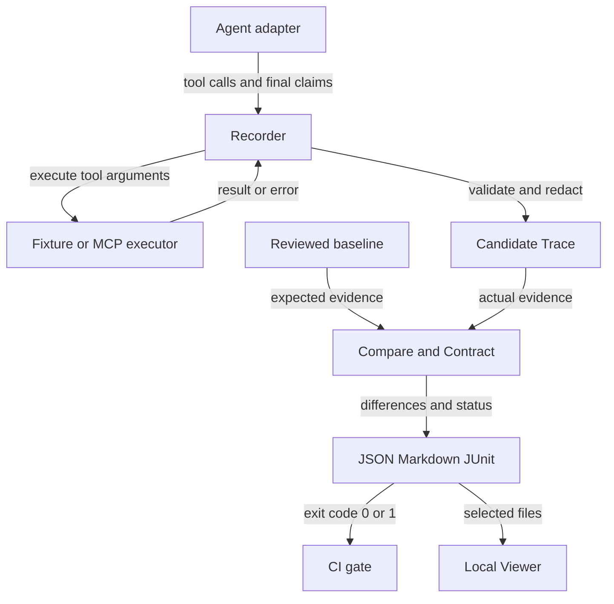

# Agent Regression Kit 技术方案

[English](technical-design.en.md) · [使用手册](user-manual.zh-CN.md) · [API](api.md)

依据 v3.8.0 源码整理；产品版本 3.8.0、PUBLIC_API_VERSION=3、AgentTrace/AgentSession schema=0.1 是三个独立边界。

## 1. 目标和适用场景

目标是把 Agent 的可观测行为保存为结构化证据，并在 Prompt、模型、工具或编排代码变化后检查回归。使用者负责业务期望、输入集、真实 Agent 的插桩和环境隔离；框架负责记录、结构校验、比较、契约检查与报告。

适用于工具参数正确性、结构化结论一致性、禁用工具约束、多轮状态衔接、业务副作用和重复运行稳定性。自由文本质量、开放式推理正确性、未暴露的内部步骤不在确定性比较的证明范围内。

## 2. 架构与责任



数据从接入边界流向录制器，比较器只消费 Trace 和策略，报告再交给 CI 与本地 Viewer。

| 层 | 主要文件 | 输入 → 输出 | 责任 |
| --- | --- | --- | --- |
| 接入 | adapters.py、sdk.py、templates.py | 框架回调 → context 调用 | 框架身份、同步/异步入口 |
| 录制 | record.py、async_record.py | Agent + 工具 → Trace | 调用配对、事件序列、脱敏、校验 |
| 工具 | record.py、mcp.py、scenario.py | 工具名/参数 → 结果 | 固定 Fixture、状态 Fixture、MCP |
| 状态隔离 | isolation.py | snapshot → restore | 用例前后恢复已接入状态 |
| 核心模型 | model.py、session.py | JSON → 已验证模型 | schema、事件与轮次约束 |
| 比较/契约 | compare.py、contracts.py | baseline + candidate + policy → diff | 结构差异与业务约束 |
| 批量评测 | batch.py、batch_record.py、stability.py、coverage.py | 场景集/多次运行 → 聚合报告 | 有界并发、失败归集、阈值 |
| 历史/交接 | history.py、report_index.py、reports.py | JSON → 趋势/索引/展示 | 文件聚合与格式化 |
| 操作入口 | cli.py、config.py、preflight.py | 参数/配置 → 命令结果 | 优先级、路径、退出码 |
| 页面 | ui.py、viewer/*.html | 用户选择文件 → 展示/配置导出 | 本地静态服务 |

源文件均位于 src/agent_regression/，除 Viewer 外无独立后端服务。核心没有必需的第三方运行时依赖；LangChain Core 是可选示例依赖。

## 3. 一次请求的运行过程

```mermaid
sequenceDiagram
    participant A as Agent adapter
    participant C as Recording context
    participant T as Tool executor
    participant V as Trace validator
    A->>C: call_tool(name, arguments)
    C->>T: call with raw arguments
    alt result returned
        T-->>C: result or ToolExecutionResult
        C-->>A: redacted result
        A->>C: final_answer(text, claims)
        C->>V: completed Trace
        V-->>C: valid Trace
    else executor raises
        T--xC: exception
        C--xA: record error event and re-raise
        Note over A,C: Unhandled error aborts record_run; no successful Trace returned
    end
```

录制器先保存调用事件，再执行工具。同步执行器抛错时会记录错误事件并重新抛出；只有 Agent 正常结束并通过 Trace 校验时，record_run 才返回完整 Trace。不要把内部错误事件理解为自动落盘的崩溃报告。

MCP 的 ToolExecutionResult 可以携带 is_error/error/metadata；这与 Python executor 直接抛异常是不同路径，适配方需要明确处理。同步 context 返回给 Agent 的结果已经过脱敏，这可能影响使用敏感字段的业务逻辑。

## 4. 数据模型

AgentTrace 包含 schema_version、run_id、agent、events 和 metadata。tool_call 与 tool_result 通过 call_id 配对；sequence 记录事件顺序；final_answer 包含 text 和可选 claims。

- run_id 用于运行标识，不应充当业务断言。
- agent 身份说明来源，模型/Prompt 版本建议放入可审核 metadata。
- claims 必须由接入方提供，不是框架从文字推导出的事实。
- world_state 的 initial/final 快照属于可选 metadata；没有快照就无法证明外部副作用。
- JSON Schema 文件位于 schema/agent-trace-v0.1.schema.json；运行时验证也检查事件约束，不能只依赖 JSON 形状校验。
- AgentSession 是有序轮次的容器；复用 Agent/工具以保持对话状态，比较器检查轮次和已暴露的状态连续性。

## 5. 比较算法与策略

compare_traces 接收两个已验证 Trace 和 ComparisonPolicy。默认按事件类型抽取列表、按顺序对齐工具调用/结果，比较名称、参数、结果、错误状态、最终文字及 claims；不是全文 JSON diff，也不是最优路径匹配。

ContractPolicy 提供投影路径 tool_calls、tool_results、final_answer、world_state。ignore_paths 和 normalizers 用于可比较值；assertions 检查 candidate 的原始投影。参数/结果通常以整个对象差异报告，world_state 可以逐字段报告；不要承诺所有嵌套字段都输出最细粒度 diff。

| 策略 | 含义 |
| --- | --- |
| exact | 默认严格比较最终文字与 claims |
| claims-only | 跳过最终文字比较；应确保 claims 包含有意义的业务字段 |
| allow_categories / allow_paths | 允许指定类别或完整报告路径的差异 |
| equals / contains / exists | 对 candidate 做显式字段断言 |
| must_call / must_not_call | 限定工具调用及可选参数 |
| max_steps | 限定工具调用总数 |
| path_rules.any_of | 接受显式列举的多条工具路径，可同时约束结果和 is_error |
| result_alignment | 默认按 call_id 关联工具结果；`order` 是旧的按事件位置对齐模式 |
| side_effects | 约束已录制状态的 from/to 变化 |
| required_claims | 要求 candidate 的结构化业务结论路径必须存在 |
| timestamp / sort | 固定时间标记或按 repr 排序列表，不执行用户脚本 |

真实框架如果已经拥有工具执行生命周期，可以使用 `FrameworkTraceRecorder`：
在框架的 tool-start 回调调用 `on_tool_start`，在 tool-end 回调调用
`on_tool_end`，在最终输出回调调用 `on_final_answer`，最后 `finish()` 得到
经过校验和脱敏的 Trace。它不会接管模型、工具或框架线程，只负责事件边界、
call_id 关联和生命周期错误。`record_framework_run` 是一个更薄的包装器，
适合把一次框架运行函数直接接入。

采用 claims-only 并不自动证明业务正确；空 claims 或过宽忽略规则会削弱测试。允许替代路径时，补上结果断言、副作用约束与分支用例，避免单纯放宽路径。

## 6. “回放”与真实重新执行

`replay_trace` 校验 Trace，将调用与已记录结果配对后返回摘要。它不调用
executor，也不执行 Agent。v3.6 新增 `CassetteToolExecutor` 和
`replay_agent_run`：它们把审核过的 Trace 转成严格 cassette，允许 Agent
代码再次执行，但每次 `call_tool` 都必须按顺序匹配工具名和 JSON 参数，结果
直接来自 cassette，不会触碰真实工具。执行结束后还会检查是否漏掉了 cassette
中的调用。真正的回归链路是：审核 baseline → 修改 Agent → 重新运行/录制
candidate → compare。

```python
from agent_regression import AgentTrace, replay_agent_run

candidate = replay_agent_run(
    my_adapter,
    request,
    AgentTrace.from_dict(json.loads(Path("baselines/order.trace.json").read_text())),
    run_id="candidate-cassette",
)
```

`replay` 仍然只读查看证据；`replay-run` 只是项目自带脚本场景的 CLI
验收入口。生产框架应使用 Python API，把自己的 adapter 传给
`replay_agent_run`。

ScriptedAgentAdapter 按固定 plan 执行，最终答案也可能是脚本预设；它证明记录/比较机制可测，不等价于验证真实模型解释能力。业务 Agent 的答案应从工具结果计算，真实模型的结果需通过适配器显式输出 claims。

## 7. 并发、隔离和非确定性

- 批量场景使用有界线程，每个 ScenarioCase 的 adapter_factory/tools_factory 应生成独立对象；结果按 case_id 稳定排序。
- 异步 API 支持同一轮的并行调用；call_id 在调用创建时分配，显式 parallel_group 记录分组。完成顺序不等于 Trace 输出顺序。
- SnapshotBackend 仅定义 snapshot()/restore()。事务、Redis、外部服务回滚实现由接入方负责；不会自动隔离全局变量或未注册副作用。
- record_stability 对重复运行的 Trace 计算通过率、claims 一致率、工具错误率和路径变体。重复次数有限，不是总体可靠性的统计保证。
- CLI stability 使用脚本场景；连接真实模型请使用 Python API 的 ScenarioCase 工厂。

## 8. MCP 适配范围

MCP 是 Agent 调用工具的协议边界。当前客户端按 2025-11-25 协议实现 stdio 和 Streamable HTTP；支持发现、工具调用、资源、prompts、分页、进度、显式取消、事件流和受控服务端请求/任务接口。

支持某个客户端接口不代表所有 AgentTrace recorder 都自动使用它。客户端生命周期是同步、单会话设计，自动 OAuth、所有可选扩展和未知协议版本没有通用保证。超时/重连不意味着安全重试业务工具，未知副作用调用不应盲目重发。

本地 Fixture 验证可控协议行为；官方 Everything Server smoke 验证发现/基础互操作；LangChain 示例验证回调；三者都不能代替生产接入用例和完整协议一致性认证。

## 9. 报告、历史和 CI

JSON 保留机器可读差异；Markdown 用于人工审核和 Job Summary；JUnit 用于测试系统。report-index 汇总 compare/batch/stability/coverage/history，并默认只输出状态和摘要，不嵌入完整差异或 Trace。使用 `--required-report path-or-glob` 可以把“报告缺失”也变成失败；这解决了某个前置步骤没有产出报告、但索引仍看起来通过的问题。

history 按排序后的相对文件名定义“最新”；不是按真实时间自动排序，也不会按用例/报告类型自动分组。应在同一测试序列内生成可解释趋势。主 CI 混合报告只演示聚合接口，不应把混合指标解释为跨版本性能趋势。

compare 等检查命令返回 0/1/2。history 跟随最新点；report-index --fail-on-regression 要求所有已识别报告通过，空索引也不通过。无法识别/损坏的 JSON 可进入 skipped；索引默认不是“所有预期报告存在”的完整性校验，在 CI 中应显式列出 `--required-report`，或给 Report Index Action 传 `required-reports`。

CI 自定义 contract 可以使用 `compare --config`，v3.5 的比较 Action 也支持 `config` 输入；旧的 baseline/candidate 输入仍兼容。CI 先录制再 check，之后比较并上传报告，绝不自动接受 baseline。

## 10. 安全与部署

默认 ui 绑定 127.0.0.1，但 --host 可更改绑定；这是静态服务，不提供认证或多租户隔离。页面读取本地文件，未提供用户管理、远程 Runner、数据库或基线审批服务。

默认脱敏覆盖常见敏感键，自由文本需显式 secret_values。文件名、路径、摘要和外部工具日志也可能敏感，上传前审查；不能把“已脱敏”视为数据绝不泄露的保证。MCP 子进程继承当前用户权限；使用可信服务与隔离测试数据。

## 11. 验收与维护边界

v3.4.3 的已记录发布证据包括 132 项本地测试、Python 3.9/3.11/3.13 主回归、LangChain Core 回调兼容检查、源码包/wheel 构建及干净环境安装。它们证明已覆盖路径可运行，不等价于多年生产使用或任意 Agent 自动兼容。

[主回归](https://github.com/ANTAO94/agent-regression-kit/actions/runs/35349647124) · [框架兼容性](https://github.com/ANTAO94/agent-regression-kit/actions/runs/35349647091) · [发布](https://github.com/ANTAO94/agent-regression-kit/releases/tag/v3.4.3)

维护策略：新增公开 API 保持兼容；破坏性变化需弃用与迁移说明；Trace schema 独立版本化；业务 baseline 人工审核；真实项目扩大覆盖后再评估服务化。后续重点应是更多实际接入验证、用户体验与安全边界验证，而不是仅凭版本号宣称成熟。
