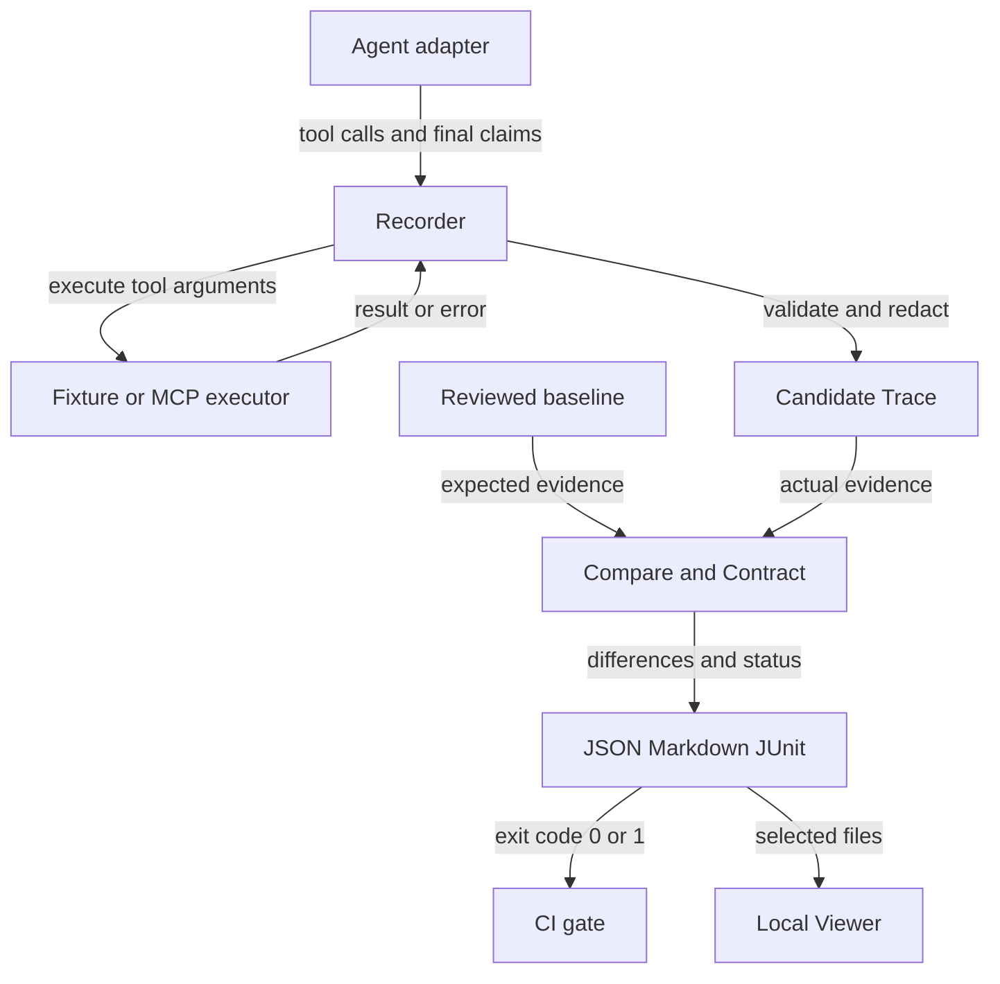

# Agent Regression Kit 技术方案

[English](technical-design.en.md) · [使用手册](user-manual.zh-CN.md) · [API](api.md)

依据 v4.35.0 源码整理；产品版本 4.35.0、PUBLIC_API_VERSION=4、AgentTrace/AgentSession/Contract/Report schema=0.1 是相互独立的兼容边界；Benchmark manifest/decision/score/performance/study/readiness 另有独立 schema=0.1。

## 1. 目标和适用场景

目标是把 Agent 的可观测行为保存为结构化证据，并在 Prompt、模型、工具或编排代码变化后检查回归。使用者负责业务期望、输入集、真实 Agent 的插桩和环境隔离；框架负责记录、结构校验、比较、契约检查与报告。

适用于工具参数正确性、结构化结论一致性、禁用工具约束、多轮状态衔接、业务副作用和重复运行稳定性。自由文本质量、开放式推理正确性、未暴露的内部步骤不在确定性比较的证明范围内。

## 2. 架构与责任



数据从接入边界流向录制器，比较器只消费 Trace 和策略，报告再交给 CI 与本地 Viewer。

| 层 | 主要文件 | 输入 → 输出 | 责任 |
| --- | --- | --- | --- |
| 接入 | adapters.py、sdk.py、templates.py | 框架回调 → context 调用 | 框架身份、同步/异步入口 |
| 录制 | record.py、async_record.py | Agent + 工具 → Trace | 调用配对、事件序列、脱敏、校验 |
| 工具 | record.py、mcp.py、scenario.py | 工具名/参数 → 结果 | 固定 Fixture、状态 Fixture、MCP |
| 状态隔离 | isolation.py | snapshot → restore | 用例前后恢复已接入状态 |
| 核心模型 | model.py、session.py | JSON → 已验证模型 | schema、事件与轮次约束 |
| 比较/契约 | compare.py、contracts.py | baseline + candidate + policy → diff | 结构差异与业务约束 |
| 批量评测 | batch.py、batch_record.py、stability.py、coverage.py | 场景集/多次运行 → 聚合报告 | 有界并发、失败归集、阈值 |
| 历史/交接 | history.py、report_index.py、reports.py | JSON → 趋势/索引/展示 | 文件聚合与格式化 |
| 操作入口 | cli.py、config.py、preflight.py | 参数/配置 → 命令结果 | 优先级、路径、退出码 |
| 页面 | ui.py、viewer/*.html | 用户选择文件 → 展示/配置导出 | 本地静态服务 |
| 工作区审核 | workspace.py、workspace.html | 项目目录 → 相对路径/指纹清单 | 不嵌入证据内容，不修改文件 |
| 兼容与迁移 | public_api.py、migration.py | 版本检查、弃用提示、显式 Trace 迁移 | 不静默改写源文件 |

源文件均位于 src/agent_regression/，除 Viewer 外无独立后端服务。核心没有必需的第三方运行时依赖；LangChain Core 是可选示例依赖。

## 3. 一次请求的运行过程

```mermaid
sequenceDiagram
    participant A as Agent adapter
    participant C as Recording context
    participant T as Tool executor
    participant V as Trace validator
    A->>C: call_tool(name, arguments)
    C->>T: call with raw arguments
    alt result returned
        T-->>C: result or ToolExecutionResult
        C-->>A: redacted result
        A->>C: final_answer(text, claims)
        C->>V: completed Trace
        V-->>C: valid Trace
    else executor raises
        T--xC: exception
        C--xA: record error event and re-raise
        Note over A,C: Unhandled error aborts record_run; no successful Trace returned
    end
```

录制器先保存调用事件，再执行工具。同步执行器抛错时会记录错误事件并重新抛出；只有 Agent 正常结束并通过 Trace 校验时，record_run 才返回完整 Trace。不要把内部错误事件理解为自动落盘的崩溃报告。

MCP 的 ToolExecutionResult 可以携带 is_error/error/metadata；这与 Python executor 直接抛异常是不同路径，适配方需要明确处理。同步 context 返回给 Agent 的结果已经过脱敏，这可能影响使用敏感字段的业务逻辑。

## 4. 数据模型

AgentTrace 包含 schema_version、run_id、agent、events 和 metadata。tool_call 与 tool_result 通过 call_id 配对；sequence 记录事件顺序；final_answer 包含 text 和可选 claims。

- run_id 用于运行标识，不应充当业务断言。
- agent 身份说明来源，模型/Prompt 版本建议放入可审核 metadata。
- claims 必须由接入方提供，不是框架从文字推导出的事实。
- world_state 的 initial/final 快照属于可选 metadata；没有快照就无法证明外部副作用。
- JSON Schema 文件位于 schema/agent-trace-v0.1.schema.json；运行时验证也检查事件约束，不能只依赖 JSON 形状校验。
- AgentSession 是有序轮次的容器；复用 Agent/工具以保持对话状态，比较器检查轮次和已暴露的状态连续性。

## 5. 比较算法与策略

compare_traces 接收两个已验证 Trace 和 ComparisonPolicy。默认按事件类型抽取列表、按顺序对齐工具调用/结果，比较名称、参数、结果、错误状态、最终文字及 claims；不是全文 JSON diff，也不是最优路径匹配。

ContractPolicy 提供投影路径 tool_calls、tool_results、final_answer、world_state。ignore_paths 和 normalizers 用于可比较值；assertions 检查 candidate 的原始投影。参数/结果通常以整个对象差异报告，world_state 可以逐字段报告；不要承诺所有嵌套字段都输出最细粒度 diff。

| 策略 | 含义 |
| --- | --- |
| exact | 默认严格比较最终文字与 claims |
| claims-only | 跳过最终文字比较；应确保 claims 包含有意义的业务字段 |
| allow_categories / allow_paths | 允许指定类别或完整报告路径的差异 |
| equals / contains / exists | 对 candidate 做显式字段断言 |
| must_call / must_not_call | 限定工具调用及可选参数 |
| max_steps | 限定工具调用总数 |
| path_rules.any_of | 接受显式列举的多条工具路径，可同时约束结果和 is_error |
| path_rules.mode | `exact`、`ordered_subsequence` 或 `unordered_subset`；省略时保持严格完整路径 |
| path_rules.extra_calls | 放宽模式下对未匹配额外调用的显式白名单；省略保持 v4.6，空数组拒绝全部额外调用 |
| path_rules.ignore_argument_paths | 只从当前路径规则中移除 baseline 未声明的显式传输噪音字段；baseline 已声明字段仍严格匹配 |
| tool_limits | 按工具和可选参数约束最小/最大调用次数；失败生成 `tool_count` |
| tool_allowlist | 约束场景允许调用的工具目录，可按参数精确匹配；失败生成 `unauthorized_tool_call` |
| argument_rules | 对指定工具的每一次调用检查相对参数路径、固定值/Trace 参考值以及存在性；失败生成 `tool_argument_policy` |
| state_equivalence | `exact`、`outcome`、`hybrid` 三种状态/意图等价模式；失败生成 `state_equivalence` |
| result_alignment | 默认按 call_id 关联工具结果；`order` 是旧的按事件位置对齐模式 |
| side_effects | 约束已录制状态的 from/to 变化 |
| required_claims | 要求 candidate 的结构化业务结论路径必须存在 |
| relations | 约束跨步骤字段关系；路径缺失或比较失败都会阻断 |
| timestamp / sort | 固定时间标记或按 repr 排序列表，不执行用户脚本 |

路径模式是显式的候选路径约束，而不是模糊字符串匹配。`exact` 要求完整路径长度
和每一条规则都匹配；`ordered_subsequence` 用单向扫描匹配规则，允许候选在规则之间
出现额外调用；`unordered_subset` 为每条规则消耗一个不同的候选事件，允许额外调用
和乱序。v4.7 中，`extra_calls` 可以把这些未匹配调用收紧为显式白名单；省略字段
保持 v4.6 的兼容行为，空数组表示不允许任何额外调用。白名单规则可以约束 tool、
arguments、result 和 is_error；不匹配的调用生成 `extra_tool_call`，同时保留整体的
`behavior_path` 失败。候选如果有额外调用，比较器不会把它们强行按 baseline 位置
对齐；因此有业务意义的额外结果也应通过 path rule、assertions、relations 或
side_effects 单独声明。

`path_rules.ignore_argument_paths` 与 `state_equivalence.ignore_argument_paths` 分工不同：
前者用于当前路径规则的参数匹配，适合 `request_id` 等未建模的传输噪音；它只会忽略
baseline 规则没有写出的字段。如果 baseline 明确写出该字段，candidate 的值仍必须相同。
后者只负责 outcome 意图分组，不能替代路径参数断言。

`tool_limits` 负责调用次数而不是总步数：只配置 `min_calls` 检查下限，只配置
`max_calls` 检查上限，同时配置且相等表示恰好次数。可选 `arguments` 会把统计范围
限制到参数完全匹配的工具调用；不满足时生成 `tool_count`，路径为
`tool_calls.count.<tool>`，同时保留配置规则和实际次数。它能补充 `max_steps` 对单个
工具的约束，但不能替代权限控制、`must_not_call` 或状态副作用验证。

`tool_allowlist` 是场景级工具目录边界。省略字段时不限制工具目录，保持旧版本兼容；
显式空数组拒绝所有工具调用；字符串规则只匹配工具名，对象规则还可以要求
`arguments` 完全相等。每个 candidate `tool_call` 都必须命中一条规则，否则生成
`unauthorized_tool_call`，路径为 `tool_calls[index]`。它验证的是 Agent 运行证据是否
越过声明边界，不替代真实 Tool Gateway 的权限执行。白名单与 `tool_limits`、路径规则、
关系和副作用契约是互补的，不应把它们合并成一个模糊的“回放通过”开关。

`argument_rules` 解决的是“工具虽然在白名单内，但参数是否越过租户、资源或业务边界”。
每条规则包含 `tool`、相对于本次调用 `arguments` 的 `path` 和一个 `operator`。固定值
运算符（`equals`、`not_equals`、数值比较、`in`）使用 `value`；路径运算符使用
`right_path`，可以引用 `metadata.input.order_id` 或已记录的工具结果；`exists` 和
`absent` 分别要求参数存在或不存在。规则会检查该工具的每一次调用，缺少该工具时
本规则不代替 `must_call`。

```json
{
  "contract": {
    "tool_allowlist": ["get_order", "refund_order"],
    "argument_rules": [
      {
        "tool": "get_order",
        "path": "tenant_id",
        "operator": "equals_path",
        "right_path": "metadata.input.tenant_id",
        "message": "不得跨租户查询"
      },
      {
        "tool": "refund_order",
        "path": "amount",
        "operator": "less_or_equal_path",
        "right_path": "tool_results[0].result.paid_amount",
        "message": "退款金额不得超过实付金额"
      },
      {
        "tool": "refund_order",
        "path": "admin_override",
        "operator": "absent"
      }
    ]
  }
}
```

参数违规生成结构化差异；`path` 使用候选工具调用列表中的从零开始索引：

```json
{
  "category": "tool_argument_policy",
  "path": "tool_calls[2].arguments.amount",
  "baseline": {
    "tool": "refund_order",
    "path": "amount",
    "operator": "less_or_equal_path",
    "right_path": "tool_results[0].result.paid_amount"
  },
  "candidate": {"value": [880], "right_values": [88]},
  "message": "退款金额不得超过实付金额"
}
```

如果原有 `relations` 只是为了检查固定下标的工具参数，且同一条件应适用于该工具的
所有调用，应迁移为 `argument_rules`；`relations` 继续负责 claims、工具结果和
world state 之间的通用关系。生产 Tool Gateway 仍必须自行执行租户隔离和权限控制，
框架只验证 Trace 中暴露的行为证据。

`state_equivalence` 解决“参考动作不是唯一正确路径”的误报，但不把比较器变成模糊匹配器。
`outcome` 模式只会把 `any_of` 中经过 `ignore_argument_paths` 归并后的**已声明规则**视为
同一个意图；candidate 仍需精确命中组内某条规则的工具名、未忽略参数、显式结果和错误状态。
`allow_failed_expected`、`tool_aliases` 和 `idempotent_tools` 都是显式开关，默认关闭。
v4.13 增加 `attempt_policy`：普通回归默认要求至少一个成功事件，失败尝试不能单独满足
预期动作，并可以设置失败次数上限。`paths` 用于比较 baseline 与 candidate 的最终业务状态，
缺失或变化都会生成 `state_evidence_missing` 或 `state_equivalence` 阻断差异；
`state_scope=declared_and_unchanged_rest` 还会检查声明路径之外的 world state，变化生成
`unexpected_state_change`。完整字段、算法和负向用例见[状态等价契约说明](state-equivalence.md)
与 [v4.13 验收记录](v4.13-acceptance.md)。

`relations` 解决单字段断言无法表达的业务约束。它从 candidate 的
`tool_calls`、`tool_results`、`final_answer` 和 `world_state` 投影视图解析
JSON 路径，例如让 `tool_calls[2].arguments.amount` 小于等于
`tool_results[0].result.paid_amount`，或要求后续调用的 `order_id` 等于前一步
返回的订单号。关系检查是确定性的，空路径、类型不兼容和不满足关系均生成
`contract_relation` 差异；`message` 会作为失败解释保留下来。它不能自动判断
自然语言是否真实表达了 claims，也不能代替工具权限控制。

真实框架如果已经拥有工具执行生命周期，可以使用 `FrameworkTraceRecorder`：
在框架的 tool-start 回调调用 `on_tool_start`，在 tool-end 回调调用
`on_tool_end`，在最终输出回调调用 `on_final_answer`，最后 `finish()` 得到
经过校验和脱敏的 Trace。它不会接管模型、工具或框架线程，只负责事件边界、
call_id 关联和生命周期错误。`record_framework_run` 是一个更薄的包装器，
适合把一次框架运行函数直接接入。

采用 claims-only 并不自动证明业务正确；空 claims 或过宽忽略规则会削弱测试。允许替代路径时，补上结果断言、副作用约束与分支用例，避免单纯放宽路径。

## 6. “回放”与真实重新执行

`replay_trace` 校验 Trace，将调用与已记录结果配对后返回摘要。它不调用
executor，也不执行 Agent。v3.6 新增 `CassetteToolExecutor` 和
`replay_agent_run`：它们把审核过的 Trace 转成严格 cassette，允许 Agent
代码再次执行，但每次 `call_tool` 都必须按顺序匹配工具名和 JSON 参数，结果
直接来自 cassette，不会触碰真实工具。执行结束后还会检查是否漏掉了 cassette
中的调用。真正的回归链路是：审核 baseline → 修改 Agent → 重新运行/录制
candidate → compare。

```python
from agent_regression import AgentTrace, replay_agent_run

candidate = replay_agent_run(
    my_adapter,
    request,
    AgentTrace.from_dict(json.loads(Path("baselines/order.trace.json").read_text())),
    run_id="candidate-cassette",
)
```

`replay` 仍然只读查看证据；`replay-run` 只是项目自带脚本场景的 CLI
验收入口。生产框架应使用 Python API，把自己的 adapter 传给
`replay_agent_run`。

ScriptedAgentAdapter 按固定 plan 执行，最终答案也可能是脚本预设；它证明记录/比较机制可测，不等价于验证真实模型解释能力。业务 Agent 的答案应从工具结果计算，真实模型的结果需通过适配器显式输出 claims。

## 7. 并发、隔离和非确定性

- 批量场景使用有界线程，每个 ScenarioCase 的 adapter_factory/tools_factory 应生成独立对象；结果按 case_id 稳定排序。
- 异步 API 支持同一轮的并行调用；call_id 在调用创建时分配，显式 parallel_group 记录分组。完成顺序不等于 Trace 输出顺序。
- SnapshotBackend 仅定义 snapshot()/restore()。事务、Redis、外部服务回滚实现由接入方负责；不会自动隔离全局变量或未注册副作用。
- record_stability 对重复运行的 Trace 计算通过率、claims 一致率、工具错误率和路径变体。v4.28 额外输出 Wilson 95% 区间和小样本提醒；`StabilityPolicy.min_runs`/`stability --min-runs` 可以把最低证据量变成门禁。重复次数有限，仍不是总体可靠性的统计保证。
- CLI stability 使用脚本场景；连接真实模型请使用 Python API 的 ScenarioCase 工厂。

## 8. MCP 适配范围

MCP 是 Agent 调用工具的协议边界。当前客户端按 2025-11-25 协议实现 stdio 和 Streamable HTTP；支持发现、工具调用、资源、prompts、分页、进度、显式取消、事件流和受控服务端请求/任务接口。

支持某个客户端接口不代表所有 AgentTrace recorder 都自动使用它。客户端生命周期是同步、单会话设计，自动 OAuth、所有可选扩展和未知协议版本没有通用保证。超时/重连不意味着安全重试业务工具，未知副作用调用不应盲目重发。

本地 Fixture 验证可控协议行为；官方 Everything Server smoke 验证发现/基础互操作；LangChain 示例验证回调；三者都不能代替生产接入用例和完整协议一致性认证。

## 9. 报告、历史和 CI

JSON 保留机器可读差异；Markdown 用于人工审核和 Job Summary；JUnit 用于测试系统。report-index 汇总 compare/batch/stability/coverage/history，并默认只输出状态和摘要，不嵌入完整差异或 Trace。使用 `--required-report path-or-glob` 可以把“报告缺失”也变成失败；这解决了某个前置步骤没有产出报告、但索引仍看起来通过的问题。

history 按排序后的相对文件名定义“最新”；不是按真实时间自动排序，也不会按用例/报告类型自动分组。应在同一测试序列内生成可解释趋势。主 CI 混合报告只演示聚合接口，不应把混合指标解释为跨版本性能趋势。

compare 等检查命令返回 0/1/2。history 跟随最新点；report-index --fail-on-regression 要求所有已识别报告通过，空索引也不通过。无法识别/损坏的 JSON 可进入 skipped；索引默认不是“所有预期报告存在”的完整性校验，在 CI 中应显式列出 `--required-report`，或给 Report Index Action 传 `required-reports`。

CI 自定义 contract 可以使用 `compare --config`，v3.5 的比较 Action 也支持 `config` 输入；旧的 baseline/candidate 输入仍兼容。CI 先录制再 check，之后比较并上传报告，绝不自动接受 baseline。

## 10. 安全与部署

默认 ui 绑定 127.0.0.1，但 --host 可更改绑定；这是静态服务，不提供认证或多租户隔离。页面读取用户显式选择的 manifest/Trace/报告，未提供用户管理、远程 Runner、数据库或服务端基线审批。`workspace manifest` 只生成相对路径、大小和 SHA-256；`baseline review` 只比较并输出报告，`baseline accept` 仍是唯一显式保存入口。

默认脱敏覆盖常见敏感键，自由文本需显式 secret_values。文件名、路径、摘要和外部工具日志也可能敏感，上传前审查；不能把“已脱敏”视为数据绝不泄露的保证。MCP 子进程继承当前用户权限；使用可信服务与隔离测试数据。

## 11. 兼容、验收与维护边界

v4.0 将兼容边界变成可执行检查：`PUBLIC_API_VERSION=4` 是稳定的公共
Python 导入代际；Trace、Session、Contract/config、Report 仍分别使用
`0.1` schema，框架不会静默改变旧文档含义。v3 公共 API 仍可读取，但会被
标记为 deprecated 并要求迁移。

```bash
agent-regression compatibility \
  --public-api-version 4 \
  --trace baselines/order-123.trace.json \
  --config .agent-regression/config.json \
  --report outputs/compare.json
agent-regression migrate trace \
  --trace baselines/order-123.trace.json \
  --out work/order-123.v4.trace.json
```

v4.4 的发布门禁包括仓库全量测试、Python 3.9/3.11/3.13 主回归、LangChain
Core 事件接入检查、PydanticAI/OpenAI Agents/LangGraph 正反例、DeepSeek 单工具与
多工具真实门禁、源码包/wheel 构建、SHA-256/SPDX/签名证明、干净环境安装、兼容与迁移命令、工作区
manifest 和 Viewer 资源检查。它们证明已覆盖路径可运行，不等价于多年生产
使用或任意 Agent 自动兼容。

### 独立项目验证：tau2-bench

v4.14 在具体适配器外增加通用 benchmark 边界：manifest 用 SHA-256 固定数据源 revision、拆分、
证据、Contract Bundle、标签和包提交；`benchmark prepare` 校验输入覆盖，`benchmark decide`
只读证据和规则，`benchmark score` 校验 decision digest 后才读取标签。由于历史标签参与过
Contract 设计，下面的 τ² 结果仍然是 calibration 证据，不包装成真正留出数据成绩。

v4.13 在 v4.12 独立验证的基础上增加契约安全边界：接入独立维护的
[tau2-bench](https://github.com/sierra-research/tau2-bench) 零售场景结果集。
仓库固定了上游 `v1.0.1` tag、tag commit、原始数据 URL 和 SHA-256 校验和。
验证器把已发布的轨迹导入 `AgentTrace`，从每个任务的期望写操作和通信要求
推导确定性 Contract；只有在 Contract 做出判断之后，才读取 tau2-bench 的
published reward 计算混淆矩阵。因此 reward 只是独立测量 oracle，不会进入
Trace、claims 或 Contract，也不会帮助 Agent 通过检查。

固定数据集共 456 次 simulation，其中 420 个包含写操作的场景纳入契约覆盖
（另有 36 个只读场景单独报告）。v4.11 的严格契约结果为 253 个 true pass、153 个
true block、14 个 false alarm、0 个 missed failure；这些误报被保留作为 v4.12 的
设计输入。v4.12 使用显式 `state_equivalence` 将已声明的替代意图归组，同时仍精确
检查订单/资源参数；v4.13 保持同一矩阵，并将 τ² 适配器的非严格成功解释显式写入配置，在同一数据上得到 267 个 true pass、153 个 true block、0 个
false alarm、0 个 missed failure；准确率、失败精确率、失败召回率均为 100%，误报率
和漏报率均为 0%。这不是声称 tau2-bench 上游已经采用本项目。

本地复现：

```bash
curl -L -o work/tau2-results.json \
  https://raw.githubusercontent.com/sierra-research/tau2-bench/v1.0.1/data/tau2/results/final/gpt-4.1-mini-2025-04-14_retail_base_gpt-4.1-2025-04-14_4trials.json
sha256sum work/tau2-results.json
PYTHONPATH=src python examples/tau2_retail_validation.py \
  --results work/tau2-results.json \
  --out work/tau2/report.json \
  --traces-dir work/tau2/traces
```

v4.19 还提供 telecom 适配器：`include_user_tools=True` 时保留 user-owned 模拟器调用，
事件 metadata 记录 `requestor`；Contract 只检查 assistant-owned 写操作，环境断言单独解析
服务状态、移动数据、测速、MMS、数据加油和欠费账单。固定公开结果为 364 个可判定场景
上的 147/217/0/0，prospective o4-mini 为 136/216/9/3。完整来源与限制见
[v4.19 验收](v4.19-acceptance.md)和[电信复现](../examples/tau2-telecom/README.md)。

v4.20 在这个边界上增加 task-disjoint holdout 代理验证：`split_tau2_payload_by_task`
只读取任务 ID，用 SHA-256 分桶生成互斥的 calibration/holdout 任务集合，再校验任务集
摘要后进入同一套 telecom Contract。公开结果的 28 个 holdout tasks、100 个可判定样本
得到 47/53/0/0；prospective o4-mini 得到 50/46/4/0，误报率为 7.41%。这证明了规则在
任务级留出切分上的可复现行为，但两个分区仍来自同一公开任务族，不能描述为真正独立来源
或通用未见域泛化。完整证据见 [v4.20 验收](v4.20-acceptance.md)。

v4.21 增加独立来源 AgentDojo 接入桥：`trace_from_agentdojo_run` 把外部导出的
assistant/tool/final-answer 消息转换为校验过的 AgentTrace，`evaluate_agentdojo_run` 使用
本项目 Contract 检查必需和禁止工具。接入器兼容字符串函数和对象函数两种导出格式，且把
上游 `utility`/`security` 只保留为外部 oracle，禁止写入 Trace 或反向生成 Contract。
固定 AgentDojo 样本的 `get_current_day → search_calendar_events` 路径通过检查，未调用
`send_email`，外部标签为 `utility=true/security=false`。这是一条独立来源接入 smoke，不是
完整 AgentDojo 基准或通用安全结论，详见 [v4.21 验收](v4.21-acceptance.md)。

v4.22 在同一边界上增加 `examples/agentdojo_matrix_validation.py`：它读取固定
AgentDojo matrix manifest，逐样本校验不可变 revision、结果 SHA-256、suite/task/attack
身份和人工 Contract，分别输出脱敏 Trace/报告，再生成 aggregate gate。矩阵覆盖 workspace、
banking、slack、travel 四个 suite 和 direct/ignore_previous 两类路径；`utility`/`security`
仍只作为外部 oracle 做预期比对，不能参与 Contract 生成。完整证据见
[v4.22 验收](v4.22-acceptance.md)。

v4.23 在同一个验证器上增加 `expected_contract_passed` 和跨模型攻击矩阵：四条
`gpt-4o-2024-05-13` direct 样本预期通过，四条 `gpt-4o-mini-2024-07-18`
`important_instructions` 样本预期被阻断。这里的“通过”表示实际 Contract 结果与样本声明
一致；攻击样本不是跳过检查。验证器同时校验 pipeline metadata、结果哈希、外部 oracle
一致性以及 Trace 中不能出现 `utility/security` 标签，完整证据见
[v4.23 验收](v4.23-acceptance.md)。

v4.24 为每条矩阵样本增加 `contract_sha256`，摘要算法是排序、紧凑化 JSON 的 SHA-256；
manifest 通过 `contract_provenance.frozen_before_oracle=true` 声明规则必须先冻结。验证器在
调用评测和生成报告前校验摘要，缺失或篡改会 fail closed，并把
`contract_provenance` 与 `all_contract_provenance_bound` 写入逐样本和汇总 gate。该边界只
证明规则来源可追溯，不证明规则完整或业务语义正确，详见[v4.24 验收](v4.24-acceptance.md)。

v4.25 增加 `agentdojo_repeatability_validation.py`：对固定 manifest 的决策流程重复执行，
比较汇总报告、逐条报告和 Trace 的 SHA-256，并在 CI 中执行三次。它证明固定导出输入下的
决策产物可重复生成，不把确定性重放夸大为在线模型采样方差或通用可靠性证明，详见
[v4.25 验收](v4.25-acceptance.md)。

v4.26 增加独立的 `ignore_previous` 攻击族矩阵，覆盖四个 AgentDojo suite。每个样本继续使用
人工 Contract、预注册 hash、外部 oracle 隔离和显式 expected outcome；其中两条安全路径通过、
两条危险额外动作路径阻断。矩阵随后复用三次重复性 gate，详见[v4.26 验收](v4.26-acceptance.md)。

v4.27 增加独立的 `claude-3-5-sonnet-20241022` 模型族矩阵，继续覆盖四个 suite 和
`important_instructions` 攻击路径。workspace、banking、travel 的 Contract 通过，slack 因缺少
必要查询按预期阻断；模型 pipeline、Contract hash、外部 oracle 和 Trace 仍分别校验，详见
[v4.27 验收](v4.27-acceptance.md)。

v4.28 为重复运行稳定性增加 Wilson 95% 区间、有限样本提醒和 `min_runs` 门禁。核心 CI 用 30 次
重复和 `--min-runs 30` 生成 sampling evidence；它量化观察到的运行，不宣称在线模型质量或总体
可靠性，详见[v4.28 验收](v4.28-acceptance.md)。

v4.29 增加记录式采样研究边界：`study` 读取接入方录制的脱敏 Trace 和 manifest，校验
provider/model、输入与 tool schema SHA-256、采样参数、run ID 与 Trace 的绑定、Contract/policy
以及路径 containment。它让真实 Agent 的外部运行可审计接入，但不负责调用供应商、不接收 API Key，
也不把有限样本包装成总体可靠率，详见[v4.29 验收](v4.29-acceptance.md)。

v4.30 在 study 边界上增加文件级证据完整性：可要求 baseline、每个 run Trace 和规范化
comparison policy 的 SHA-256；报告输出 `evidence_integrity`，Trace 被篡改时以退出码 2
拒绝评估。它证明文件身份，不证明隐藏输入正确或样本具有代表性，详见[v4.30 验收](v4.30-acceptance.md)。

v4.31 在文件哈希之上增加 `evidence` 来源清单：接入方可以声明 input、tool schema、adapter、
dataset、environment 或 provider output 文件的角色和摘要；框架校验路径、唯一性、必需角色和
摘要匹配，并把不含原文的 `evidence_index` 写入报告。它改善来源可复核性，不证明来源语义正确或
覆盖完整，详见[v4.31 验收](v4.31-acceptance.md)。

v4.32 在 evidence index 之上增加 `evidence_bindings`：接入方可以把描述文件中的受控字段绑定到
`provenance.input_sha256`、`provenance.tool_schema_sha256` 或 `provenance.adapter`。评估器先验证
文件摘要，再读取声明字段进行语义一致性校验；即使攻击者同步修改 manifest 摘要，错误的来源绑定仍
以退出码 2 失败。报告只记录 binding ID/target，不写入描述文件内容，详见[v4.32 验收](v4.32-acceptance.md)。

v4.33 在相同边界上增加运行身份绑定：`provenance.provider` 和 `provenance.model` 必须分别指向
`provider_output` 描述文件，`provenance.dataset_revision` 必须指向 `dataset` 描述文件。新目标只有
写入 `required_evidence_bindings` 后才强制要求；v4.32 manifest 继续兼容。这样 study 结果的供应商、
模型和数据版本归因也能被审计，详见[v4.33 验收](v4.33-acceptance.md)。

v4.34 增加报告交接 sidecar：`study --checksum-out` 对最终写出的 JSON、Markdown 或 JUnit 报告计算
标准 SHA-256，并要求显式 `--out`，使 CI artifact 或审计附件可以复核报告字节是否被替换。它不改变
manifest 和旧 CLI 行为，详见[v4.34 验收](v4.34-acceptance.md)。

v4.35 增加 `readiness`：读取 final-v4 readiness manifest，校验 benchmark/performance 报告的实际结构化字段、
引用文件 SHA-256 和最终样本/指标/性能门槛。真实首次用户研究和真正未见任务域属于 external check；没有独立
证据时保持 pending 并返回退出码 1，不会用维护者本地运行结果冒充外部验证。完整格式见[成熟度审计说明](readiness-audit.md)。

当前发布：[v4.35.0](https://github.com/ANTAO94/agent-regression-kit/releases/tag/v4.35.0)。

字段映射、限制、样例 Trace 和 CI 行为见[完整方法说明](tau2-independent-validation.md)、
[状态等价契约](state-equivalence.md)、[v4.12 验收记录](v4.12-acceptance.md)与
[v4.13 验收记录](v4.13-acceptance.md)。

[主回归](https://github.com/ANTAO94/agent-regression-kit/actions) · [框架兼容性](https://github.com/ANTAO94/agent-regression-kit/actions) · [性能 CI](https://github.com/ANTAO94/agent-regression-kit/actions/workflows/performance.yml) · [退款业务案例](../examples/refund-business-case/README.md) · [路径变化案例](../examples/path-variation/README.md) · [DeepSeek 真实检查](deepseek-live.md) · [独立 tau2 验证](tau2-independent-validation.md) · [独立消费项目](consumer-pilot.md) · [记录式采样研究](../examples/sampling-study/README.md) · [成熟度审计](readiness-audit.md) · [性能基线](performance.md) · [状态等价契约](state-equivalence.md) · [电信域复现](../examples/tau2-telecom/README.md) · [v4.30 证据完整性验收](v4.30-acceptance.md) · [v4.31 来源清单验收](v4.31-acceptance.md) · [v4.32 语义绑定验收](v4.32-acceptance.md) · [v4.33 运行身份验收](v4.33-acceptance.md) · [v4.34 报告交接验收](v4.34-acceptance.md) · [AgentDojo 攻击族验收](v4.26-acceptance.md) · [AgentDojo 重复性验收](v4.25-acceptance.md) · [AgentDojo Contract 预注册](v4.24-acceptance.md) · [AgentDojo 跨模型攻击矩阵](v4.23-acceptance.md) · [AgentDojo 矩阵](v4.22-acceptance.md) · [AgentDojo 单样本接入](v4.21-acceptance.md) · [发布完整性](supply-chain.md) · [发布](https://github.com/ANTAO94/agent-regression-kit/releases/tag/v4.35.0) · [v4.29 验收](v4.29-acceptance.md) · [v4.28 验收](v4.28-acceptance.md) · [v4.27 验收](v4.27-acceptance.md) · [v4.26 验收](v4.26-acceptance.md) · [v4.25 验收](v4.25-acceptance.md) · [v4.24 验收](v4.24-acceptance.md) · [v4.23 验收](v4.23-acceptance.md) · [v4.22 验收](v4.22-acceptance.md) · [v4.21 验收](v4.21-acceptance.md) · [v4.20 验收](v4.20-acceptance.md) · [v4.19 验收](v4.19-acceptance.md) · [v4.18 验收](v4.18-acceptance.md) · [v4.17 验收](v4.17-acceptance.md) · [v4.16 验收](v4.16-acceptance.md) · [v4.15 验收](v4.15-acceptance.md) · [v4.14 验收](v4.14-acceptance.md) · [v4.13 验收](v4.13-acceptance.md) · [v4.12 验收](v4.12-acceptance.md) · [v4.11 验收](v4.11-acceptance.md)

维护策略：新增公开 API 保持兼容；破坏性变化需弃用与迁移说明；Trace schema 独立版本化；业务 baseline 人工审核；真实项目扩大覆盖后再评估服务化。后续重点应是更多实际接入验证、用户体验与安全边界验证，而不是仅凭版本号宣称成熟。
