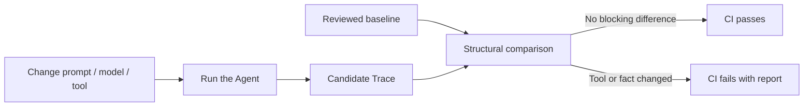

# Agent Regression Kit: Getting Started

> Start with the [current user manual](user-manual.en.md). This document retains advanced API examples. See the [technical design](technical-design.en.md) for implementation boundaries.

This guide answers one question: **I already have an AI Agent; how do I connect it to regression testing in a few minutes?**

## 1. The problem it solves

An Agent run is more than its final text. It also includes:

- which tool it selected;
- which arguments it sent;
- what the tool returned;
- whether it interpreted that result correctly;
- what it finally told the user.

After changing a prompt, model, tool schema, or business code, manually reading a few answers can miss hidden regressions. Agent Regression Kit stores one run as a Trace, then compares a new candidate with a reviewed baseline.



The meaning is simple: the baseline is the behavior we reviewed as correct; the candidate is what this code change produced. Tool names, arguments, results, claims, and flow changes become visible in CI.

## 2. What it does and does not do

| Component | Responsibility | Not responsible for |
| --- | --- | --- |
| Your Agent | Decide whether and how to call tools and answer | Switching to a specific framework |
| `AgentAdapter` | Connect Agent actions to two stable methods | Scoring or CI orchestration |
| `ToolExecutor` | Execute local or MCP tools | Retrying unknown side effects |
| `Trace` | Store redacted evidence for one run | Calling an LLM |
| `baseline` | Reviewed expected behavior | Being overwritten on every CI run |
| `compare` | Compare baseline and candidate | Guessing facts from prose |
| GitHub Action | Fail CI and publish reports | Running your Agent for you |

## 3. Run the complete example in five minutes

Python 3.9 or newer is enough. Verify the project in a clean checkout:

```bash
git clone https://github.com/ANTAO94/agent-regression-kit.git
cd agent-regression-kit
python -m venv .venv
.venv/bin/pip install -e .
```

Create an integration template:

```bash
agent-regression init
```

The template contains:

- `.agent-regression/config.json`: baseline, candidate, and report paths;
- `scripts/record_agent.py`: a runnable deterministic Agent example;
- `baselines/README.md`: baseline review guidance;
- `.github/workflows/agent-regression.yml`: a CI example.
- `.github/workflows/agent-coverage.yml`: a scenario path coverage gate example.

Generate a candidate:

```bash
python scripts/record_agent.py --out work/my-agent.trace.json
```

After reviewing the first behavior, save it as the baseline. Generate a new candidate after the next Agent change:

```bash
cp work/my-agent.trace.json baselines/my-agent.trace.json
python scripts/record_agent.py --out work/my-agent.trace.json
```

Validate the configuration, then compare:

```bash
agent-regression config validate \
  --config .agent-regression/config.json \
  --kind single

# Side-effect-free preflight: verify referenced Trace files and their schema
agent-regression check \
  --config .agent-regression/config.json \
  --kind single

agent-regression compare --config .agent-regression/config.json
```

These commands have different boundaries: `config validate` checks the config
fields, types, and paths; `check` also reads the baseline and candidate Trace
files and validates their JSON and AgentTrace schema. It does not execute an
Agent, mutate a baseline, or compare behavior. Invalid input returns exit code
`2`.

For a batch config, use `--kind batch`; the check also verifies that the two
Trace directories contain matching relative `.trace.json` file names.

Exit code `0` means the comparison passed. Exit code `1` means a blocking regression was found. Exit code `2` means invalid configuration, Trace data, or runtime input.

### Local viewer, report index, and configuration center (v3.4)

To inspect Trace timelines and compare differences in a browser, start the
bundled local Viewer:

```bash
agent-regression ui --open-browser
```

It binds to `127.0.0.1` by default and does not upload evidence or execute an
Agent. Trace Inspector reads baseline, candidate, and compare JSON files; the
configuration center generates `.agent-regression/config.json`. The Python CLI
remains the source of truth for comparison decisions, and the Viewer is read-only.

When one CI run produces several compare, batch, stability, coverage, or history reports,
build a small index containing only status, metrics, and relative paths:

```bash
agent-regression report-index \
  --report-dir outputs \
  --out outputs/report-index.json

agent-regression report-index \
  --report-dir outputs \
  --format markdown \
  --out outputs/report-index.md \
  --fail-on-regression
```

Then open `viewer/reports.html` and select `outputs/report-index.json`. The index
does not copy full Trace or diff contents into the browser. Reviewers see the
global status first, then explicitly load an original JSON by relative path in
Trace Inspector. This is intentional: a static page must not silently scan your
local filesystem.

## 4. Connect your own Agent

You do not need to rewrite your Agent. Have it report tool calls and the final answer through `context`:

```python
from agent_regression import FixtureTools, record_run


class MyOrderAgent:
    identity = {"name": "my-order-agent", "version": "1.0.0"}

    def run(self, request, context):
        order_id = str(request).rsplit(" ", 1)[-1]
        order = context.call_tool("get_order", {"order_id": order_id})
        context.final_answer(
            f"Order {order_id} status: {order['status']}",
            {"order_id": order_id, "order_status": order["status"]},
        )


trace = record_run(
    MyOrderAgent(),
    "lookup order 123",
    # Use a fixed tool for this example; replace it with your ToolExecutor.
    tools=FixtureTools({"get_order": {"order_id": "123", "status": "not_shipped"}}),
    run_id="my-order-agent-123",
)
```

There are only three integration rules:

1. expose an `identity` mapping;
2. route tool calls through `context.call_tool(name, arguments)`;
3. finish through `context.final_answer(text, claims)`, exactly once per run.

`claims` are facts you explicitly emit, such as an order ID, status, or success flag. Tool results and claims are compared strictly. Sensitive fields are redacted before a Trace is written.

### Agents that already use MCP

Use one of the MCP recorders when tools come from an MCP Server:

```python
from agent_regression import record_mcp_run, record_mcp_http_run

# stdio MCP Server
trace = record_mcp_run(
    MyOrderAgent(),
    "lookup order 123",
    ["node", "path/to/server.js", "stdio"],
    run_id="my-order-agent-123",
)

# Streamable HTTP MCP Server
trace = record_mcp_http_run(
    MyOrderAgent(),
    "lookup order 123",
    "https://example.com/mcp",
    run_id="my-order-agent-123",
    headers={"Authorization": "Bearer ..."},
)
```

`examples/rule_agent_mcp_example.py` is a complete local reference. It uses a deterministic MCP fixture and needs neither an API key nor a model call.

## 5. Read a comparison result

The default is strict: every difference is reported. Common categories are:

| Category | Example | Blocks by default |
| --- | --- | --- |
| `tool_name` | `get_order` becomes `lookup_order` | Yes |
| `tool_arguments` | String `"123"` becomes number `123` | Yes |
| `tool_result` | Tool output changes | Yes |
| `result_interpretation` | Tool says not shipped, Agent says shipped | Yes |
| `final_answer` | Final prose changes | Yes |
| `event_count` | Tool-call count or flow changes | Yes |

If the model wording varies but structured claims are stable, opt into:

```bash
agent-regression compare \
  --baseline baselines/my-agent.trace.json \
  --candidate work/my-agent.trace.json \
  --final-answer-mode claims-only
```

This ignores only `final_answer.text`. It still checks claims, tool calls, arguments, results, and error state. It is not a semantic judge. Keep the default `exact` mode when the final wording is part of your product contract.

### Baseline checks and noise filtering

In v2.8, a complete AgentTrace can be combined with an executable Agent Contract. You can configure both which baseline differences should not block and what the candidate behavior must satisfy:

```json
{
  "baseline": "baselines/my-agent.trace.json",
  "candidate": "work/my-agent.trace.json",
  "format": "markdown",
  "allow_categories": ["final_answer"],
  "allow_paths": ["tool_calls[0].arguments"],
  "final_answer_mode": "claims-only",
  "secret_values": ["local-secret"],
  "contract": {
    "must_call": [{"tool": "get_order"}],
    "must_not_call": ["delete_order"],
    "assertions": [
      {"path": "final_answer.claims.order_status", "equals": "not_shipped"}
    ],
    "ignore_paths": ["tool_results[*].result.request_id"],
    "normalizers": [
      {"path": "tool_results[*].result.created_at", "type": "timestamp"}
    ],
    "max_steps": 5,
    "path_rules": {
      "any_of": [
        [{"tool": "get_order", "arguments": {"order_id": "123"}}],
        [
          {"tool": "get_order", "arguments": {"order_id": "123"}},
          "get_shipping"
        ]
      ]
    },
    "side_effects": [
      {"path": "orders.123.status", "from": "paid", "to": "cancelled"}
    ]
  }
}
```

`allow_categories` and `allow_paths` **relax baseline blocking rules**; every detected difference remains in the report. `contract` constrains candidate behavior: it can require or forbid tool calls, assert Trace fields, ignore dynamic fields, normalize timestamps/lists, and cap tool-call steps. `path_rules.any_of` declares multiple valid complete tool paths by default; the candidate must match one of them. With `path_rules.mode=ordered_subsequence`, listed rules must remain ordered while extra calls are allowed; `unordered_subset` also allows reordering and should only be used when the domain permits it. In v4.7, `path_rules.extra_calls` turns tolerant extras into an explicit allowlist; omitting it preserves v4.6 compatibility, `extra_calls: []` rejects all unmatched calls, and unknown calls produce `extra_tool_call`. Tolerant modes still need `must_not_call`, `max_steps`, assertions, relations and side-effect constraints. A string tool rule checks only the tool name. `side_effects` checks a business-state transition such as an order changing from `paid` to `cancelled`. `relations` checks cross-step fields, such as requiring a later refund amount to stay within the paid amount returned by an earlier lookup. `secret_values` only provides redaction.

`allow-path` matches a complete difference path already produced by the comparator. `contract.ignore_paths` is the nested JSON filter and supports `[*]`; for example, `tool_results[*].result.request_id` ignores each result's request ID without allowing the entire tool result to change.

v4.8 adds `tool_limits` for per-tool call-count boundaries. `min_calls` is a
lower bound, `max_calls` is an upper bound, and equal values express an exact
count; optional `arguments` counts only exact argument matches. Violations
produce `tool_count`, which is useful for blocking duplicate refunds, repeated
writes and accidental loops. It complements `max_steps`, `must_not_call` and
side-effect Contracts; it is not authorization.

v4.9 adds `tool_allowlist` for the complete tool catalog permitted in one
scenario. Omitting the field preserves older behavior; an explicit `[]` denies
every tool call. Strings match tool names, while objects may add `arguments`
for an exact argument-object match. An unmatched candidate call produces
`unauthorized_tool_call` at `tool_calls[index]`. This is an Agent Trace boundary,
not a replacement for authorization in the real Tool Gateway; use it with
`tool_limits`, `path_rules`, `relations` and `side_effects`.

v4.10 adds `argument_rules` for executable tool-argument boundaries. A rule
selects a tool with `tool` and a parameter relative to that call's `arguments`
with `path`. Literal comparisons use `value`; Trace comparisons use
`right_path`; `exists` and `absent` express required and forbidden fields. Every
matching call is checked and a violation produces `tool_argument_policy`.

```json
{
  "contract": {
    "argument_rules": [
      {"tool": "get_order", "path": "tenant_id", "operator": "equals_path", "right_path": "metadata.input.tenant_id"},
      {"tool": "refund_order", "path": "amount", "operator": "less_or_equal_path", "right_path": "tool_results[0].result.paid_amount"},
      {"tool": "refund_order", "path": "admin_override", "operator": "absent"}
    ]
  }
}
```

A missing tool does not fail an argument rule; use `must_call` when presence is
required. If an old relation only checks a fixed path such as
`tool_calls[2].arguments.amount` and should apply to every call of that tool,
migrate it to `argument_rules`. Keep `relations` for general claims, result and
state relationships.

```json
{
  "contract": {
    "tool_allowlist": [
      "get_order",
      {"tool": "refund_order", "arguments": {"order_id": "123", "amount": 88}}
    ]
  }
}
```

### v4.13: outcome equivalence, success evidence and controlled alternatives

When a business allows different payment methods for one order, a reviewed
retry after a failed call, or a repeated idempotent update, use
`state_equivalence`. It groups only rules already written inside
`path_rules.any_of`; `ignore_argument_paths` is not a wildcard for order IDs,
tenant IDs or amounts.

```json
{
  "contract": {
    "path_rules": {
      "mode": "unordered_subset",
      "any_of": [[
        {"tool": "charge_order", "arguments": {"order_id": "123", "payment_method_id": "card-a"}},
        {"tool": "charge_order", "arguments": {"order_id": "123", "payment_method_id": "card-b"}}
      ]],
      "extra_calls": []
    },
    "state_equivalence": {
      "mode": "outcome",
      "paths": ["world_state.final.orders.123.status"],
      "ignore_argument_paths": ["payment_method_id"],
      "state_scope": "declared_and_unchanged_rest",
      "attempt_policy": {
        "require_success": true,
        "allow_failed_before_success": true,
        "max_failed_attempts": 1
      },
      "idempotent_tools": ["modify_pending_order_address"]
    }
  }
}
```

`exact` keeps the old strict behavior. `outcome` groups declared rules after
removing ignored fields, but the candidate must still exactly match a tool name
and all other arguments in the group. `hybrid` keeps each rule separate while
allowing explicitly configured aliases. `attempt_policy` requires a successful
matching event by default; failed retries are allowed only before success and
up to the configured limit. Failed-only behavior produces
`required_success_missing`, over-limit retries produce `retry_limit_exceeded`,
and missing state evidence produces `state_evidence_missing`.
`state_scope=declared_and_unchanged_rest` also reports
`unexpected_state_change` for undeclared state changes. See the
[state-equivalence guide](state-equivalence.md) and [v4.13 acceptance record](v4.13-acceptance.md)
for the complete field reference.

### Stateful scenarios and side effects

A normal Trace says which tools the Agent called. A stateful scenario also proves that those calls did not corrupt an order, inventory, or permission state. Give the tool executor a `snapshot()` method and the recorder automatically stores the state before and after the run:

```json
{
  "metadata": {
    "world_state": {
      "initial": {"orders": {"123": {"status": "paid"}}},
      "final": {"orders": {"123": {"status": "cancelled"}}}
    }
  }
}
```

The comparator emits field-level `state_change` differences, while `side_effects` turns an allowed business transition into an explicit contract. Create a new `StatefulFixtureTools` for each case, or call `.fresh()`, so a cancellation in one case cannot leak into the next case.

### Automatically isolate external state (v2.6)

When the tools use a test database, Redis, or a service emulator instead of an
in-memory fixture, wrap it in the small `SnapshotBackend` boundary. It only
needs `snapshot()` to return a serializable state and `restore(snapshot)` to
put that state back. Then use `isolated_record_run`:

```python
from agent_regression import isolated_record_run


class TestOrderDatabase:
    def snapshot(self):
        return read_test_order_rows_as_json()

    def restore(self, snapshot):
        replace_test_order_rows_from_json(snapshot)


trace = isolated_record_run(
    MyOrderAgent(),
    "cancel order 123",
    my_tools,
    state_backend=TestOrderDatabase(),
    run_id="order-123",
)
```

The Trace still records the before/after state so side effects can be
compared, but the backend is restored after the block, even if the Agent
raises. For a multi-turn flow, use `isolated_record_session`: state carries
between turns and is restored once after the complete Session. The boundary
can only restore what the adapter exposes; writes to another untracked service
still need project-specific cleanup. See the runnable offline example at
[`examples/external_state_backend_example.py`](../examples/external_state_backend_example.py).

### Bridge a framework callback and record scenarios in parallel (v2.7)

If your Agent framework already exposes `invoke`, `run`, or `execute`, use
`CallableAgentAdapter` as a small wrapper instead of reimplementing a complete
Adapter class. Give each `ScenarioCase` a fresh Agent and tool factory:

```python
from agent_regression import CallableAgentAdapter, ScenarioCase, record_scenario_batch


def invoke_framework(request, context):
    result = context.call_tool("get_order", {"order_id": request["order_id"]})
    context.final_answer(
        f"status={result['status']}",
        {"order_status": result["status"]},
    )


case = ScenarioCase(
    case_id="order-123",
    request={"order_id": "123"},
    run_id="order-123",
    adapter_factory=lambda: CallableAgentAdapter(
        {"name": "my-framework-agent", "version": "1.0.0"},
        invoke_framework,
    ),
    tools_factory=make_test_tools,
    isolate=True,
)
result = record_scenario_batch([case], max_workers=4)
```

`tools_factory` and `adapter_factory` must return new objects for every case;
do not share a mutable Agent or tool executor across workers. Results are
sorted by `case_id`, and a failed case is collected without hiding failures in
other cases. For deterministic JSON scenarios, use the CLI:

```bash
agent-regression batch-record \
  --scenario-dir examples/order-123 \
  --out-dir work/scenarios \
  --workers 4 \
  --report outputs/batch-record.json
```

The command turns each `*.scenario.json` into a matching `*.trace.json`.
All-success returns `0`; any failed scenario returns `1`. It is bounded,
in-process thread concurrency and does not make an unsafe framework
thread-safe or isolate process-global environment variables automatically.

### Repeated-run stability evaluation (v2.8)

A single replay checks one candidate run. If sampling or an external tool can
make the same input take a different path, repeat the isolated scenario and
gate the aggregate behavior:

```bash
agent-regression stability \
  --baseline baselines/order-123.trace.json \
  --scenario examples/order-123/baseline.scenario.json \
  --repeats 10 \
  --workers 4 \
  --min-pass-rate 0.95 \
  --min-claims-match-rate 1.0 \
  --max-tool-error-rate 0.05 \
  --max-path-variants 1 \
  --final-answer-mode claims-only \
  --format markdown \
  --out outputs/stability.md
```

The report exposes `pass_rate`, `claims_match_rate`, `tool_error_rate`, and
`path_variant_count`. A threshold failure returns exit code `1`, so this is a
direct CI gate. The same operation is available as
`record_stability(baseline, scenario_case, ...)`; see
[`examples/stability_example.py`](../examples/stability_example.py).

Every repeat gets fresh Agent and tool factories, with optional state
isolation. This is a deterministic check over recorded evidence, not a
statistical proof of model quality and not an LLM judge.

### Async parallel calls inside one run (v2.9)

v2.8 ran independent scenarios in parallel. v2.9 also supports one Agent
awaiting several tools concurrently. Call-creation order and result `call_id`
values are preserved, and the trace records the group under
`metadata.execution.parallel_groups`:

```bash
agent-regression async-record \
  --scenario examples/async-order/parallel.scenario.json \
  --format markdown \
  --out outputs/async-order.md
```

For an async framework:

```python
import asyncio
from agent_regression import AsyncCallableAgentAdapter, record_async_run


async def invoke(request, context):
    order, shipping = await asyncio.gather(
        context.call_tool("get_order", {"order_id": "123"}, parallel_group="lookup"),
        context.call_tool("get_shipping", {"order_id": "123"}, parallel_group="lookup"),
    )
    context.final_answer("done", {"order": order, "shipping": shipping})


trace = record_async_run(
    AsyncCallableAgentAdapter({"name": "async-agent"}, invoke),
    "lookup order 123",
    async_tools,
    run_id="async-order-123",
)
```

If the caller already owns an event loop, use `await async_record_run(...)`;
the synchronous wrapper is convenient for scripts. Without `call_async`, the
kit runs an existing synchronous `call` in a worker thread. Native async tools
are preferred for network clients, and the integration remains responsible
for shared-state safety and side-effect idempotency. A changed parallel-group
shape is reported as `execution_concurrency`.

### Connect a framework with the SDK and template (v3.0)

Generate a starter with an offline contract test:

```bash
agent-regression adapter-init \
  --directory my-agent-regression \
  --name my-order-agent \
  --mode both
cd my-agent-regression
PYTHONPATH=. python -m unittest discover -s tests -v
```

The generated directory contains `adapter.py`,
`tests/test_adapter_contract.py`, and a bilingual `README.md`. Replace the
example body with the LangChain, Spring AI, or custom framework call, while
keeping tool calls on `context.call_tool` and the terminal result on
`context.final_answer`.

Existing projects can use `AdapterSpec` directly:

```python
from agent_regression import AdapterSpec

spec = AdapterSpec("my-agent", version="1.0.0", metadata={"framework": "your-framework"})
sync_adapter = spec.build_sync(invoke_framework)
async_adapter = spec.build_async(invoke_async_framework)
```

The SDK fixes adapter identity and the callback contract. It does not inspect
framework internals or invent business claims; the integration must emit
structured claims explicitly.

For actionable integration failures, use the structured diagnostic helper:

```python
from agent_regression import FixtureTools, check_adapter_contract

report = check_adapter_contract(
    sync_adapter,
    {"order_id": "123"},
    FixtureTools({"get_order": {"status": "paid"}}),
    expected_tool_path=["get_order"],
    expected_claims={"order_status": "paid"},
)
assert report["ok"], report
```

The result tells you whether identity, Trace validity, tool path, or final
claims failed. Use `check_async_adapter_contract` for an async integration.
This is an integration diagnostic, not an LLM judge.

The repository also includes an optional real-framework reference using
LangChain Core's `RunnableLambda`. It needs no model key and is kept outside
the default dependency-free suite:

```bash
python -m pip install -r examples/optional-requirements.txt
python examples/langchain_core_callback_example.py
agent-regression validate --trace work/langchain-core.trace.json
```

This proves the framework callback and observation boundary, not coverage of
every provider or a complete production Agent orchestration.

### Historical trends and long-term regression (v3.1)

Save stability, compare, batch, or coverage JSON reports in one directory and
aggregate them into a release-to-release report:

```bash
agent-regression history \
  --report-dir reports/agent-history \
  --format markdown \
  --out outputs/history.md
```

Use stable prefixes such as `001-v2.8.json` and `002-v2.9.json` to define
point order. The report lists every point, the latest status, historical
failure count, and first/latest/delta/min/max values for pass rate, claims
match, tool errors, path variants, and coverage. The exit code follows the
latest recognized report: `0` for latest pass and `1` for latest failure;
older failures remain visible instead of being overwritten.

[`examples/history/`](../examples/history/) contains a runnable offline
fixture. This is a file-based aggregator, not an online dashboard or a model
quality judge.

### Scenario-suite path coverage

Once you have normal, error, permission, or side-effect scenario traces, aggregate them to see which ordered tool paths the Agent has actually exercised:

```bash
agent-regression coverage \
  --trace-dir work/scenarios \
  --expected-path "get_order" \
  --expected-path "get_order -> cancel_order" \
  --expected-path "get_order -> refund" \
  --format markdown \
  --out outputs/coverage.md
```

An `expected-path` is a complete ordered tool path. If any expected path is absent from the directory, the command returns exit code `1` and can fail CI. Without expected paths, it only summarizes what was observed. This measures scenario-evidence coverage, not source-code coverage or model quality.

To distinguish successful and failed tool calls, add `--include-outcomes`; paths become `get_order[ok]` or `get_order[error]`:

```bash
agent-regression coverage \
  --trace-dir work/scenarios \
  --branch-path final_answer.claims.order_status \
  --include-outcomes \
  --expected-path "get_order[error]" \
  --expected-branch paid \
  --expected-branch cancelled \
  --format markdown
```

`--branch-path` points to the structured claim that represents a business result. Combined with `--expected-branch`, it can require coverage for results such as `paid`, `cancelled`, and `not_found`. Tool-path coverage and business-branch coverage can be gated together.

GitHub Actions can reuse the built-in gate:

```yaml
- uses: ANTAO94/agent-regression-kit/.github/actions/agent-coverage@v4.13.0
  with:
    trace-dir: work/scenarios
    expected-paths: get_order,get_order->cancel_order,get_order->refund
    branch-paths: final_answer.claims.order_status
    expected-branches: paid,cancelled,not_found
```

If the same workflow also produces compare, stability, coverage, or history JSON
files, build one handoff index after the gates. The repository's main
regression workflow keeps all four report types under `work/ci-reports/` and
appends the Markdown index to the GitHub Job Summary:

```yaml
- name: Build report index
  if: always()
  uses: ANTAO94/agent-regression-kit/.github/actions/agent-report-index@main
  with:
    report-dir: outputs
    fail-on-regression: 'true'
```

It writes JSON and Markdown indexes and appends the Markdown to the GitHub Job
Summary.

### Multi-turn Agent Sessions

When a business flow contains follow-up questions, do not flatten every turn into one opaque Trace. Save each turn as independent evidence inside a Session:

```bash
agent-regression session-record \
  --scenario examples/order-session/session.scenario.json \
  --out work/order-session.json

agent-regression session-compare \
  --baseline baselines/order-session.json \
  --candidate work/order-session.json \
  --format markdown \
  --out outputs/order-session.md
```

`record_session` reuses the same Agent Adapter and Tool Executor, so world state can carry across turns. The comparator reports differences per turn and fails when the candidate changes the number of turns. For a real Agent, replace the example `ScriptedSessionAdapter` with your own Adapter.

When world snapshots are present, the comparator also checks that turn 2 starts from turn 1's final state. A reset or leaked state is reported as `session_state_discontinuity`.

## 6. Multiple cases and CI

For multiple cases, use matching relative paths in two directories:

```bash
agent-regression batch-compare \
  --baseline-dir baselines \
  --candidate-dir work/candidate \
  --format markdown \
  --out outputs/batch-summary.md
```

You can also store the directories and policy in `.agent-regression/batch.json`, validate it, and run it:

```bash
agent-regression config validate \
  --config .agent-regression/batch.json \
  --kind batch
agent-regression batch-compare --config .agent-regression/batch.json
```

Minimal GitHub Action:

```yaml
- uses: actions/checkout@v4
- uses: actions/setup-python@v5
  with:
    python-version: "3.11"
- run: python -m pip install "git+https://github.com/ANTAO94/agent-regression-kit.git"
- run: python scripts/record_agent.py --out work/my-agent.trace.json
- uses: ANTAO94/agent-regression-kit/.github/actions/agent-regression@main
  with:
    baseline: baselines/my-agent.trace.json
    candidate: work/my-agent.trace.json
    report: outputs/my-agent.junit.xml
    summary: outputs/my-agent.md
```

The Action writes JUnit and Markdown reports and appends the Markdown report to the GitHub Job Summary. Commit baselines to the repository and update them only through review.

### Independent project validation

To validate the framework against a project it does not own, v4.12 continues to include a
pinned tau2-bench retail integration. The source manifest records the upstream
tag, commit, raw dataset URL, MIT license and SHA-256 checksum. The adapter
converts each published half-duplex trajectory into `AgentTrace`, derives a
write-action/communication contract from the task, and reads the published
reward only after the contract decision for measurement.

Run it locally:

```bash
curl -L -o work/tau2-results.json \
  https://raw.githubusercontent.com/sierra-research/tau2-bench/v1.0.1/data/tau2/results/final/gpt-4.1-mini-2025-04-14_retail_base_gpt-4.1-2025-04-14_4trials.json
PYTHONPATH=src python examples/tau2_retail_validation.py \
  --results work/tau2-results.json \
  --out work/tau2/report.json \
  --traces-dir work/tau2/traces
```

The pinned run has 420 eligible write scenarios out of 456 simulations: 253
true passes, 153 true blocks, 14 false alarms and 0 missed failures. The gate
reports 96.67% accuracy, 91.62% failure precision, 100% failure recall, 5.24%
false-alarm rate and 0% missed-failure rate. The false alarms remain visible:
strict action/argument contracts can reject a semantically equivalent path.
This is evidence about the adapter and contract, not an upstream endorsement.
See [`docs/tau2-independent-validation.md`](tau2-independent-validation.md)
for the exact mapping and limitations.

## 7. Frequently asked questions

**Do I need a mature Agent first?** No. Start with the bundled fixture or a fake ToolExecutor to verify recording, replay, and comparison before connecting a real Agent.

**Is this an LLM judge?** No. v2.8 compares explicitly recorded structural evidence and deterministic contracts; it does not call a model to decide whether prose is “probably correct.”

**Does it support LangChain, Spring AI, or a custom framework?** Yes. Implement the small `AgentAdapter` boundary; the Trace and comparator remain framework-neutral.

**When should I update the baseline?** Only after reviewing an intentional product behavior change. Never auto-accept every candidate in CI.

**Where do I go next?** Read [`docs/api.md`](api.md) and [`docs/architecture.md`](architecture.md), then run `python -m unittest discover -s tests -v` to see the complete offline suite.
