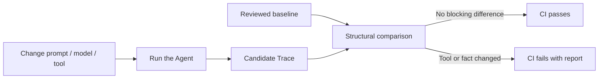

# Agent Regression Kit: Getting Started

This guide answers one question: **I already have an AI Agent; how do I connect it to regression testing in a few minutes?**

## 1. The problem it solves

An Agent run is more than its final text. It also includes:

- which tool it selected;
- which arguments it sent;
- what the tool returned;
- whether it interpreted that result correctly;
- what it finally told the user.

After changing a prompt, model, tool schema, or business code, manually reading a few answers can miss hidden regressions. Agent Regression Kit stores one run as a Trace, then compares a new candidate with a reviewed baseline.



The meaning is simple: the baseline is the behavior we reviewed as correct; the candidate is what this code change produced. Tool names, arguments, results, claims, and flow changes become visible in CI.

## 2. What it does and does not do

| Component | Responsibility | Not responsible for |
| --- | --- | --- |
| Your Agent | Decide whether and how to call tools and answer | Switching to a specific framework |
| `AgentAdapter` | Connect Agent actions to two stable methods | Scoring or CI orchestration |
| `ToolExecutor` | Execute local or MCP tools | Retrying unknown side effects |
| `Trace` | Store redacted evidence for one run | Calling an LLM |
| `baseline` | Reviewed expected behavior | Being overwritten on every CI run |
| `compare` | Compare baseline and candidate | Guessing facts from prose |
| GitHub Action | Fail CI and publish reports | Running your Agent for you |

## 3. Run the complete example in five minutes

Python 3.9 or newer is enough. Verify the project in a clean checkout:

```bash
git clone https://github.com/ANTAO94/agent-regression-kit.git
cd agent-regression-kit
python -m venv .venv
.venv/bin/pip install -e .
```

Create an integration template:

```bash
agent-regression init
```

The template contains:

- `.agent-regression/config.json`: baseline, candidate, and report paths;
- `scripts/record_agent.py`: a runnable deterministic Agent example;
- `baselines/README.md`: baseline review guidance;
- `.github/workflows/agent-regression.yml`: a CI example.

Generate a candidate:

```bash
python scripts/record_agent.py --out work/my-agent.trace.json
```

After reviewing the first behavior, save it as the baseline. Generate a new candidate after the next Agent change:

```bash
cp work/my-agent.trace.json baselines/my-agent.trace.json
python scripts/record_agent.py --out work/my-agent.trace.json
```

Validate the configuration, then compare:

```bash
agent-regression config validate \
  --config .agent-regression/config.json \
  --kind single

agent-regression compare --config .agent-regression/config.json
```

Exit code `0` means the comparison passed. Exit code `1` means a blocking regression was found. Exit code `2` means invalid configuration, Trace data, or runtime input.

## 4. Connect your own Agent

You do not need to rewrite your Agent. Have it report tool calls and the final answer through `context`:

```python
from agent_regression import FixtureTools, record_run


class MyOrderAgent:
    identity = {"name": "my-order-agent", "version": "1.0.0"}

    def run(self, request, context):
        order_id = str(request).rsplit(" ", 1)[-1]
        order = context.call_tool("get_order", {"order_id": order_id})
        context.final_answer(
            f"Order {order_id} status: {order['status']}",
            {"order_id": order_id, "order_status": order["status"]},
        )


trace = record_run(
    MyOrderAgent(),
    "lookup order 123",
    # Use a fixed tool for this example; replace it with your ToolExecutor.
    tools=FixtureTools({"get_order": {"order_id": "123", "status": "not_shipped"}}),
    run_id="my-order-agent-123",
)
```

There are only three integration rules:

1. expose an `identity` mapping;
2. route tool calls through `context.call_tool(name, arguments)`;
3. finish through `context.final_answer(text, claims)`, exactly once per run.

`claims` are facts you explicitly emit, such as an order ID, status, or success flag. Tool results and claims are compared strictly. Sensitive fields are redacted before a Trace is written.

### Agents that already use MCP

Use one of the MCP recorders when tools come from an MCP Server:

```python
from agent_regression import record_mcp_run, record_mcp_http_run

# stdio MCP Server
trace = record_mcp_run(
    MyOrderAgent(),
    "lookup order 123",
    ["node", "path/to/server.js", "stdio"],
    run_id="my-order-agent-123",
)

# Streamable HTTP MCP Server
trace = record_mcp_http_run(
    MyOrderAgent(),
    "lookup order 123",
    "https://example.com/mcp",
    run_id="my-order-agent-123",
    headers={"Authorization": "Bearer ..."},
)
```

`examples/rule_agent_mcp_example.py` is a complete local reference. It uses a deterministic MCP fixture and needs neither an API key nor a model call.

## 5. Read a comparison result

The default is strict: every difference is reported. Common categories are:

| Category | Example | Blocks by default |
| --- | --- | --- |
| `tool_name` | `get_order` becomes `lookup_order` | Yes |
| `tool_arguments` | String `"123"` becomes number `123` | Yes |
| `tool_result` | Tool output changes | Yes |
| `result_interpretation` | Tool says not shipped, Agent says shipped | Yes |
| `final_answer` | Final prose changes | Yes |
| `event_count` | Tool-call count or flow changes | Yes |

If the model wording varies but structured claims are stable, opt into:

```bash
agent-regression compare \
  --baseline baselines/my-agent.trace.json \
  --candidate work/my-agent.trace.json \
  --final-answer-mode claims-only
```

This ignores only `final_answer.text`. It still checks claims, tool calls, arguments, results, and error state. It is not a semantic judge. Keep the default `exact` mode when the final wording is part of your product contract.

### Baseline checks and noise filtering: current boundary

In v2.0, a baseline is a complete AgentTrace. You can configure which differences should not block:

```json
{
  "baseline": "baselines/my-agent.trace.json",
  "candidate": "work/my-agent.trace.json",
  "format": "markdown",
  "allow_categories": ["final_answer"],
  "allow_paths": ["tool_calls[0].arguments.debug_id"],
  "final_answer_mode": "claims-only",
  "secret_values": ["local-secret"]
}
```

`allow_categories` and `allow_paths` **relax blocking rules**; they do not select which checks run. Every detected difference remains in the report. `secret_values` provides redaction, not dynamic-field noise filtering.

The current release therefore does not yet provide the full traditional traffic-replay feature set: field-level assertions such as `status=success`, nested-field removal, timestamp/random-ID normalization, regex redaction, or custom normalizers. In particular, `allow-path` matches a complete difference path already produced by the comparator; it does not recursively remove a child field from an arbitrary tool-result JSON object.

The recommended next design is deterministic `checks`, `ignore_paths`, and `normalizers`: explicitly remove declared noise, then assert selected fields while keeping undeclared critical tool behavior strict. That belongs in v2.1 so existing baseline meaning does not change implicitly.

## 6. Multiple cases and CI

For multiple cases, use matching relative paths in two directories:

```bash
agent-regression batch-compare \
  --baseline-dir baselines \
  --candidate-dir work/candidate \
  --format markdown \
  --out outputs/batch-summary.md
```

You can also store the directories and policy in `.agent-regression/batch.json`, validate it, and run it:

```bash
agent-regression config validate \
  --config .agent-regression/batch.json \
  --kind batch
agent-regression batch-compare --config .agent-regression/batch.json
```

Minimal GitHub Action:

```yaml
- uses: actions/checkout@v4
- uses: actions/setup-python@v5
  with:
    python-version: "3.11"
- run: python -m pip install "git+https://github.com/ANTAO94/agent-regression-kit.git"
- run: python scripts/record_agent.py --out work/my-agent.trace.json
- uses: ANTAO94/agent-regression-kit/.github/actions/agent-regression@main
  with:
    baseline: baselines/my-agent.trace.json
    candidate: work/my-agent.trace.json
    report: outputs/my-agent.junit.xml
    summary: outputs/my-agent.md
```

The Action writes JUnit and Markdown reports and appends the Markdown report to the GitHub Job Summary. Commit baselines to the repository and update them only through review.

## 7. Frequently asked questions

**Do I need a mature Agent first?** No. Start with the bundled fixture or a fake ToolExecutor to verify recording, replay, and comparison before connecting a real Agent.

**Is this an LLM judge?** No. v2.0 compares explicitly recorded structural evidence and does not call a model to decide whether prose is “probably correct.”

**Does it support LangChain, Spring AI, or a custom framework?** Yes. Implement the small `AgentAdapter` boundary; the Trace and comparator remain framework-neutral.

**When should I update the baseline?** Only after reviewing an intentional product behavior change. Never auto-accept every candidate in CI.

**Where do I go next?** Read [`docs/api.md`](api.md) and [`docs/architecture.md`](architecture.md), then run `python -m unittest discover -s tests -v` to see the complete offline suite.
