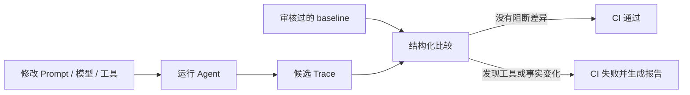

# Agent Regression Kit：新手接入指南

这份指南只回答一个问题：**我已经有一个 AI Agent，怎样在几分钟内把它接入回归测试？**

## 1. 先理解它解决什么问题

Agent 不是只有一个最终文本答案。一次运行还可能包含：

- 选择了哪个工具；
- 给工具传了什么参数；
- 工具返回了什么结果；
- Agent 是否正确理解结果；
- 最后给用户说了什么。

当你修改 Prompt、模型、工具 Schema 或业务代码后，人工看几条回答很容易漏掉隐藏回归。Agent Regression Kit 把一次运行保存为 Trace，再把新版本和审核过的旧版本进行比较。



图的含义是：baseline 是“我们确认过的正确行为”，candidate 是“这次代码生成的行为”；工具名、参数、结果、claims 和流程变化都可以在 CI 中被看见。

## 2. 它负责什么，不负责什么

| 组件 | 它做什么 | 它不做什么 |
| --- | --- | --- |
| 你的 Agent | 决定是否调用工具、如何组织回答 | 不需要改成某个特定框架 |
| `AgentAdapter` | 把 Agent 的动作接到两个统一方法 | 不负责评分或 CI |
| `ToolExecutor` | 执行本地工具或 MCP 工具 | 不自动重试未知副作用的工具 |
| `Trace` | 保存一次脱敏后的运行证据 | 不调用 LLM |
| `baseline` | 经过人工审核的期望行为 | 不应在每次 CI 自动覆盖 |
| `compare` | 比较 baseline 和 candidate | 不从自然语言猜测事实 |
| GitHub Action | 根据退出码阻断回归并上传报告 | 不替你的项目运行 Agent |

## 3. 五分钟跑通完整示例

Python 3.9 或更高版本即可。先在一个临时目录验证：

```bash
git clone https://github.com/ANTAO94/agent-regression-kit.git
cd agent-regression-kit
python -m venv .venv
.venv/bin/pip install -e .
```

生成接入模板：

```bash
agent-regression init
```

模板包含：

- `.agent-regression/config.json`：baseline、candidate 和报告路径；
- `scripts/record_agent.py`：可以直接运行的确定性 Agent 示例；
- `baselines/README.md`：baseline 审核说明；
- `.github/workflows/agent-regression.yml`：CI 示例。
- `.github/workflows/agent-coverage.yml`：场景路径覆盖率门禁示例。

生成一次 candidate：

```bash
python scripts/record_agent.py --out work/my-agent.trace.json
```

第一次确认行为正确后，把它保存为 baseline；下一次 Agent 改动后再生成 candidate：

```bash
cp work/my-agent.trace.json baselines/my-agent.trace.json
python scripts/record_agent.py --out work/my-agent.trace.json
```

先预检配置，再比较：

```bash
agent-regression config validate \
  --config .agent-regression/config.json \
  --kind single

# 比较前的无副作用预检：确认配置引用的 Trace 存在且 schema 合法
agent-regression check \
  --config .agent-regression/config.json \
  --kind single

agent-regression compare --config .agent-regression/config.json
```

两条命令的边界不同：`config validate` 只检查配置文件的字段、类型和路径；
`check` 会继续读取 baseline/candidate Trace，检查 JSON 和 AgentTrace schema，
但不会执行 Agent、修改 baseline 或比较两次运行的行为。输入错误返回退出码 `2`。

如果使用批量配置，把 `--kind single` 改成 `--kind batch`；它还会检查两侧
目录中的 `.trace.json` 相对文件名是否一一匹配。

匹配时退出码是 `0`。发现阻断性回归时退出码是 `1`。配置、Trace 或运行环境无效时退出码是 `2`。

### 本地查看器、报告索引和配置中心（v3.4）

如果你希望用页面查看 Trace 和 compare 差异，可以启动仓库自带的本地 Viewer：

```bash
agent-regression ui --open-browser
```

它默认只监听 `127.0.0.1`，不会上传或执行任何 Agent。Trace Inspector 读取
baseline、candidate 和 compare JSON；配置中心可以生成 `.agent-regression/config.json`。
Python CLI 仍然是比较结果的唯一来源，页面只是只读展示层。

如果一次 CI 产生了多份 compare、batch、stability、coverage 或 history 报告，可以先生成一个
只包含状态、指标和相对路径的索引：

```bash
agent-regression report-index \
  --report-dir outputs \
  --out outputs/report-index.json

agent-regression report-index \
  --report-dir outputs \
  --format markdown \
  --out outputs/report-index.md \
  --fail-on-regression
```

再打开 `viewer/reports.html`，选择 `outputs/report-index.json`。报告索引不会把完整
Trace 或差异复制到浏览器；维护者先看全局状态，再按相对路径把原始 JSON 显式加载到
Trace Inspector。这是静态页面的安全边界：页面不会自动扫描你的本机目录。

## 4. 如何接入自己的 Agent

你不需要把 Agent 重写成新的框架，只需要让它通过 `context` 报告工具调用和最终回答：

```python
from agent_regression import FixtureTools, record_run


class MyOrderAgent:
    identity = {"name": "my-order-agent", "version": "1.0.0"}

    def run(self, request, context):
        order_id = str(request).rsplit(" ", 1)[-1]
        order = context.call_tool("get_order", {"order_id": order_id})
        context.final_answer(
            f"订单 {order_id} 的状态是 {order['status']}。",
            {"order_id": order_id, "order_status": order["status"]},
        )


trace = record_run(
    MyOrderAgent(),
    "查询订单 123",
    # 示例使用固定工具；真实项目替换成自己的 ToolExecutor
    tools=FixtureTools({"get_order": {"order_id": "123", "status": "not_shipped"}}),
    run_id="my-order-agent-123",
)
```

接入规则只有三条：

1. 暴露一个 `identity` 字典；
2. 工具调用走 `context.call_tool(name, arguments)`；
3. 最终回答走 `context.final_answer(text, claims)`，并且每次运行只结束一次。

`claims` 是你明确写出的结构化事实，例如订单号、状态或是否成功。工具结果和 claims 会严格比较；工具结果含有敏感字段时，默认脱敏会在 Trace 落盘前处理。

### 已经使用 MCP 的 Agent

如果工具由 MCP Server 提供，使用：

```python
from agent_regression import record_mcp_run, record_mcp_http_run

# stdio MCP Server
trace = record_mcp_run(
    MyOrderAgent(),
    "查询订单 123",
    ["node", "path/to/server.js", "stdio"],
    run_id="my-order-agent-123",
)

# Streamable HTTP MCP Server
trace = record_mcp_http_run(
    MyOrderAgent(),
    "查询订单 123",
    "https://example.com/mcp",
    run_id="my-order-agent-123",
    headers={"Authorization": "Bearer ..."},
)
```

项目中的 `examples/rule_agent_mcp_example.py` 是完整的本地参考实现；它使用确定性 MCP Fixture，不需要 API Key 或模型调用。

## 5. 如何理解比较结果

默认是严格模式：任何差异都会被报告。常见类别如下：

| 类别 | 例子 | 默认是否阻断 |
| --- | --- | --- |
| `tool_name` | `get_order` 变成 `lookup_order` | 是 |
| `tool_arguments` | 字符串 `"123"` 变成数字 `123` | 是 |
| `tool_result` | 工具返回内容变化 | 是 |
| `result_interpretation` | 工具说未发货，Agent 却声称已发货 | 是 |
| `final_answer` | 最终文本变化 | 是 |
| `event_count` | 工具调用次数或流程变化 | 是 |

如果模型每次回答的自然语言措辞不同，但结构化 claims 稳定，可以显式使用：

```bash
agent-regression compare \
  --baseline baselines/my-agent.trace.json \
  --candidate work/my-agent.trace.json \
  --final-answer-mode claims-only
```

这只忽略 `final_answer.text`，不会忽略 claims、工具调用、参数、结果或错误状态。不要把它当成语义评分器；如果最终措辞本身是产品契约，就保留默认的 `exact`。

### baseline 检查项和噪音过滤

v2.8 在完整 AgentTrace 之上提供了可执行的 Agent Contract。你可以同时配置“哪些差异不阻断”和“候选行为必须满足什么条件”：

```json
{
  "baseline": "baselines/my-agent.trace.json",
  "candidate": "work/my-agent.trace.json",
  "format": "markdown",
  "allow_categories": ["final_answer"],
  "allow_paths": ["tool_calls[0].arguments"],
  "final_answer_mode": "claims-only",
  "secret_values": ["local-secret"],
  "contract": {
    "must_call": [{"tool": "get_order"}],
    "must_not_call": ["delete_order"],
    "assertions": [
      {"path": "final_answer.claims.order_status", "equals": "not_shipped"}
    ],
    "ignore_paths": ["tool_results[*].result.request_id"],
    "normalizers": [
      {"path": "tool_results[*].result.created_at", "type": "timestamp"}
    ],
    "max_steps": 5,
    "path_rules": {
      "any_of": [
        [{"tool": "get_order", "arguments": {"order_id": "123"}}],
        [
          {"tool": "get_order", "arguments": {"order_id": "123"}},
          "get_shipping"
        ]
      ]
    },
    "side_effects": [
      {"path": "orders.123.status", "from": "paid", "to": "cancelled"}
    ]
  }
}
```

`allow_categories` / `allow_paths` 是**放宽 baseline 差异的阻断规则**，所有差异仍会出现在报告里。`contract` 才是候选行为约束：它可以要求必须调用某个工具、禁止调用某个工具、断言 Trace 字段、忽略动态字段、归一化时间戳/排序，并限制最大工具步骤数。`path_rules.any_of` 表示多条都合法的工具调用路径，候选 Trace 必须完整匹配其中一条；字符串工具规则只检查工具名，对参数不设限。`side_effects` 检查候选运行前后的业务状态，例如订单必须从 `paid` 变成 `cancelled`。`secret_values` 只负责敏感信息脱敏。

`allow-path` 匹配比较器已经产生的完整差异路径；`contract.ignore_paths` 才支持深入嵌套 JSON，并支持 `[*]` 通配。例如 `tool_results[*].result.request_id` 可以忽略每个工具结果里的 request ID，而不会放宽整个工具结果。

### 有状态场景和副作用检查

普通 Trace 只能说明 Agent 调用了什么工具；有状态场景还要说明这些调用有没有把订单、库存或权限状态改坏。实现一个带 `snapshot()` 的工具执行器即可让录制器自动写入：

```json
{
  "metadata": {
    "world_state": {
      "initial": {"orders": {"123": {"status": "paid"}}},
      "final": {"orders": {"123": {"status": "cancelled"}}}
    }
  }
}
```

比较器会把变化报告成 `state_change`，而 `side_effects` 可以把允许的业务变化写成明确契约。每个用例都应创建新的 `StatefulFixtureTools`，或调用 `.fresh()`，避免上一个用例取消的订单污染下一个用例。

### 外部状态的自动隔离（v2.6）

如果工具背后连接的不是内存 Fixture，而是测试数据库、Redis 或服务模拟器，可以把它包装成一个 `SnapshotBackend`。它只需要提供两个方法：`snapshot()` 返回可序列化的当前状态，`restore(snapshot)` 把状态恢复回去。然后用 `isolated_record_run` 包住录制过程：

```python
from agent_regression import isolated_record_run


class TestOrderDatabase:
    def snapshot(self):
        return read_test_order_rows_as_json()

    def restore(self, snapshot):
        replace_test_order_rows_from_json(snapshot)


trace = isolated_record_run(
    MyOrderAgent(),
    "取消订单 123",
    my_tools,
    state_backend=TestOrderDatabase(),
    run_id="order-123",
)
```

录制期间，Trace 仍会保存运行前后的状态，便于比较副作用；代码块结束后，状态后端会自动恢复，即使 Agent 抛出异常也一样。多轮流程使用 `isolated_record_session`，它会让状态在 Session 的各轮之间连续，整个 Session 结束后再恢复一次。这个边界只能恢复适配器暴露出来的状态；如果 Agent 还写入了另一个未接入的服务，需要由项目自己的测试清理机制负责。可运行的离线示例见 [`examples/external_state_backend_example.py`](../examples/external_state_backend_example.py)。

### 用框架回调并行录制多个场景（v2.7）

如果你的 Agent 框架已经有 `invoke`、`run` 或 `execute` 方法，可以用 `CallableAgentAdapter` 只包一层回调，不需要重复实现完整 Adapter。多个场景则用 `ScenarioCase` 提供独立工厂：

```python
from agent_regression import CallableAgentAdapter, ScenarioCase, record_scenario_batch


def invoke_framework(request, context):
    result = context.call_tool("get_order", {"order_id": request["order_id"]})
    context.final_answer(
        f"status={result['status']}",
        {"order_status": result["status"]},
    )


case = ScenarioCase(
    case_id="order-123",
    request={"order_id": "123"},
    run_id="order-123",
    adapter_factory=lambda: CallableAgentAdapter(
        {"name": "my-framework-agent", "version": "1.0.0"},
        invoke_framework,
    ),
    tools_factory=make_test_tools,
    isolate=True,
)
result = record_scenario_batch([case], max_workers=4)
```

`tools_factory` 和 `adapter_factory` 必须每次返回新对象，不能让多个线程共享同一个有状态 Agent 或工具。执行结果会按 `case_id` 排序；某个场景失败会被收集到报告中，不会遮住其他场景的失败。目录中的确定性场景可以直接批量录制：

```bash
agent-regression batch-record \
  --scenario-dir examples/order-123 \
  --out-dir work/scenarios \
  --workers 4 \
  --report outputs/batch-record.json
```

命令会把 `*.scenario.json` 生成成对应的 `*.trace.json`，全部成功返回 `0`，任意场景失败返回 `1`。它是单进程有界线程并发，不会自动替你解决框架线程安全或跨进程环境变量隔离。

### 重复运行稳定性评测（v2.8）

回放一次只能检查一次 candidate；如果模型采样或外部工具让同一个输入偶尔走不同路径，就需要重复执行。稳定性评测会为每次重复创建新的 Agent、工具和可选的隔离状态，并把所有结果与审核过的 baseline 比较：

```bash
agent-regression stability \
  --baseline baselines/order-123.trace.json \
  --scenario examples/order-123/baseline.scenario.json \
  --repeats 10 \
  --workers 4 \
  --min-pass-rate 0.95 \
  --min-claims-match-rate 1.0 \
  --max-tool-error-rate 0.05 \
  --max-path-variants 1 \
  --final-answer-mode claims-only \
  --format markdown \
  --out outputs/stability.md
```

报告中的关键指标是：`pass_rate`（通过率）、`claims_match_rate`（结构化结果一致率）、`tool_error_rate`（工具错误率）和 `path_variant_count`（观察到的工具路径数量）。阈值不满足时命令返回退出码 `1`，可以直接作为 CI 门禁。`examples/stability_example.py` 展示了对应的 Python API：

```python
from agent_regression import StabilityPolicy, record_stability

report = record_stability(
    baseline,
    scenario_case,
    repeats=10,
    max_workers=4,
    policy=StabilityPolicy(min_pass_rate=0.95, max_path_variants=1),
)
assert report.passed
```

它是对结构化 Trace 的重复性检查，不是模型质量的统计学证明，也不是 LLM Judge。

### 一次运行内的异步并行调用（v2.9）

v2.8 的批量录制是“多个独立场景并行”；v2.9 支持“一个 Agent 在同一轮并行调用多个工具”。调用创建顺序和结果 `call_id` 会被保留，并在 Trace 的 `metadata.execution.parallel_groups` 中记录并行组：

```bash
agent-regression async-record \
  --scenario examples/async-order/parallel.scenario.json \
  --format markdown \
  --out outputs/async-order.md
```

真实异步框架可以这样接入：

```python
import asyncio
from agent_regression import AsyncCallableAgentAdapter, record_async_run


async def invoke(request, context):
    order, shipping = await asyncio.gather(
        context.call_tool("get_order", {"order_id": "123"}, parallel_group="lookup"),
        context.call_tool("get_shipping", {"order_id": "123"}, parallel_group="lookup"),
    )
    context.final_answer("done", {"order": order, "shipping": shipping})


trace = record_async_run(
    AsyncCallableAgentAdapter({"name": "async-agent"}, invoke),
    "查询订单 123",
    async_tools,
    run_id="async-order-123",
)
```

如果你的代码已经处在事件循环中，使用 `await async_record_run(...)`；同步脚本使用 `record_async_run(...)`。如果工具没有 `call_async`，工具包会把同步 `call` 放进线程执行；网络型 Agent 更推荐实现原生异步工具，并自行保证共享状态和副作用安全。并行组结构发生变化时，比较报告会给出 `execution_concurrency` 差异。

### 用 SDK 和模板接入框架（v3.0）

第一次接入时，可以先生成一个带契约测试的模板：

```bash
agent-regression adapter-init \
  --directory my-agent-regression \
  --name my-order-agent \
  --mode both
cd my-agent-regression
PYTHONPATH=.. python -m unittest discover -s tests -v
```

生成目录中有 `adapter.py`、`tests/test_adapter_contract.py` 和双语 `README.md`。你只需要把 `adapter.py` 里的示例逻辑换成自己的 LangChain、Spring AI 或自研框架调用；测试会持续检查工具调用经过 `context.call_tool`，并且最终回答经过 `context.final_answer`。

已有项目可以直接使用 `AdapterSpec`，统一同步和异步 Agent 的身份：

```python
from agent_regression import AdapterSpec

spec = AdapterSpec("my-agent", version="1.0.0", metadata={"framework": "your-framework"})
sync_adapter = spec.build_sync(invoke_framework)
async_adapter = spec.build_async(invoke_async_framework)
```

这个 SDK 只固定适配器边界，不会自动发现框架内部状态，也不会替你生成业务 claims；业务语义仍由接入回调明确输出。

如果希望接入失败时直接看到原因，可以用结构化诊断辅助方法：

```python
from agent_regression import FixtureTools, check_adapter_contract

report = check_adapter_contract(
    sync_adapter,
    {"order_id": "123"},
    FixtureTools({"get_order": {"status": "paid"}}),
    expected_tool_path=["get_order"],
    expected_claims={"order_status": "paid"},
)
assert report["ok"], report
```

返回结果会分别说明身份信息、Trace 合法性、实际工具路径和最终 claims 哪一项失败；异步接入使用 `check_async_adapter_contract`。它是接入诊断，不是 LLM Judge。

仓库还提供一个可选的真实框架参考：它用 LangChain Core 的 `RunnableLambda` 跑一个不需要模型密钥的离线链路。核心包默认不安装第三方框架；需要验证时执行：

```bash
python -m pip install -r examples/optional-requirements.txt
python examples/langchain_core_callback_example.py
agent-regression validate --trace work/langchain-core.trace.json
```

这个示例只证明框架回调和观测边界能接通，不代表任何模型供应商或完整 Agent 编排已经被覆盖。

### 历史趋势和长期回归（v3.1）

把每个版本的 stability、compare、batch 或 coverage JSON 保存到同一个目录，就可以生成长期报告：

```bash
agent-regression history \
  --report-dir reports/agent-history \
  --format markdown \
  --out outputs/history.md
```

文件名建议使用 `001-v2.8.json`、`002-v2.9.json` 这样的稳定前缀。报告会列出每个历史点、最新通过状态、历史失败数量，以及 `pass_rate`、claims 一致率、工具错误率、路径变体和覆盖率的首值/最新值/变化量/最小值/最大值。命令的退出码跟随最新一个已识别报告：最新通过返回 `0`，最新失败返回 `1`；旧失败仍会显示，不会被覆盖。

仓库中的 [`examples/history/`](../examples/history/) 是可直接运行的最小离线数据。它是文件聚合器，不是在线 Dashboard 或模型质量判断器。

### 场景集合覆盖率

当你已经有多份正常、异常、权限或副作用场景 Trace 时，可以统计 Agent 实际走过的工具路径：

```bash
agent-regression coverage \
  --trace-dir work/scenarios \
  --expected-path "get_order" \
  --expected-path "get_order -> cancel_order" \
  --expected-path "get_order -> refund" \
  --format markdown \
  --out outputs/coverage.md
```

这里的 `expected-path` 是完整的工具调用路径。只要其中一条路径没有在目录中出现，命令就返回退出码 `1`，可以直接阻断 CI；没有配置期望路径时，命令只汇总实际观察到的路径。它衡量的是场景证据覆盖，不是代码覆盖率，也不是模型评分。

如果要区分工具成功和工具失败，可以加 `--include-outcomes`，路径会变成 `get_order[ok]` 或 `get_order[error]`：

```bash
agent-regression coverage \
  --trace-dir work/scenarios \
  --branch-path final_answer.claims.order_status \
  --include-outcomes \
  --expected-path "get_order[error]" \
  --expected-branch paid \
  --expected-branch cancelled \
  --format markdown
```

`--branch-path` 指向结构化 claims 中代表业务结果的字段；配合 `--expected-branch` 可以检查 `paid`、`cancelled`、`not_found` 等结果是否都被场景覆盖。工具路径覆盖和业务分支覆盖可以同时配置。

GitHub Actions 还可以直接复用：

```yaml
- uses: ANTAO94/agent-regression-kit/.github/actions/agent-coverage@v3.4.3
  with:
    trace-dir: work/scenarios
    expected-paths: get_order,get_order->cancel_order,get_order->refund
    branch-paths: final_answer.claims.order_status
    expected-branches: paid,cancelled,not_found
```

如果同一个工作流还会产生 compare、stability、coverage 或 history JSON，可以在门禁之后统一生成索引。仓库主回归工作流把四类报告都放在 `work/ci-reports/`，并将 Markdown 索引写入 Job Summary：

```yaml
- name: Build report index
  if: always()
  uses: ANTAO94/agent-regression-kit/.github/actions/agent-report-index@main
  with:
    report-dir: outputs
    fail-on-regression: 'true'
```

它会同时写出 JSON/Markdown 索引，并把 Markdown 追加到 GitHub Job Summary。

### 多轮 Agent Session

如果一个业务流程包含连续追问，不要把每一轮拼成一个不可读的大 Trace。可以使用 Session 文件保存每一轮的独立证据：

```bash
agent-regression session-record \
  --scenario examples/order-session/session.scenario.json \
  --out work/order-session.json

agent-regression session-compare \
  --baseline baselines/order-session.json \
  --candidate work/order-session.json \
  --format markdown \
  --out outputs/order-session.md
```

`record_session` 会复用同一个 Agent Adapter 和 Tool Executor，因此多轮之间可以保留 world state；比较器会逐轮报告差异，并在候选轮数变化时失败。真实 Agent 接入时，把示例中的 `ScriptedSessionAdapter` 换成你的 Adapter 即可。

如果录制结果中存在 world snapshot，比较器还会检查第 2 轮的初始状态是否等于第 1 轮的最终状态；不连续时会报告 `session_state_discontinuity`，防止测试环境偷偷重置或污染状态。

## 6. 多用例和 CI

多用例时，两个目录中的 Trace 使用相同相对路径：

```bash
agent-regression batch-compare \
  --baseline-dir baselines \
  --candidate-dir work/candidate \
  --format markdown \
  --out outputs/batch-summary.md
```

也可以保存到 `.agent-regression/batch.json`，先校验再运行：

```bash
agent-regression config validate \
  --config .agent-regression/batch.json \
  --kind batch
agent-regression batch-compare --config .agent-regression/batch.json
```

最小 GitHub Action：

```yaml
- uses: actions/checkout@v4
- uses: actions/setup-python@v5
  with:
    python-version: "3.11"
- run: python -m pip install "git+https://github.com/ANTAO94/agent-regression-kit.git"
- run: python scripts/record_agent.py --out work/my-agent.trace.json
- uses: ANTAO94/agent-regression-kit/.github/actions/agent-regression@main
  with:
    baseline: baselines/my-agent.trace.json
    candidate: work/my-agent.trace.json
    report: outputs/my-agent.junit.xml
    summary: outputs/my-agent.md
```

Action 会生成 JUnit 和 Markdown 报告，并把 Markdown 追加到 GitHub Job Summary。baseline 应该提交到代码库，并通过人工审核更新。

## 7. 常见问题

**需要先有一个成熟的 Agent 吗？** 不需要。先用仓库自带 Fixture 或一个假的 ToolExecutor 验证录制、回放、比较链路，再接真实 Agent。

**它是 LLM Judge 吗？** 不是。v2.8 只比较明确记录下来的结构化证据和确定性契约，不调用模型替你判断“这句话大概对不对”。

**能不能支持 LangChain、Spring AI 或自研框架？** 可以，只要在框架边界实现 `AgentAdapter`；核心 Trace 和 compare 不绑定语言框架。

**baseline 什么时候更新？** 只有当行为变化是有意且经过审核的产品变更时更新。不要让 CI 自动接受 candidate。

**从哪里继续？** 先阅读 [`docs/api.md`](api.md)、[`docs/architecture.md`](architecture.md)，再运行 `python -m unittest discover -s tests -v` 查看完整离线测试。
