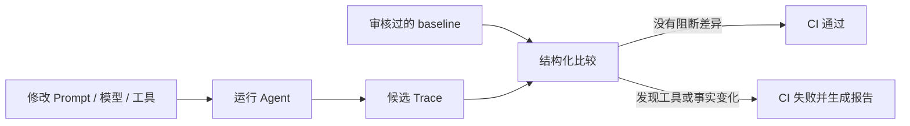

# Agent Regression Kit：新手接入指南

这份指南只回答一个问题：**我已经有一个 AI Agent，怎样在几分钟内把它接入回归测试？**

## 1. 先理解它解决什么问题

Agent 不是只有一个最终文本答案。一次运行还可能包含：

- 选择了哪个工具；
- 给工具传了什么参数；
- 工具返回了什么结果；
- Agent 是否正确理解结果；
- 最后给用户说了什么。

当你修改 Prompt、模型、工具 Schema 或业务代码后，人工看几条回答很容易漏掉隐藏回归。Agent Regression Kit 把一次运行保存为 Trace，再把新版本和审核过的旧版本进行比较。



图的含义是：baseline 是“我们确认过的正确行为”，candidate 是“这次代码生成的行为”；工具名、参数、结果、claims 和流程变化都可以在 CI 中被看见。

## 2. 它负责什么，不负责什么

| 组件 | 它做什么 | 它不做什么 |
| --- | --- | --- |
| 你的 Agent | 决定是否调用工具、如何组织回答 | 不需要改成某个特定框架 |
| `AgentAdapter` | 把 Agent 的动作接到两个统一方法 | 不负责评分或 CI |
| `ToolExecutor` | 执行本地工具或 MCP 工具 | 不自动重试未知副作用的工具 |
| `Trace` | 保存一次脱敏后的运行证据 | 不调用 LLM |
| `baseline` | 经过人工审核的期望行为 | 不应在每次 CI 自动覆盖 |
| `compare` | 比较 baseline 和 candidate | 不从自然语言猜测事实 |
| GitHub Action | 根据退出码阻断回归并上传报告 | 不替你的项目运行 Agent |

## 3. 五分钟跑通完整示例

Python 3.9 或更高版本即可。先在一个临时目录验证：

```bash
git clone https://github.com/ANTAO94/agent-regression-kit.git
cd agent-regression-kit
python -m venv .venv
.venv/bin/pip install -e .
```

生成接入模板：

```bash
agent-regression init
```

模板包含：

- `.agent-regression/config.json`：baseline、candidate 和报告路径；
- `scripts/record_agent.py`：可以直接运行的确定性 Agent 示例；
- `baselines/README.md`：baseline 审核说明；
- `.github/workflows/agent-regression.yml`：CI 示例。
- `.github/workflows/agent-coverage.yml`：场景路径覆盖率门禁示例。

生成一次 candidate：

```bash
python scripts/record_agent.py --out work/my-agent.trace.json
```

第一次确认行为正确后，把它保存为 baseline；下一次 Agent 改动后再生成 candidate：

```bash
cp work/my-agent.trace.json baselines/my-agent.trace.json
python scripts/record_agent.py --out work/my-agent.trace.json
```

先预检配置，再比较：

```bash
agent-regression config validate \
  --config .agent-regression/config.json \
  --kind single

agent-regression compare --config .agent-regression/config.json
```

匹配时退出码是 `0`。发现阻断性回归时退出码是 `1`。配置、Trace 或运行环境无效时退出码是 `2`。

## 4. 如何接入自己的 Agent

你不需要把 Agent 重写成新的框架，只需要让它通过 `context` 报告工具调用和最终回答：

```python
from agent_regression import FixtureTools, record_run


class MyOrderAgent:
    identity = {"name": "my-order-agent", "version": "1.0.0"}

    def run(self, request, context):
        order_id = str(request).rsplit(" ", 1)[-1]
        order = context.call_tool("get_order", {"order_id": order_id})
        context.final_answer(
            f"订单 {order_id} 的状态是 {order['status']}。",
            {"order_id": order_id, "order_status": order["status"]},
        )


trace = record_run(
    MyOrderAgent(),
    "查询订单 123",
    # 示例使用固定工具；真实项目替换成自己的 ToolExecutor
    tools=FixtureTools({"get_order": {"order_id": "123", "status": "not_shipped"}}),
    run_id="my-order-agent-123",
)
```

接入规则只有三条：

1. 暴露一个 `identity` 字典；
2. 工具调用走 `context.call_tool(name, arguments)`；
3. 最终回答走 `context.final_answer(text, claims)`，并且每次运行只结束一次。

`claims` 是你明确写出的结构化事实，例如订单号、状态或是否成功。工具结果和 claims 会严格比较；工具结果含有敏感字段时，默认脱敏会在 Trace 落盘前处理。

### 已经使用 MCP 的 Agent

如果工具由 MCP Server 提供，使用：

```python
from agent_regression import record_mcp_run, record_mcp_http_run

# stdio MCP Server
trace = record_mcp_run(
    MyOrderAgent(),
    "查询订单 123",
    ["node", "path/to/server.js", "stdio"],
    run_id="my-order-agent-123",
)

# Streamable HTTP MCP Server
trace = record_mcp_http_run(
    MyOrderAgent(),
    "查询订单 123",
    "https://example.com/mcp",
    run_id="my-order-agent-123",
    headers={"Authorization": "Bearer ..."},
)
```

项目中的 `examples/rule_agent_mcp_example.py` 是完整的本地参考实现；它使用确定性 MCP Fixture，不需要 API Key 或模型调用。

## 5. 如何理解比较结果

默认是严格模式：任何差异都会被报告。常见类别如下：

| 类别 | 例子 | 默认是否阻断 |
| --- | --- | --- |
| `tool_name` | `get_order` 变成 `lookup_order` | 是 |
| `tool_arguments` | 字符串 `"123"` 变成数字 `123` | 是 |
| `tool_result` | 工具返回内容变化 | 是 |
| `result_interpretation` | 工具说未发货，Agent 却声称已发货 | 是 |
| `final_answer` | 最终文本变化 | 是 |
| `event_count` | 工具调用次数或流程变化 | 是 |

如果模型每次回答的自然语言措辞不同，但结构化 claims 稳定，可以显式使用：

```bash
agent-regression compare \
  --baseline baselines/my-agent.trace.json \
  --candidate work/my-agent.trace.json \
  --final-answer-mode claims-only
```

这只忽略 `final_answer.text`，不会忽略 claims、工具调用、参数、结果或错误状态。不要把它当成语义评分器；如果最终措辞本身是产品契约，就保留默认的 `exact`。

### baseline 检查项和噪音过滤

v2.3 在完整 AgentTrace 之上增加了可执行的 Agent Contract。你可以同时配置“哪些差异不阻断”和“候选行为必须满足什么条件”：

```json
{
  "baseline": "baselines/my-agent.trace.json",
  "candidate": "work/my-agent.trace.json",
  "format": "markdown",
  "allow_categories": ["final_answer"],
  "allow_paths": ["tool_calls[0].arguments"],
  "final_answer_mode": "claims-only",
  "secret_values": ["local-secret"],
  "contract": {
    "must_call": [{"tool": "get_order"}],
    "must_not_call": ["delete_order"],
    "assertions": [
      {"path": "final_answer.claims.order_status", "equals": "not_shipped"}
    ],
    "ignore_paths": ["tool_results[*].result.request_id"],
    "normalizers": [
      {"path": "tool_results[*].result.created_at", "type": "timestamp"}
    ],
    "max_steps": 5,
    "path_rules": {
      "any_of": [
        [{"tool": "get_order", "arguments": {"order_id": "123"}}],
        [
          {"tool": "get_order", "arguments": {"order_id": "123"}},
          "get_shipping"
        ]
      ]
    },
    "side_effects": [
      {"path": "orders.123.status", "from": "paid", "to": "cancelled"}
    ]
  }
}
```

`allow_categories` / `allow_paths` 是**放宽 baseline 差异的阻断规则**，所有差异仍会出现在报告里。`contract` 才是候选行为约束：它可以要求必须调用某个工具、禁止调用某个工具、断言 Trace 字段、忽略动态字段、归一化时间戳/排序，并限制最大工具步骤数。`path_rules.any_of` 表示多条都合法的工具调用路径，候选 Trace 必须完整匹配其中一条；字符串工具规则只检查工具名，对参数不设限。`side_effects` 检查候选运行前后的业务状态，例如订单必须从 `paid` 变成 `cancelled`。`secret_values` 只负责敏感信息脱敏。

`allow-path` 匹配比较器已经产生的完整差异路径；`contract.ignore_paths` 才支持深入嵌套 JSON，并支持 `[*]` 通配。例如 `tool_results[*].result.request_id` 可以忽略每个工具结果里的 request ID，而不会放宽整个工具结果。

### 有状态场景和副作用检查

普通 Trace 只能说明 Agent 调用了什么工具；有状态场景还要说明这些调用有没有把订单、库存或权限状态改坏。实现一个带 `snapshot()` 的工具执行器即可让录制器自动写入：

```json
{
  "metadata": {
    "world_state": {
      "initial": {"orders": {"123": {"status": "paid"}}},
      "final": {"orders": {"123": {"status": "cancelled"}}}
    }
  }
}
```

比较器会把变化报告成 `state_change`，而 `side_effects` 可以把允许的业务变化写成明确契约。每个用例都应创建新的 `StatefulFixtureTools`，或调用 `.fresh()`，避免上一个用例取消的订单污染下一个用例。

### 场景集合覆盖率

当你已经有多份正常、异常、权限或副作用场景 Trace 时，可以统计 Agent 实际走过的工具路径：

```bash
agent-regression coverage \
  --trace-dir work/scenarios \
  --expected-path "get_order" \
  --expected-path "get_order -> cancel_order" \
  --expected-path "get_order -> refund" \
  --format markdown \
  --out outputs/coverage.md
```

这里的 `expected-path` 是完整的工具调用路径。只要其中一条路径没有在目录中出现，命令就返回退出码 `1`，可以直接阻断 CI；没有配置期望路径时，命令只汇总实际观察到的路径。它衡量的是场景证据覆盖，不是代码覆盖率，也不是模型评分。

GitHub Actions 还可以直接复用：

```yaml
- uses: ANTAO94/agent-regression-kit/.github/actions/agent-coverage@v2.3.0
  with:
    trace-dir: work/scenarios
    expected-paths: get_order,get_order->cancel_order,get_order->refund
```

## 6. 多用例和 CI

多用例时，两个目录中的 Trace 使用相同相对路径：

```bash
agent-regression batch-compare \
  --baseline-dir baselines \
  --candidate-dir work/candidate \
  --format markdown \
  --out outputs/batch-summary.md
```

也可以保存到 `.agent-regression/batch.json`，先校验再运行：

```bash
agent-regression config validate \
  --config .agent-regression/batch.json \
  --kind batch
agent-regression batch-compare --config .agent-regression/batch.json
```

最小 GitHub Action：

```yaml
- uses: actions/checkout@v4
- uses: actions/setup-python@v5
  with:
    python-version: "3.11"
- run: python -m pip install "git+https://github.com/ANTAO94/agent-regression-kit.git"
- run: python scripts/record_agent.py --out work/my-agent.trace.json
- uses: ANTAO94/agent-regression-kit/.github/actions/agent-regression@main
  with:
    baseline: baselines/my-agent.trace.json
    candidate: work/my-agent.trace.json
    report: outputs/my-agent.junit.xml
    summary: outputs/my-agent.md
```

Action 会生成 JUnit 和 Markdown 报告，并把 Markdown 追加到 GitHub Job Summary。baseline 应该提交到代码库，并通过人工审核更新。

## 7. 常见问题

**需要先有一个成熟的 Agent 吗？** 不需要。先用仓库自带 Fixture 或一个假的 ToolExecutor 验证录制、回放、比较链路，再接真实 Agent。

**它是 LLM Judge 吗？** 不是。v2.3 只比较明确记录下来的结构化证据和确定性契约，不调用模型替你判断“这句话大概对不对”。

**能不能支持 LangChain、Spring AI 或自研框架？** 可以，只要在框架边界实现 `AgentAdapter`；核心 Trace 和 compare 不绑定语言框架。

**baseline 什么时候更新？** 只有当行为变化是有意且经过审核的产品变更时更新。不要让 CI 自动接受 candidate。

**从哪里继续？** 先阅读 [`docs/api.md`](api.md)、[`docs/architecture.md`](architecture.md)，再运行 `python -m unittest discover -s tests -v` 查看完整离线测试。
